# 1\. 개발툴 정리

Ctl Height - 보통 30

Ctl TOP – 10, 40

 

GroubBox 추가 후 - 캡션 지우기

 

\* YYYY-MM-DD

> DataYearMonth =\> X
>
> DataBox =\> default 값 YMD 설정

---------------------------------

속성 - 기능 - CodeHelpReturn

=\> 체크 해제 시 연결 해제

ex.

담당자 입력 =\> 부서 자동으로 입력

담당자만 가져오고 싶다 =\> CodeHelpReturn에서 연결 끊기

 

 

===============================================

웹, cs버전

테스트의 경우 고객들이 웹을 사용하므로 웹에서 한다

 

erp 패스워드 1111

 

k-studio - 업체별 연결정보 (업체별로 관리)

업체별로 맨 뒤에 이니셜

----------------------------

초록색 아이콘 – 본인이 개발 중인 것

검정색 자물쇠 사람이 개발 중인 것

검정색 아이콘 - 체크인 되어 있어서 누구나 개발 가능

하얀색 아이콘 - 다른 업체의 개발 건 (볼 수는 있지만 수정은 아예 불가능)

 

작업 시작 시 : 체크아웃 검 =\> 초

작업 종료 시 : 체크인 초 =\> 검

-----------------------------

\* 다른 회사 폴더에 만들었을 때

하얀색 아이콘이기 때문에 그대로 옮기는 것은 불가능하고

새로 만든 후 화면 불러오기를 해야 한다

-----------------------------

 

 

 

 

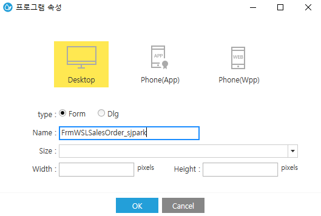

프로그램 속성

\* 프로그램ID

> 가급적 안바꿈 (프로그램 만들 시 만들었기 때문)

FrmWSLSalesOrder2_sj_sysdevwk

> ex. Frm WSLSalesOrder \_ sjpark \_ sysdevwk

\* 프로그램명

> 화면에 보이는 이름
>
> ex. 주문입력_sjpark

\* 메시지

> 삭제전, 잘라내기 전은 주로 켜놓는다
>
> =\> 삭제는 신중하게

----------------------------------------------------------

위에 master영역 - 컨트롤

아래 item영역 - 시트

splitter - 비율 (모니터 크기별로 퍼센트로 나눔)

더블클릭 -\> 초록색 변경 (길이 고정)

------------------------------------

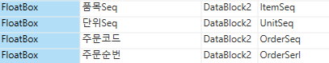

 

Seq중에 integer형인건 floatbox로

수량, 단가, 판매금액도 마찬가지

(+. 품목Seq, 단위Seq, 주문순번Seq, 주문코드Seq

 

시트에도 주문순번 키값을 가져야한다 OrderSeq

시트에서 한줄만 수정할 때도

 

 

 

 

 

 

 

 

 

 

 

 

 

도구상자 (보기 – 도구상자 / 왼쪽 2번째 아이콘)

\* TextBox

> 단순 텍스트 입력

\* TextBoxMulti

> 엔터키 입력 가능

\* CodeHelp

기능

\- CodeHelpConst 에서 지정

ex. 사원 =\> genuine

사원_wbs =\> Ace버전에 맞춰짐

– AddTotal 1 =\> 공백 선택 가능

\* FloatBox

> 숫자만 입력
>
> 디자인 - UseComma 체크 =\> 3자리 쉼표
>
> 디자인 – DecLength =\> 소수점 정할 수 있다

\* MaskBox

> 형식 지정 (MaskAndCaption) (숫자를 많이 사용, ex. 주민등록번호)

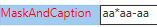

 

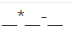

=\>

 

\* DataBox

> Default : YMD (화면 처음 열었을 때 고정된 값)

ex.

2022-02-10 YMD - 현재일

2022-02-05 YMD-5 – D-5 =\> 5일전

2022-02-01 YMFD - MF =\> M월의 첫 날

2022-02-28 YMLD - ML =\> M월의 마지막 날

2021-12-10 YM-2D : M-2 =\> 2개월 전

2022-01-10

: YF =\> Y년의 첫 달

2022-12-10 YLMD : YL =\> Y년의 마지막 달

컨트롤Type에서 바꿀 수 있다

=\> 주로 3가지 씀 DataBox, DataYearMonth, DateYear

 

\* Option

> 라디오 버튼 (코드 도움 사용)

\* Label

> 정보 알려주는 용도 (컨트롤Caption에 작성)
>
> =\> ex. 입력하기 전에 팀장 확인바랍니다
>
> =\> 따로 저장은 안되고 단순히 알리는 용도

\* master영역에서 많이 하는 것

1\. 오른쪽 클릭 – GroupBox =\> 그룹 설정 (caption 지우는 경우도 많다)

2\. 컨트롤 Caption - 이름 바꿈

 

시트 구분 (보통 SS1로 줌)

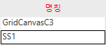

------------------

\*\*\* 전체속성

사전

\* 컨트롤Caption에 내용 무시하고 사전의 내용이 들어감

(ex.외국 업체)

 

\* ControlKey

\- NOS; - 빨간색 (저장할 때 필수로 입력해야 하는 부분)

\- NOQ; - 조회할 때 필수

\- DIS; - 입력 불가

\- HID; - 화면 숨김

\- SHID; - 시트 왼쪽 모서리 - 시트설정 - 잠금 on off가능하지만

SHID는 아예 안보임

\- CLC; - 해당 코드 도움 지울 때 연결된 데이터도 같이 지우는 용도

 

\*\*\* CLC 범위 (CodeHelp 아니면 안 넣음)

담당자 입력 =\> 부서 자동 입력

==\> 담당자에 CLC 붙이기

 

거래처 \<-\> 거래처 번호

둘 중 하나만 지워도 둘 다 지워지므로

둘다 CLC 입력

 

(시트) 판매단위 – CLC

판매단위를 통해 가져올 컬럼이 없기 때문에 (단위Seq제외)

(CLC를 사용함으로써 단위Seq가 지워지는건 아님)

 

==\> 판매단위의 CLC를 없애도 된다

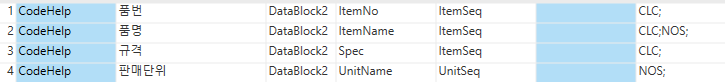

----------------------------------

\*\*\* 전체속성

\* DataBlock - 임시테이블 느낌

> (master에 있는 내용들 = 모두 동일한 데이터블록)

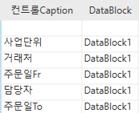

 

\* DataFieldName

> SP와 연결되어 사용 (대소문자 구분)
>
> ex.
>
> 부서 - Remark
>
> 사원 - EmpName

 

\* DataFieldCd

> CodeHelp에서만 사용
>
> 키 값 작성
>
> ex. EmpSeq, DeptSeq, OrderSeq

명칭으로 저장하면 중복될 수가 있다

ex. 사원의 경우 중복될 가능성이 있다

=\> 실제화면에 저장하는 데이터는 키 값 (EmpSeq)

==\> 명칭, 키 값 같이 가져옴

키 값이 메인이고 명칭은 단순 이름 느낌

별도 입력이 안되기 때문에 DIS;HID; 처리

 

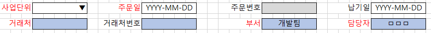

 

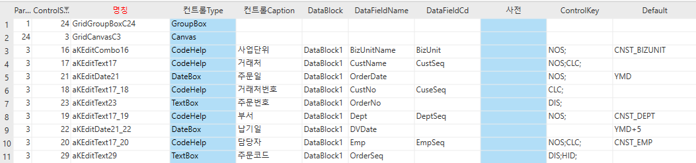

 

+. 사업단위의 경우 특이하게

> DataFieldName : BizUnitName
>
> DataFieldCd : BizUnit

\*\* OrderSeq (주문코드) =\> 개발자를 위한 키 값 (TextBox)

=\> OrderSeq로 전체 조회

=\> DIS; HID;

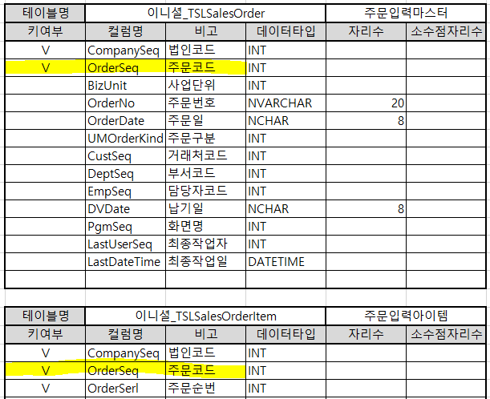

 

-------------------------------------------

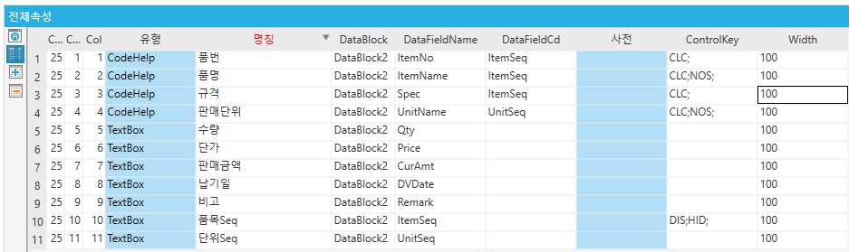

 

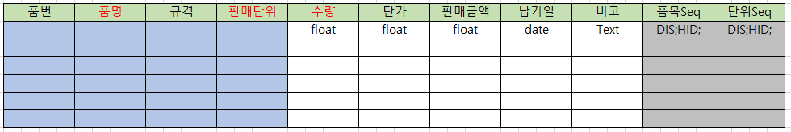

=\> 수량, 단가, 판매금액은 FloatBox