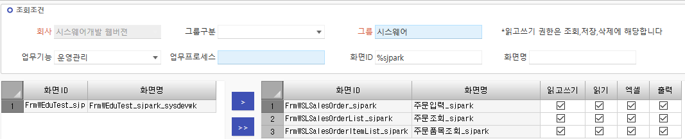
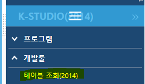
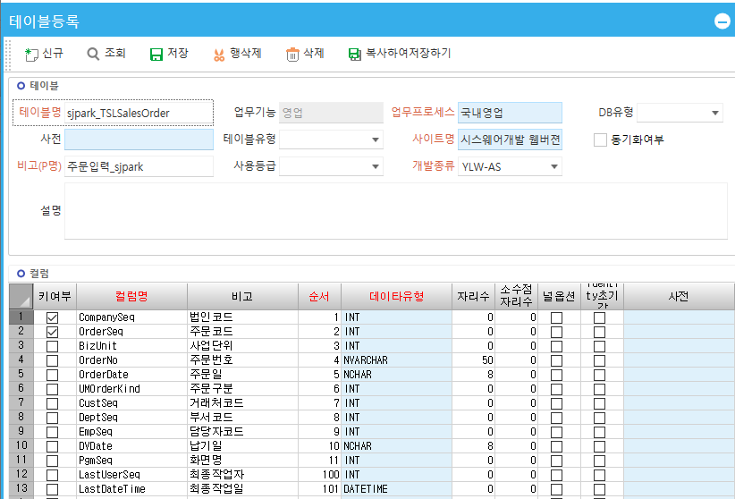
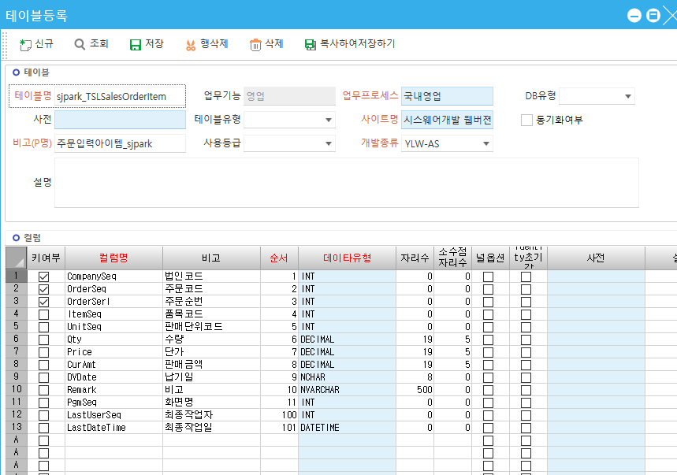
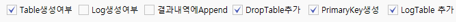
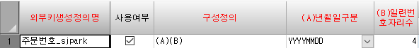
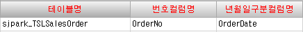

# 2\. 권한부여 및 테이블 등록

1.  권한 부여

운영관리 - 권한 – 화면권한 - 그룹별 프로그램 권한등록

 

==============================================================

1.   

2.  만들기 (신규)

K-STUDIO(2014) - 개발툴 - 테이블 조회 =\> ‘테이블신규등록‘ 클릭

 

 \* 테이블 등록 (만들기)

\- master영역 / item영역 총 2개 작성

 

 

데이터유형

-------------------------

NVARCHAR는 공백이 없다

NCHAR는 공백 존재

ex. NCHAR ‘1234 ’

NVARCHAR ‘1234’

둘이 더하면 =\> ‘1234 1234’

-------------------------

\* 대부분 – INT – INT형은 자리수가 필요 없다

CompanySeq 회사명 – 필수 (키 값)

OrderSeq 테이블 키 값

키 값은 정수형이므로 int (코드값은 대부분 int)

 

\* 날짜 – NCHAR – 자리수 8

8자리 고정

 

\* 주문번호 – NVARCHAR – 자리수 50

YYYYMMDD + 순번4 = 12자리

\(A\) (B)

대부분 (A)(B)지만 회사마다 다르므로 넉넉하게 50자리)

 

 

\* 최종수정일 - DATETIME

> 시분초도 들어가기 때문

---------------------------------------------

키여부

CompanySeq 는 고정

item테이블은 키값이 serl까지 포함해서 3개

마스터키값 1개 / 품명 1개 =\> 품명 말고 따로 순서를 키 값으로 설정

(순번을 키 값으로)

CompanySeq 까지 총 3개

============================================================== 

3.  테이블 스크립트 생성

K-STUDIO – 개발툴 - table명 작성 - 조회 - 테이블선택 – 추가

체크 해야할 것 4가지

Table생성여부, DropTable추가, PrimaryKey생성, LogTable추가

=\> 스크립트생성테이블 나옴

=\> 전체 선택

테이블스크립트를 sql에 복붙 (마지막 go지우기)

===\> 테이블이 데이터베이스에 생성된다

-----------------------------------------------------

4.  업무별외부키생성

외부키생성정의명

그림의 외부키

 

