# 4\. 서비스, 이벤트 작성

> 프로시저란 실제 테이블을 수정할 때 많이 사용
>
>  
>
> 화면 구성 시 기본적으로 – 조회SP, 체크SP, 저장SP =\> 3개를 한 세트로 많이 씀
>
> =\> 지금은 시트, 마스터 영역 따로 있으므로
>
> =\> 3개씩 총 6개가 필요
>
>  
>
> \*\*\* SP WorkList 우클릭 – 새 SP
>
> 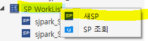
>
>  

- 스크립트ID // 스크립트명 // 스크립트유형

> 총 3가지 작성
>
>  

- 스크립트ID

> 프로시저의 경우 S로시작
>
> 프로그램ID : Frm WSLSalesOrder_sjpark_sysdevwk
>
> 스크립트ID : sjpark_S WSLSalesOrderCheck
>
>  
>
>  
>
> 스크립트ID : sjpark_SWSLSalesOrderQuery 조회
>
> sjpark_SWSLSalesOrderCheck 체크
>
> sjpark_SWSLSalesOrderSave 저장
>
> -----------------------------------
>
> sjpark_SWSLSalesOrderItemQuery 조회
>
> sjpark_SWSLSalesOrderItemCheck 체크
>
> sjpark_SWSLSalesOrderItemSave 저장
>
>  

- 스크립트명

> 스크립트명은 별로 안 중요하지만 ‘비고’느낌으로 다른 사람이 볼 ‘명칭’
>
>  
>
> 주문입력 마스터조회_sjpark
>
> 주문입력 마스터체크_sjpark
>
> 주문입력 마스터저장_sjpark
>
> -----------------------
>
> 주문입력 아이템조회_sjpark
>
> 주문입력 아이템체크_sjpark
>
> 주문입력 아이템저장_sjpark
>
>  
>
>  
>
>  

3.  스크립트유형

> Q-조회
>
> E-처리
>
> S-저장
>
>  
>
> ====\> SP를 만든건아니고 / 명칭을 만든 단계
>
> 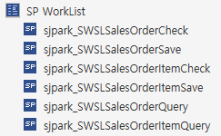
>
>  
>
> ======================================================================================================================== 

- 서비스 만들기

- 메소드 클릭 =\> 하단 ‘서비스 WF’ 선택

> 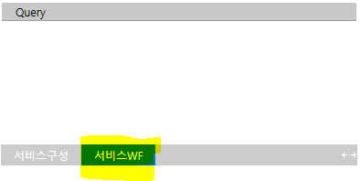
>
>  

- 오른쪽 클릭 – 추가 – SP Method

> 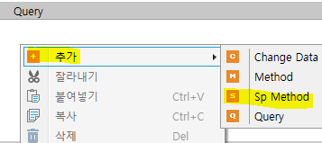
>
>  
>
>  

3.  SP WorkList에서 필요한 SP를 맨 오른쪽 회색 영역에 드래그하여 추가

> 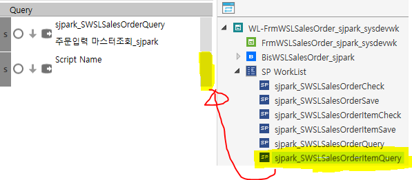
>
>  
>
>  
>
>  

- Query (서비스에 SP 메소드 추가)

> 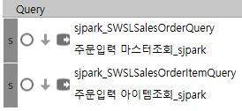
>
>  
>
>  

- Save (서비스에 SP 메소드 추가)

> 체크 : 저장할 때 실제 데이터가 유효한지 checkList
>
> 저장 : 실제 저장
>
> 체크 – 체크 – 저장 – 저장 (순서는 딱히 상관 없다)
>
> (\*\* 체크의 경우 어떤게 체크된지 보여줘야 하기 때문에 트랜잭션을 걸지 않는다)
>
> 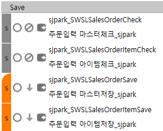
>
>  
>
>  
>
> 
>
> : 오류가 생기면 다음 단계로 안 넘어간다
>
> (Check – 체크에서 사용)
>
>  
>
>  
>
> \* 앞에 바를 누르면 색이 변함 (주황색) =＞ 트랜잭션 기능 (보통 저장 부분에서 사용)
>
> 
>
>  
>
> 
>
> 마지막 부분이 꺾인 모양이 아니어도 상관없다
>
>  
>
> 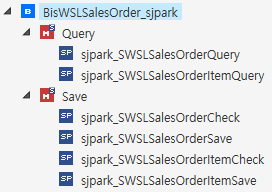
>
> 실제 테이블에 데이터가 들어가는 작업은 SP에서 진행
>
>  
>
> SP는 한번 열었다가 닫아야 체크인이 가능
>
> +. SP 체크인이 안 될 때 =\> 열고 닫아라
>
>  
>
>  ========================================================================================================================
>
>  
>
>   

- 서비스 구성

- master 영역

> DataFieldName + DataFieldCd
>
>  
>
> \- 서비스 명칭과 실제 테이블 명칭은 맞춰주는게 좋다
>
>  
>
> 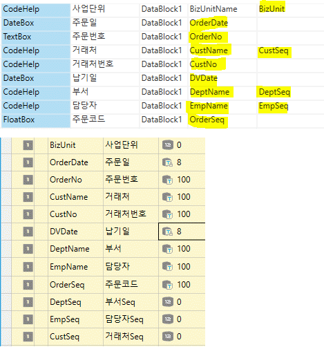
>
>  
>
>  \*\*\* 유형
>
> ==================================================
>
> \* 고정값 = Fix String
>
> OrderDate(주문일), DVDate(납기일)
>
> =\> (8자리)
>
> \* 키 값은 integer 형이므로 int 사용
>
> ex. BizUnit, DeptSeq, EmpSeq, CustSeq
>
> \* Double (시트 영역)
>
> ex. Qty (수량), 단가 (Price), 판매금액 (CurAmt)
>
> ==================================================
>
>  
>
> 2\. 시트 영역
>
> 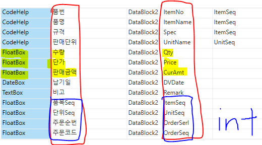
>
>  
>
> 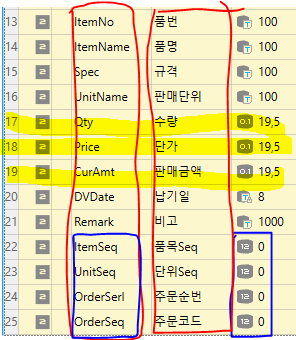
>
> 판매단위 또한 키 값을 통해 명칭도 가져올 수 있다

- 키 값 = INT

> ItemSeq, UnitSeq, OrderSerl, OrderSeq
>
>  

- 고정값

> DVDate
>
>  

- Double =\> FloatBox

> Qty, Price, CurAmt
>
> -----------------------------------------------
>
>  
>
>  

- 화살표

> 왼쪽 – SP로 가져가는 값
>
> 오른쪽 – SP에서 작업을 하고 화면으로(결과로) 보여주는 방향
>
>  
>
> \* Query
>
> 왼쪽 : OrderSeq로 모든 데이터 가져올 수 있으므로 OrderSeq만 체크
>
> 오른쪽 : 데이터 다 가져오기
>
>  
>
> \* Save
>
> 왼쪽, 오른쪽 동일
>
> \- 코드도움은 키 값만 가지고도 명칭을 가져올 수 있기 때문에
>
> Save 안해도 된다
>
> ==\> 키 값 기준으로 저장한다
>
> +. 사업단위 – 화면에서의 명칭 (비고 이기 때문에 안 넣어도 되지만 있는게 좋다 / 주석)
>
> +. 품번, 품명, 규격 은 한 세트
>
>  
>
> 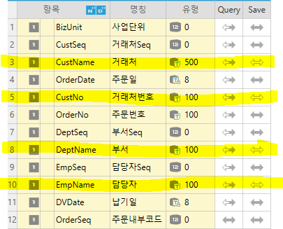