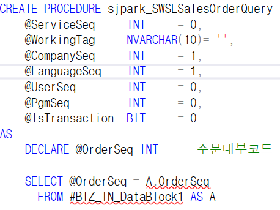
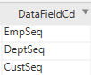
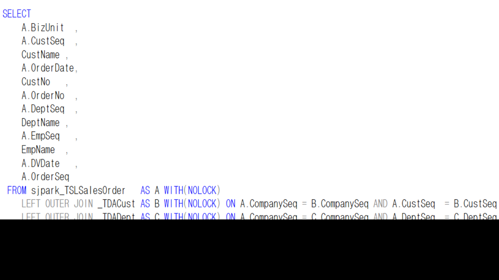

# 5\. 조회 SP 작성

> \* 조회 SP 만들기
>
>  
>
> **왼쪽,오른쪽 방향으로 가져온 데이터 각각 임시테이블이 만들어짐**
>
>  
>
> \*\* 조회 \*\*
>
> SP명 =\> sjpark_SWSLSalesOrderQuery
>
>  
>
> 

- CREATE PROCEDURE \~~

> =\> 고정값
>
>  

- DECLARE @OrderSeq INT

> 조회조건 =\> OrderSeq
>
> 변수 =\> OrderSeq
>
> 하나만 넘어오기 때문에 변수 설정이 가능 (변수 – 임시변수)
>
>  
>
>  
>
>  
>
>  

- 메인테이블 (sjpark_TSLSalesOrder)의 컬럼

> CompanySeq
>
> OrderSeq
>
> ----------- =\> WHERE 조건절에 들어감
>
> WHERE A.CompanySeq = @CompanySeq
>
> AND A.OrderSeq = @OrderSeq
>
> ---------------------------------------------
>
> BizUnit
>
> OrderNo
>
> OrderDate
>
> UMOrderKind
>
> CustSeq
>
> DeptSeq
>
> EmpSeq
>
> DVDate
>
> PgmSeq
>
> LastUserSeq
>
> LastDateTime
>
> ==\> sjpark_TSLSalesOrder의 값
>
> ( NOLOCK =\> 동시작업 불가능 )
>
>  

- \_TDACust / \_TDADept / \_TDAEmp

> 
>
> =\> LEFT OUTER JOIN
>
> 