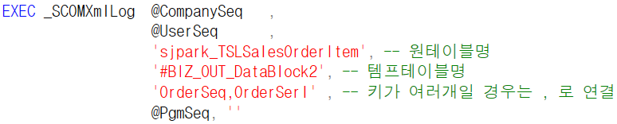
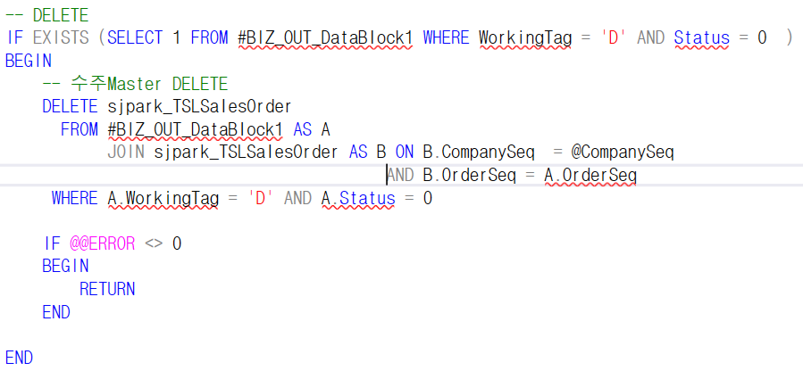
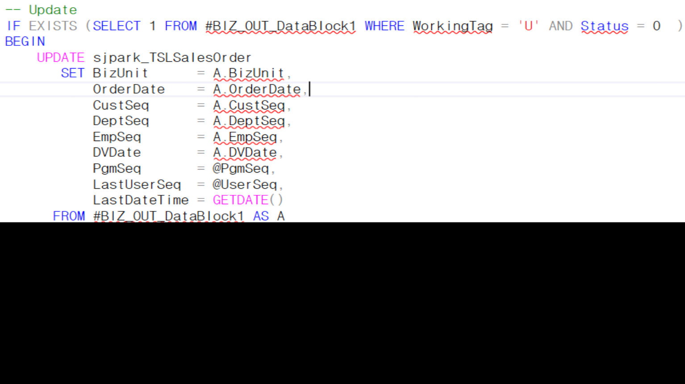

# 6\. 저장 SP

>  
>
>  
>
> \*저장
>
> 체크에서 나온 값 사용
>
> \#BIZ_OUT_DataBlock1 =\> 마스터 영역
>
> 
>
> \#BIZ_OUT_DataBlock2 =\> 아이템 영역

- 아이템 영역의 경우 키 값이 2개이므로

> ‘OrderSeq, OrderSerl’ 라고 작성
>
>  
>
> DELETE – UPDATE – INSERT 순서로 진행
>
> ================================================================================================

- DELETE

> 

- WorkingTag = ‘D’

- Status = 0

> ----------------------------------------------------------------------------------------------------------------------------------------------------------
>
>  
>
>  

- UPDATE

> 
>
>  
>
> sjpark_TSLSalesOrder // \#BIZ_OUT_DataBlock1
>
> 원테이블 // 임시테이블 비교
>
> 원테이블에 임시테이블 값 넣기
>
>  
>
> 
>
> ==\> 아이템영역은 OrderSerl 조건 추가로 필요 (DELETE도 마찬가지)
>
>  
>
> ----------------------------------------------------------------------------------------------------------------------------------------------------------

- INSERT

> Status가 0이 아니면 오류난 데이터라 저장을 안함
>
> 존재유무를 먼저 확인해줘야한다
>
> Orderseq는 BIZ테이블1에서 방향 선언
>
> int니까 0n
>
> pgmseq 프로그램의 내부코드 속성값
>
> lastuserseq – 최종 수정자 이름 (수정자의 내부코드 값이 들어감)
>
> =\> 화면에서 변수로 받아옴
>
>  
>
> update
>
> company, orderseq 키 값 이기에 수정 x
>
> bizunit은 업데이트가 없어도 수정
>
> \- 화면에 없는 값이므로 삭제