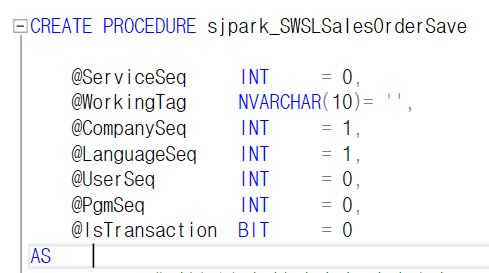
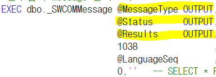

# 7\. 체크 SP

\* 체크 사용 예시

필수값이 아니더라도

수량 \* 단가 = 판매금액 다른 경우

납기일이 오늘 이전

등등

오류가 있는 경우 체크가 저장하지 못하도록 막아준다

- Check SP

> 
>
>  
>
> ==\> 무조건 고정
>
> -----------------
>
> 순서는 D U I
>
>  
>
> \#임시테이블
>
> \#Biz~out
>
> 화면에서 가져온 정보 (아직 데이터가 아니다)
>
>  
>
> 임시테이블과 원테이블을 조인 =\> 삭제 : 다른걸 지운다
>
> =\> 변경 : 겹치는걸 업데이트한다
>
>  
>
> 화면에 있는 값 넣어준다
>
>  
>
>  
>
> \* OUT인 데이터를 저장 =\> BIZOUT
>
> 
>
>