# 조회 1.

>  
>
> CS 버전 웹버전 둘다 비밀번호 1111
>
>  
>
> 마스터 현황 (주문현황)
>
> 아이템 현황 (품목현황)
>
> 한세트씩 조회가 존재한다
>
> 이외에 별도로 진행현황 같은것들도 존재한다
>
> 수주 == 주문
>
>  
>
> FrmW(웹)SLOrderList
>
>  
>
> Caption-W 4글자까지 대략 60정도를 준다
>
>  
>
> NOS =\> 저장필수 NON + SAVE
>
> NOQ =\> 조회필수
>
> =\> NON + QRY
>
> QRY =\> ‘변경 하시겠습니까?’ 메시지 안 뜸
>
>  
>
> 수주입력,거래명세서를 참고하면 대부분 다 있음
>
> DateFr DateTo
>
> YMFD YMLD
>
>  
>
> 조회조건의 대부분의 조건을 시트에 보여준다
>
> 사업단위를 필수조건 값으로 할 경우 시트에서는 제외해도 됨
>
>  
>
> 조회는 DataBlock을 마스터 아이템 둘다 DataBlock1로 써도 됨
>
> 모든 시트값들을 DIS를 넣어준다
>
>  
>
> 제뉴인=\> 비즈니스 서비스 안에 데이터서비스 안에 SP가 있음
>
> 에이스=\> 비즈니스 서비스
>
> 메소드유형 - R조회 SP
>
>  
>
> 툴바에 있는 이벤트 속성에서 "변경여부확인“
>
> =\> 주문입력 시에는 넣어줘야함 NotNullCheck를 체크해야 NOQ NOS가 작동함
>
> 이벤트 자동생성후 VISIBLE 체크 풀기
>
>  
>
> Name 은 사이즈 100 날짜는 8 SEQ는 int
>
> 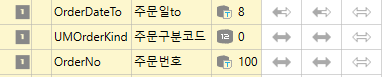
>
>  
>
>  
>
> 화살표는 왼쪽(최초 input Data)
>
>  
>
> IF @OrderDateTo = '' SELECT @OrderDateTo = '99991231'
>
> 안 넣으면 오류 나는 sql 버전이 있어서 넣자!
>
>  
>
> AND(@OrderNo = '' OR A.OrderNo LIKE @OrderNo + '%')
>
> 품목같은 경우는 앞에도 '%' + 를 붙여준다
>
> AND(@CustSeq = 0 OR A.CustSeq = @CustSeq)
>
>  
>
> ERP 대부분은 품목으로 움직임(필수) 따라서 품목은 inner JOIN을 걸어주고 나머지 값들은 LEFT OUTER JOIN
>
>  
>
> \_T TABLE
>
> \_S SP
>
> \+ DA 마스터(공용)
>
> \_V VIEW
>
>  
>
> Order By A.OrderDate A.OrderNo
>
>  
>
>  
>
> JUMP =\> 액티브 로우 선택 후 툴바
>
> 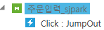
>
> 툴바 추가 이벤트유형 O-JUMPOUT DataKey JumpSjpark 연결할 화면 이름
>
> 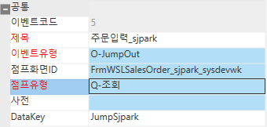
>
>  
>
> 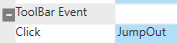
>
> 메소드 추가 Jump Out G SS1 Active Row
>
>  
>
> ACE는 받는 쪽에서는 따로 안하지만
>
> 제뉴인은 받는 쪽에서도 JUMP IN 을 해줘야 함
>
> JUMPIN S -\> T RunPgmMethod('Query') 이게 디폴트 점프인이고
>
> 어디서 들어오는지에 따라 툴바에 추가 해서 하는 것은 VISIBLE을 꺼줌
>
>  
>
>  
>
> 더블클릭은 MethodType =\> E-처리 T JumpOut('JumpSjpark')
>
>  
>
>  
>
>  
>
>  
>
> 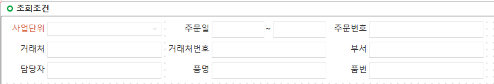
>
>  
>
> 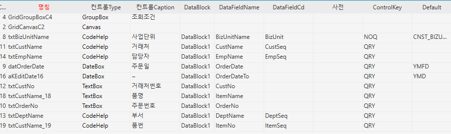
>
>  
>
> 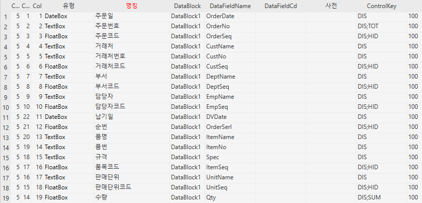
>
>  
>
> 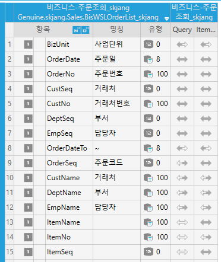
>
>  
>
>  
>
>  
>
>  
>
>  
>
>  
>
>  
>
>  
>
>  
>
>  
>
>  
>
>  
>
>  
>
> 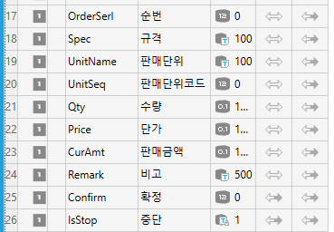
>
>  
>
>  
>
>  
>
> ========================================
>
> 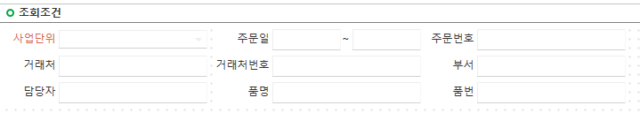
>
>  
>
> 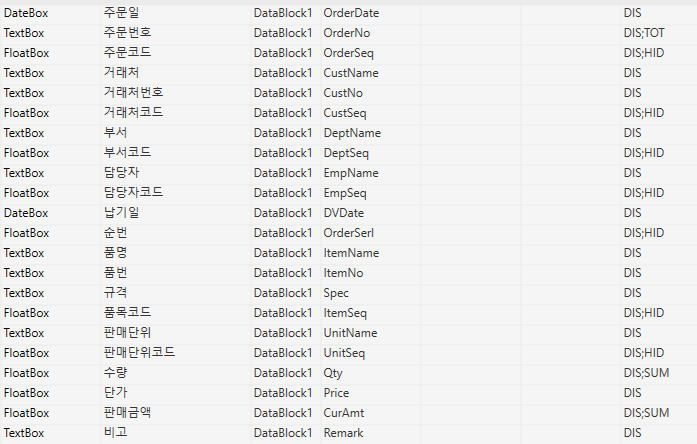
>
> 품목현황
>
> FrmWSLOderItemList_sjpark
>
> 주문품목조회_sjpark
>
> 화면정보불러오기 할때 자동저장이니까 조심하기
>
>  
>
> 코드도움 \_WBS \_VEN 이 ACE 꺼 안붙어있는거는 제뉴인꺼임
>
> 조회에서 코드도움 자동으로 리턴받는거 빼주기 조회기 때문에 원하는 것만 넣어주려고
>
>  
>
> 환경설정 값을 수량 단가 판매금액에 Default값으로 넣어준것 환경설정 값을 바꾸면 알아서 적용
>
>  
>
> 테이블 정보에서 LENGTH 가 1000 이면 서비스 구성에서는 500을 넣어주면됨
>
>  
>
> OrderItem, \_TDAItem 테이블은 inner join으로 처리해도 충분하다
>
> Order by 위에꺼 + OrderSerl
>
>  
>
> Total 컬럼 추가하기
>
> Text로 된 항목 컨트롤키에 TOT
>
> 수량, 판매금액 컨트롤키에 SUM
>
>  
>
> 등록에서의 조회는 임시테이블을 JOIN해도 되지만
>
> 조회에서의 조회는 임시테이블을 변수에 담아서 처리하는것이
>
> 존재하지 않을 경우가 쉽다
>
>  
>
>  
>
>  
>
> \_TDAUMinor ==\> 유저가 수정할 수 있는 테이블에 U 가 붙음
>
> MinorSeq
>
> UmOrderKind
>
>  
>
> \_TDASMinor ==\> 유저가 수정할 수 없음 S(ystem) =\> 하드코딩 가능
>
> SmOrderKind
>
>  

- SP

> 한 쪽에만 있으면 가비지 데이터 이기 때문에
>
> OrderItem은 left가 아니라 그냥 join
>
> 품목도
>
> ================================================
>
> ================================================

- Total 값 추가

- textbox 항목뒤에 txt (컨트롤키에) (주문번호)

> 보여줄 애들한테 SUM
>
> 단가는 스킵
>
> 수량, 판매금액에 SUM
>
>  
>
>  
>
>  
>
>