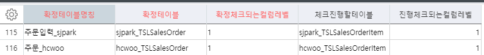
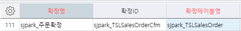
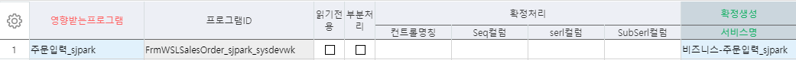
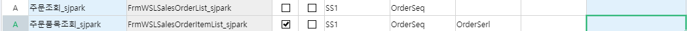
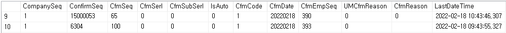
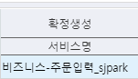
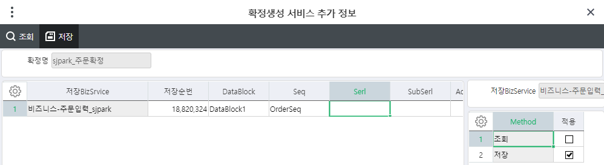
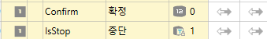

# 확정

Ace 확정, 중단, 진행

 

\_TCOMConfimTable = 확정을 사용하겠다

 

\_TCOMConfirm =\> 확정 사용할 때 필수로 join해야하는 테이블

 

확정테이블관리

 

\- 코드관리(개발자) - 확정/중단관리 = 확정테이블관리(2014)

확정테이블명칭 - 주문입력_sjpark

확정테이블 - sjpark_TSLSalesOrder

확정체크되는컬럼레벨 - 확정할 마스터영역 갯수

체크진행할테이블 - sjpark_TSLSalesOrderItem

진행체크되는컬럼레벨 - 1

==\> \_TCOMConfirmTable 에 데이터가 들어간다

 

\- 코드관리(개발자) - 확정/중단관리 = 확정관리(2014)

확정명 - sjpark_주문확정

확정ID - sjpark_TSLSalesOrderCfm

확정테이블명칭

사용할거기에 사용안함에 체크 x

==\> 작성 후 더블클릭

> =\> 영향받는 프로그램에 '주문조회' '주문품목조회' '주문입력'넣기

 

 

 

 

1\. 조회

2\. 품목조회 (읽기전용)

3\. 주문입력 (읽기전용)

키값이 3개인거 까지 조회가능 (진행되는 컬럼레벨3)

 

 

확정생성

확정번호가 \_TCOMConfirm 에 들어감

 

입력에서는 확정이 안됨

대신 확정생성 - 서비스명 (비즈니스-주문입력_sjpark 넣어야함)

 

 

 

> DataBlock(DataBlock1), Seq(OrderSeq) 넣기
>
> =\> 더블클릭 =\> 저장 적용체크

===================================================================

\_TCOMConfirm 테이블

Cfmcode - 확정확인 (1이면 확정)

 

다시 조회하면 확정 풀려있음 =\> SP에 넣어줘야함

\* SP (화면에 안보이더라도 넣어줘야함)

서비스구성에도 추가

(확정,중단은 컬럼명을 고정해서 쓰자)

Confirm 확정 int

IsStop 중단 fix String –1 (오른쪽화살표)

 

\* SP

cfmcode as ConFirm 추가

JOIN 걸기

ConfirmSeq는 알고 있어야한다