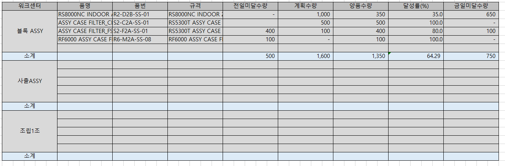

# 소계 - 개발툴

생산계획대비실적달성조회_mcf

 

mcf_SWMRPProdPlanRltListQuery

 

CREATE PROCEDURE mcf_SWMRPProdPlanRltListQuery

@ServiceSeq INT = 0,

@WorkingTag NVARCHAR(10)= '',

@CompanySeq INT = 1,

@LanguageSeq INT = 1,

@UserSeq INT = 0,

@PgmSeq INT = 0,

@IsTransaction BIT = 0

AS

 

DECLARE @BizUnit INT ,

@WorkDateFr NCHAR(8),

@WorkDateTo NCHAR(8),

@WorkCenterSeq INT ,

@WorkStartDate NCHAR(8) -- 작업일 From과 동일한 연도의 1월 1일

SELECT @BizUnit = ISNULL(A.BizUnit , 0),

@WorkDateFr = ISNULL(A.WorkDateFr ,''),

@WorkDateTo = ISNULL(A.WorkDateTo ,''),

@WorkCenterSeq = ISNULL(A.WorkCenterSeq, 0)

FROM \#BIZ_IN_DataBlock1 AS A

 

SELECT @WorkStartDate = CONVERT(CHAR(8), DATEADD(YEAR, DATEDIFF(YEAR, 0, @WorkDateFr), 0), 112)

 

--==============================--

-- 1. 전일 미달 수량 구하기 (PreShortQty) : 작업일From일과 동일한 연도의 1월1일부터 작업일From까지 작업지시-작업실적 양품수량 --

--==============================--

-- 전일미달수량 임시테이블 (작업일연도 1월1일 ~ 작업일 From 까지의 지시수량)

SELECT ISNULL(A.WorkCenterSeq, 0) AS WorkCenterSeq ,

ISNULL(A.GoodItemSeq , 0) AS ItemSeq ,

ISNULL(SUM(A.OrderQty), 0) AS PreOrderQty

INTO \#PreShortQtyOrder

FROM \_TPDSFCWorkOrder AS A WITH(NOLOCK)

WHERE A.WorkDate BETWEEN @WorkStartDate AND @WorkDateFr

AND A.BizUnit = @BizUnit

AND (@WorkCenterSeq = 0 OR A.WorkCenterSeq = @WorkCenterSeq)

GROUP BY A.WorkCenterSeq,

A.GoodItemSeq

 

-- 전일미달수량 임시테이블 (작업일연도 1월1일 ~ 작업일 From 까지의 양품수량)

SELECT ISNULL(A.WorkCenterSeq , 0) AS WorkCenterSeq ,

ISNULL(A.GoodItemSeq , 0) AS ItemSeq ,

ISNULL(SUM(A.OKQty) , 0) AS PreOKQty

INTO \#PreShortQtyReport

FROM \_TPDSFCWorkReport AS A WITH(NOLOCK)

WHERE A.WorkDate BETWEEN @WorkStartDate AND @WorkDateFr

AND A.BizUnit = @BizUnit

AND (@WorkCenterSeq = 0 OR A.WorkCenterSeq = @WorkCenterSeq)

GROUP BY A.WorkCenterSeq,

A.GoodItemSeq

 

 

-- 지시수량 - 양품수량 (정렬하기 위해 임시테이블에 담기)

SELECT ISNULL(A.WorkCenterSeq,B.WorkCenterSeq) AS WorkCenterSeq ,

ISNULL(A.ItemSeq,B.ItemSeq) AS ItemSeq ,

ISNULL(A.PreOrderQty,0)-ISNULL(B.PreOKQty,0) AS PreShortQty

INTO \#PreShortQtyTmp

FROM \#PreShortQtyOrder AS A

FULL OUTER JOIN \#PreShortQtyReport AS B ON A.WorkCenterSeq = B.WorkCenterSeq

AND A.ItemSeq = B.ItemSeq

 

 

CREATE TABLE \#ResultTmp

(

WorkCenterSeq INT DEFAULT 0,

ItemSeq INT DEFAULT 0,

PreShortQty DECIMAL(19,5) DEFAULT 0,

PlanQty DECIMAL(19,5) DEFAULT 0,

OKQty DECIMAL(19,5) DEFAULT 0,

AchRate DECIMAL(19,5) DEFAULT 0,

ShortQty DECIMAL(19,5) DEFAULT 0,

ID INT IDENTITY(1,1) -- 정렬하기 위해 추가

)

-- 최종테이블에 워크센터 ,품목, 전일미달수량 INSERT

INSERT INTO \#ResultTmp (WorkCenterSeq,ItemSeq,PreShortQty)

SELECT \*

FROM \#PreShortQtyTmp

ORDER BY WorkCenterSeq, ItemSeq

 

 

--==============================--

-- 2. 계획수량, 양품수량 구하기--

-- 2-1. 계획수량: 작업일From~To 까지의 작업지시 수량 합계

-- 2-2. 양품수량: 작업일From~To 까지의 작업실적 양품수량 합계

--==============================--

-- 2-1. 작업지시 임시테이블 담기 (From~To 까지의 작업지시 수량 합계)

SELECT ISNULL(A.WorkCenterSeq , 0) AS WorkCenterSeq ,

ISNULL(A.GoodItemSeq , 0) AS ItemSeq ,

ISNULL(SUM(A.OrderQty) , 0) AS OrderQty

INTO \#PlanQty

FROM \_TPDSFCWorkOrder AS A WITH(NOLOCK)

WHERE A.BizUnit = @BizUnit

AND (@WorkCenterSeq = 0 OR A.WorkCenterSeq = @WorkCenterSeq)

AND A.WorkDate BETWEEN @WorkDateFr AND @WorkDateTo

GROUP BY A.WorkCenterSeq ,

A.GoodItemSeq

 

-- 최종 테이블 없는 워크센터, 품목 INSERT

INSERT INTO \#ResultTmp (WorkCenterSeq,ItemSeq)

SELECT A.WorkCenterSeq, A.ItemSeq

FROM \#PlanQty AS A

LEFT OUTER JOIN \#ResultTmp AS B ON A.WorkCenterSeq = B.WorkCenterSeq AND A.ItemSeq = B.ItemSeq

WHERE B.WorkCenterSeq IS NULL

 

 

-- 작업실적 임시테이블 담기 (From~To 까지의 작업실적 양품수량 합계)

SELECT ISNULL(A.WorkCenterSeq , 0) AS WorkCenterSeq ,

ISNULL(A.GoodItemSeq , 0) AS ItemSeq ,

ISNULL(SUM(A.OKQty) , 0) AS OKQty

INTO \#OKQty

FROM \_TPDSFCWorkReport AS A WITH(NOLOCK)

WHERE A.BizUnit = @BizUnit

AND (@WorkCenterSeq = 0 OR A.WorkCenterSeq = @WorkCenterSeq)

AND A.WorkDate BETWEEN @WorkDateFr AND @WorkDateTo

GROUP BY A.WorkCenterSeq ,

A.GoodItemSeq

 

-- 최종 테이블 없는 워크센터, 품목 INSERT

INSERT INTO \#ResultTmp (WorkCenterSeq,ItemSeq)

SELECT A.WorkCenterSeq, A.ItemSeq

FROM \#OKQty AS A

LEFT OUTER JOIN \#ResultTmp AS B ON A.WorkCenterSeq = B.WorkCenterSeq AND A.ItemSeq = B.ItemSeq

WHERE B.WorkCenterSeq IS NULL

 

 

-- 계획수량, 양품수량, 달성률, 금일미달수량 UPDATE

UPDATE \#ResultTmp

SET PlanQty = B.OrderQty,

OKQty = C.OKQty

FROM \#ResultTmp AS A

JOIN \#PlanQty AS B ON A.WorkCenterSeq = B.WorkCenterSeq AND A.ItemSeq = B.ItemSeq

JOIN \#OKQty AS C ON A.WorkCenterSeq = C.WorkCenterSeq AND A.ItemSeq = C.ItemSeq

 

UPDATE \#ResultTmp

SET AchRate = ISNULL(OKQty,1) /

CASE WHEN (ISNULL(PreShortQty,0) + ISNULL(PlanQty,0)) = 0 THEN 1 ELSE (ISNULL(PreShortQty,0) + ISNULL(PlanQty,0)) END

\* 100, -- 달성률(%) : (전일미달수량 + 계획수량) / 양품수량 \*100

ShortQty = (ISNULL(PreShortQty,0) + ISNULL(PlanQty,0)) - ISNULL(OKQty,0) -- 금일미달수량: (전일미달수량 + 계획수량) - 양품수량

FROM \#ResultTmp AS A

 

SELECT A.WorkCenterSeq,

A.ItemSeq,

A.PreShortQty,

A.PlanQty ,

A.OKQty ,

A.AchRate ,

A.ShortQty ,

1 AS Gubun

INTO \#Result

FROM \#ResultTmp AS A

 

--=============--

-- 소 계 --

--=============--

INSERT \#Result

SELECT A.WorkCenterSeq,

0, -- ItemSeq

SUM(A.PreShortQty),

SUM(A.PlanQty ),

SUM(A.OKQty ),

SUM(A.AchRate ),

SUM(A.ShortQty ),

2

FROM \#ResultTmp AS A GROUP BY A.WorkCenterSeq

 

 

SELECT A.WorkCenterSeq,

CASE WHEN A.ItemSeq = 0

THEN '소계'

ELSE B.WorkCenterName END AS WorkCenterName,

A.ItemSeq,

ISNULL(C.ItemName,'') AS ItemName ,

ISNULL(C.ItemNo ,'') AS ItemNo ,

ISNULL(C.Spec ,'') AS Spec ,

PreShortQty AS PreShortQty,

PlanQty AS PlanQty ,

OKQty AS OKQty ,

AchRate AS AchRate ,

ShortQty AS ShortQty

FROM \#Result AS A

LEFT OUTER JOIN \_TPDBaseWorkCenter AS B WITH(NOLOCK) ON B.CompanySeq = @CompanySeq

AND B.WorkCenterSeq = A.WorkCenterSeq

LEFT OUTER JOIN \_TDAItem AS C WITH(NOLOCK) ON C.CompanySeq = @CompanySeq

AND C.ItemSeq = A.ItemSeq

ORDER BY A.WorkCenterSeq, A.Gubun,A.ItemSeq

 

 

 

RETURN

--go

--begin tran

--DECLARE @CONST\_#BIZ_IN_DataBlock1 INT-- , @CONST\_#BIZ_OUT_DataBlock1 INT--SELECT @CONST\_#BIZ_IN_DataBlock1 = 0-- , @CONST\_#BIZ_OUT_DataBlock1 = 0

--IF @CONST\_#BIZ_IN_DataBlock1 = 0

--BEGIN

-- CREATE TABLE \#BIZ_IN_DataBlock1

-- (-- WorkingTag NCHAR(1)-- , IDX_NO INT-- , DataSeq INT-- , Selected INT-- , MessageType INT-- , Status INT-- , Result NVARCHAR(255)-- , ROW_IDX INT-- , IsChangedMst NCHAR(1)-- , TABLE_NAME NVARCHAR(255)-- , BizUnit INT, WorkDateFr NCHAR(8), WorkDateTo NCHAR(8), WorkCenterSeq INT-- ) -- SET @CONST\_#BIZ_IN_DataBlock1 = 1--END--IF @CONST\_#BIZ_OUT_DataBlock1 = 0--BEGIN-- CREATE TABLE \#BIZ_OUT_DataBlock1-- (-- WorkingTag NCHAR(1)-- , IDX_NO INT-- , DataSeq INT-- , Selected INT-- , MessageType INT-- , Status INT-- , Result NVARCHAR(255)-- , ROW_IDX INT-- , IsChangedMst NCHAR(1)-- , TABLE_NAME NVARCHAR(255)-- , BizUnit INT, WorkDateFr NCHAR(8), WorkDateTo NCHAR(8), WorkCenterSeq INT, WorkCenterName NVARCHAR(100), ItemName NVARCHAR(100), ItemNo NVARCHAR(100), Spec NVARCHAR(100), ItemSeq INT, PreShortQty DECIMAL(19, 5), PlanQty DECIMAL(19, 5), OKQty DECIMAL(19, 5), AchRate DECIMAL(19, 5), ShortQty DECIMAL(19, 5)-- ) -- SET @CONST\_#BIZ_OUT_DataBlock1 = 1--END--DECLARE @INPUT_ERROR_MESSAGE NVARCHAR(4000)

-- , @INPUT_ERROR_SEVERITY INT

-- , @INPUT_ERROR_STATE INT

-- , @INPUT_ERROR_PROCEDURE NVARCHAR(128)

--INSERT INTO \#BIZ_IN_DataBlock1 (WorkingTag, IDX_NO, DataSeq, Selected, Status, Result, ROW_IDX, IsChangedMst, TABLE_NAME, BizUnit, WorkDateFr, WorkDateTo, WorkCenterSeq) --SELECT N'A', 1, 1, 1, 0, NULL, NULL, N'1', N'DataBlock1', N'2', N'20221026', N'20221026', N'1'--IF @@ERROR \<\> 0 RETURN

--DECLARE @HasError NCHAR(1)-- , @UseTransaction NCHAR(1)-- -- 내부 SP용 파라메터-- , @ServiceSeq INT-- , @MethodSeq INT-- , @WorkingTag NVARCHAR(10)-- , @CompanySeq INT-- , @LanguageSeq INT-- , @UserSeq INT-- , @PgmSeq INT-- , @IsTransaction BIT--SET @HasError = N'0'--SET @UseTransaction = N'0'--BEGIN TRY--SET @ServiceSeq = 95320041----SET @MethodSeq = 1--SET @WorkingTag = N''--SET @CompanySeq = 1--SET @LanguageSeq = 1--SET @UserSeq = 27292--SET @PgmSeq = 95320074--SET @IsTransaction = 0---- ExecuteOrder : 1 : Start--EXEC mcf_SWMRPProdPlanRltListQuery-- @ServiceSeq-- , @WorkingTag-- , @CompanySeq-- , @LanguageSeq-- , @UserSeq-- , @PgmSeq-- , @IsTransaction

--IF @@ERROR \<\> 0 --BEGIN-- SET @HasError = N'1'-- GOTO GOTO_END--END---- ExecuteOrder : 1 : End--GOTO_END:

--END TRY

--BEGIN CATCH

---- SQL 오류인 경우는 여기서 처리가 된다

-- IF @UseTransaction = N'1'

-- ROLLBACK TRAN

-- DECLARE @ERROR_MESSAGE NVARCHAR(4000)

-- , @ERROR_SEVERITY INT

-- , @ERROR_STATE INT

-- , @ERROR_PROCEDURE NVARCHAR(128)

-- SELECT @ERROR_MESSAGE = ERROR_MESSAGE()

-- , @ERROR_SEVERITY = ERROR_SEVERITY()

-- , @ERROR_STATE = ERROR_STATE()

-- , @ERROR_PROCEDURE = ERROR_PROCEDURE()

-- RAISERROR (@ERROR_MESSAGE, @ERROR_SEVERITY, @ERROR_STATE, @ERROR_PROCEDURE)

-- RETURN

--END CATCH

---- SQL 오류를 제외한 체크로직으로 발생된 오류는 여기서 처리

--IF @HasError = N'1' AND @UseTransaction = N'1'

-- ROLLBACK TRAN

--DROP TABLE \#BIZ_IN_DataBlock1--DROP TABLE \#BIZ_OUT_DataBlock1--rollback tran