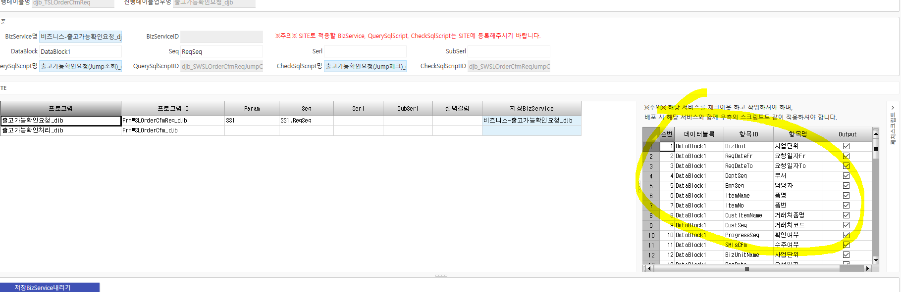

# 진행 주의사항

1.  진행대상테이블등록 - 신규입력

> ex. 출고가능확인요청_djb
>
>  
>
>  

2.  진행설정

    1.  개발툴 진행테이블 입력 하면 화면 나옴

    2.  오른쪽 항목들은 비즈니스에 있는 항목들이 나옴

    3.  

3.  Jump진행현황 -\> Jump신규등록

    1.  컬럼명 안 맞는 것들 수동으로 매칭 가능

패치스크립트 반영시 Common에도 추가

 

Jump조회 sp 작성 시 ProgParamData 필수

참고 (djb_SWSLOrderCfmReqJumpQuery)