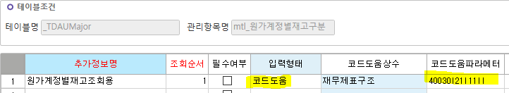

# 추가정보정의 - 코드도움 파라미터 넣기

SetTypeComboSheet(SS1, 'UMSituationName', SS1.ActiveRow, 19999, '1110052', '111000001', CellText(SS1,SS1.ActiveRow,'UMOccTypeSeq'), '', false)

 

SetTypeCombo(txtProfitDiv, 40030, '40030' ,'21', '11', '', false)

 

40030\|21\|11

 

- 콤보로 하면 파라미터 값이 안 먹음 / 코드도움으로 작성

 

 

