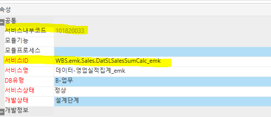
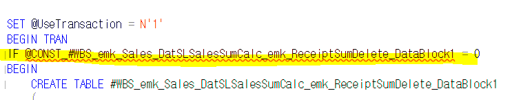

# 스칼라 변수 "@CONST \~~ 선언해야합니다.

메시지 137, 수준 15, 상태 2, 줄 85

스칼라 변수 "@CONST\_#WBS_emk_Sales_DatSLSalesSumCalc_emk_ReceiptSumDelete_DataBlock1"을(를) 선언해야 합니다.

메시지 137, 수준 15, 상태 1, 줄 102

스칼라 변수 "@CONST\_#WBS_emk_Sales_DatSLSalesSumCalc_emk_ReceiptSumDelete_DataBlock1"을(를) 선언해야 합니다.

메시지 137, 수준 15, 상태 2, 줄 151

스칼라 변수 "@CONST\_#WBS_emk_Sales_DatSLSalesSumCalc_emk_ReceiptSumCreate_DataBlock1"을(를) 선언해야 합니다.

메시지 137, 수준 15, 상태 1, 줄 168

스칼라 변수 "@CONST\_#WBS_emk_Sales_DatSLSalesSumCalc_emk_ReceiptSumCreate_DataBlock1"을(를) 선언해야 합니다.

 

 

 

 

 

Ace에서 데이터서비스 사용 시

서비스 ID 로 테이블 생성

 

표준 화면의 경우 서비스내부코드에 따라서

\#TSLDeleteReceiptSum 이런 식으로 생성 해준다

 

=\> 비즈니스는 새로 생성해도 데이터 서비스는 표준으로 사용해야함