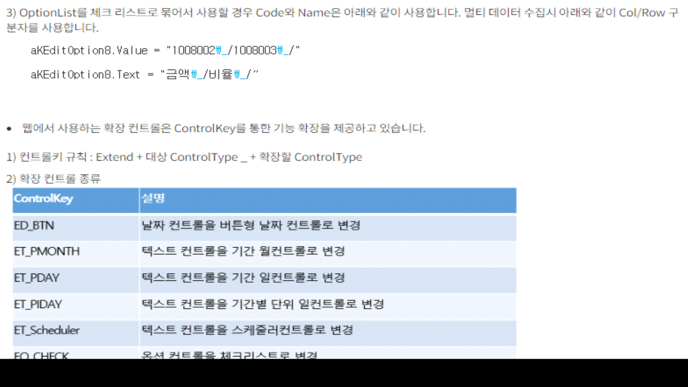
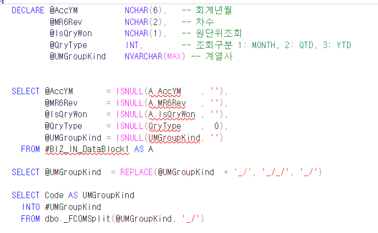
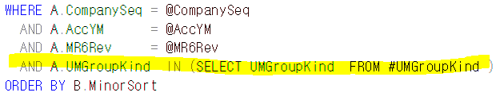

# OptionList

참고화면 : FrmWACAsstDepreList_mcnk

 

 

optUMGroupKindName        OptionList        계열사        DataBlock1        UMGroupKindName        UMGroupKind                QRY;EO_CHECK;

 

--비즈니스 (-1 : max)

00DataBlock1                        UMGroupKind                121001,-1,0        10

 

 

DECLARE @AccYM NCHAR(6), -- 회계년월

@MR6Rev NCHAR(2), -- 차수

@IsQryWon NCHAR(1), -- 원단위조회

@QryType INT, -- 조회구분 1: MONTH, 2: QTD, 3: YTD

@UMGroupKind NVARCHAR(MAX) -- 계열사

 

SELECT @AccYM = ISNULL(A.AccYM , ''),

@MR6Rev = ISNULL(A.MR6Rev , ''),

@IsQryWon = ISNULL(A.IsQryWon , ''),

@QryType = ISNULL(QryType , 0),

@UMGroupKind = ISNULL(UMGroupKind, '')

FROM \#BIZ_IN_DataBlock1 AS A

 

SELECT @UMGroupKind = REPLACE(@UMGroupKind + '\_/', '\_/\_/', '\_/')

 

SELECT Code AS UMGroupKind

INTO \#UMGroupKind

FROM dbo.\_FCOMSplit(@UMGroupKind, '\_/')

 

WHERE A.CompanySeq = @CompanySeq

AND A.UMGroupKind IN (SELECT UMGroupKind FROM \#UMGroupKind )

 

