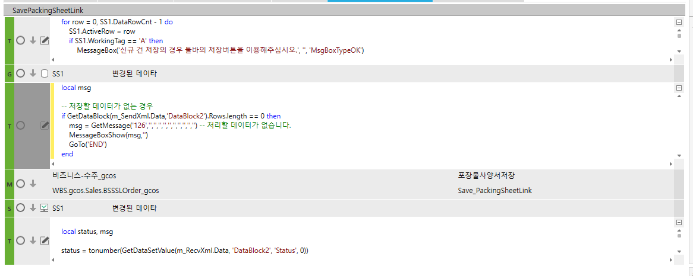

# 버튼 저장

for row = 0, SS1.DataRowCnt - 1 do

SS1.ActiveRow = row

> if SS1.WorkingTag == 'A' then
>
> MessageBox('신규 건 저장의 경우 툴바의 저장버튼을 이용해주십시오.', '', 'MsgBoxTypeOK')
>
> GoTo('END')
>
> return
>
> end

end

 

local msg

 

-- 저장할 데이터가 없는 경우

if GetDataBlock(m_SendXml.Data,'DataBlock2').Rows.length == 0 then

> msg = GetMessage('126','','','','','','','','','','') -- 처리할 데이터가 없습니다.
>
> MessageBoxShow(msg,'')
>
> GoTo('END')

end

 

 

local status, msg

 

status = tonumber(GetDataSetValue(m_RecvXml.Data, 'DataBlock2', 'Status', 0))

 

if status == 0 then

> MessageBoxShow('저장 완료 되었습니다.','')

else

> MessageBoxShow(GetDataSetValue(m_RecvXml.Data, 'DataBlock2', 'Result', 0),'')

end

 

DROP PROCEDURE gcos_SWSLOrderGetPackingSheetLinkSave

GO

CREATE PROCEDURE gcos_SWSLOrderGetPackingSheetLinkSave

@ServiceSeq INT = 0,

@WorkingTag NVARCHAR(10)= '',

@CompanySeq INT = 1,

@LanguageSeq INT = 1,

@UserSeq INT = 0,

@PgmSeq INT = 0,

@IsTransaction BIT = 0

AS

-- 로그테이블 남기기(마지막 파라메터는 반드시 한줄로 보내기)

EXEC \_SCOMXmlLog @CompanySeq ,

@UserSeq ,

'gcos_TSLOrderItem', -- 원테이블명

'#BIZ_OUT_DataBlock2', -- 템프테이블명

'OrderSeq,OrderSerl' , -- 키가 여러개일 경우는 , 로 연결한다.

@PgmSeq, ''

IF EXISTS (SELECT 1 FROM \#BIZ_OUT_DataBlock2 WHERE WorkingTag = 'U' AND Status = 0 )

BEGIN

UPDATE gcos_TSLOrderItem

SET PackingSheetLink = A.PackingSheetLink,

LastUserSeq = @UserSeq,

LastDateTime = GETDATE(),

PgmSeq = @PgmSeq

FROM \#BIZ_OUT_DataBlock2 AS A

JOIN gcos_TSLOrderItem AS B ON B.CompanySeq = @CompanySeq

AND B.OrderSeq = A.OrderSeq

AND B.OrderSerl = A.OrderSerl

WHERE A.WorkingTag = 'U' AND A.Status = 0

IF @@ERROR \<\> 0

BEGIN

RETURN

END

-- 사이트용 테이블 로직(수정 시 사이트용 테이블에 데이터 없을 경우 신규 생성합니다.)

INSERT INTO gcos_TSLOrderItem(

CompanySeq,

OrderSeq,

OrderSerl,

OrderSubSerl,

PackingSheetLink,

LastUserSeq,

LastDateTime,

PgmSeq)

SELECT @CompanySeq,

A.OrderSeq,

A.OrderSerl,

ISNULL(A.OrderSubSerl,0),

A.PackingSheetLink,

@UserSeq,

GETDATE(),

@pgmSeq

FROM \#BIZ_OUT_DataBlock2 A

WHERE WorkingTag = 'U'

AND Status = 0

AND NOT EXISTS(SELECT 1

FROM gcos_TSLOrderItem AS B WITH(NOLOCK)

WHERE B.CompanySeq = @CompanySeq

AND A.OrderSeq = B.OrderSeq

AND A.OrderSerl = B.OrderSerl

AND A.OrderSubSerl = B.OrderSubSerl)

IF @@ERROR \<\> 0

BEGIN

RETURN

END

END

RETURN

/\*\*\*\*\*\*\*\*\*\*\*\*\*\*\*\*\*\*\*\*\*\*\*\*\*\*\*\*\*\*\*\*\*\*\*\*\*\*\*\*\*\*\*\*\*\*\*\*\*\*\*\*\*\*\*\*\*\*\*\*\*\*\*\*\*\*\*\*\*\*\*\*\*\*\*\*\*\*\*\*\*\*\*\*\*\*\*\*\*\*\*\*\*\*\*\*\*\*/