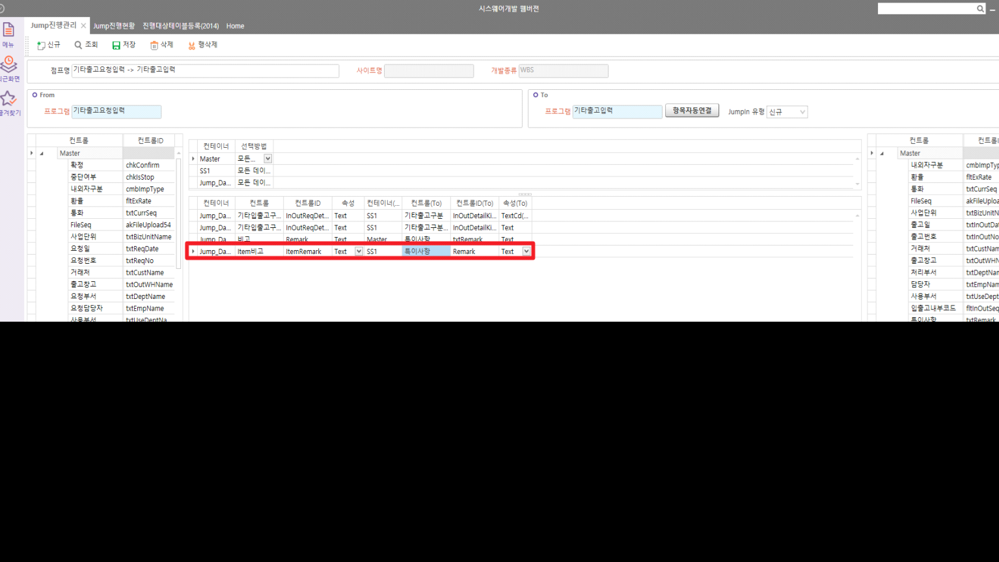

# Jump 진행관리 수기 입력

기타출고요청입력 -\> 기타출고입력

 

 

|     | From              | To          |
|-----|-------------------|-------------|
| 전  | 시트의 Remark     | 시트 Remark |
| 후  | 시트의 ItemRemark | 시트 Remark |

왼쪽의 From의 데이터를 드래그 후 To 데이터 수기로 입력

 

