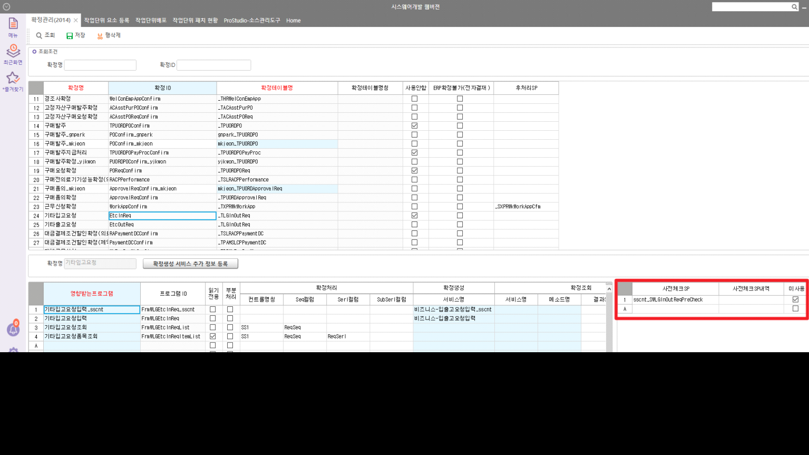
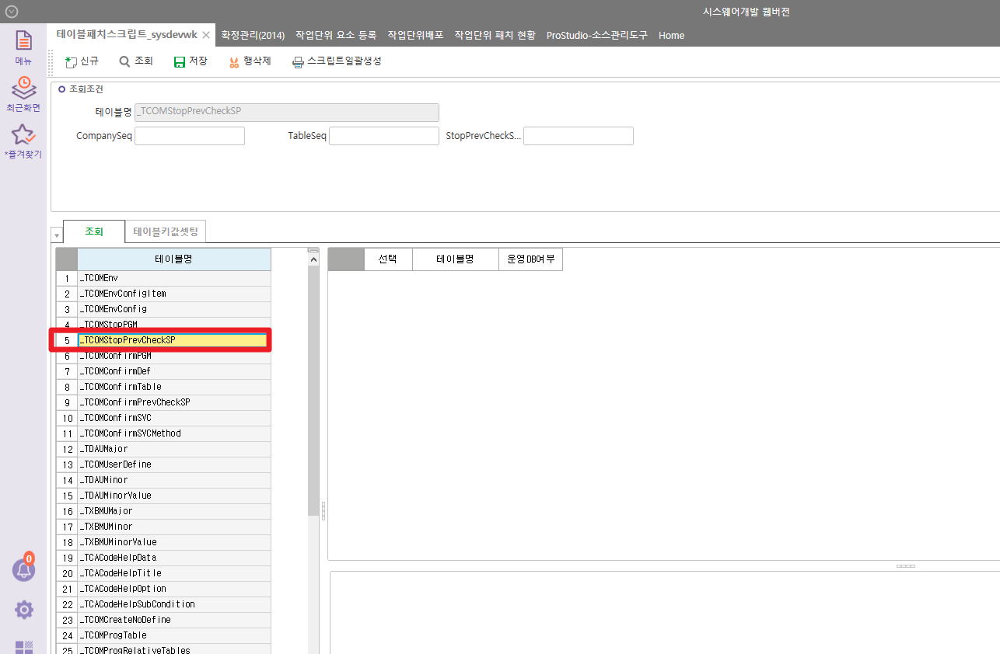

# 확정 사전체크 sp

DROP PROCEDURE das_SWPJTSVCProjectConfirmCheck

GO

CREATE PROCEDURE das_SWPJTSVCProjectConfirmCheck

@CompanySeq INT = 1,

@ConfirmSeq INT = 0,

@UserSeq INT = 0,

@LanguageSeq INT = 1

AS

 

 

DECLARE @MessageType INT,

@Status INT,

@Results NVARCHAR(250)

 

CREATE TABLE \#BIZ_OUT_DataBlock1(

Result NVARCHAR(100)

,MessageType INT

,Status INT

,WorkingTag NCHAR(1)

,SVCSeq INT

,PJTSeq INT

)

INSERT INTO \#BIZ_OUT_DataBlock1(Result, MessageType, Status, WorkingTag, SVCSeq, PJTSeq)

SELECT '' AS Result

,0 AS MessageType

,0 AS Status

,'D' AS WorkingTag

,A.CfmSeq

,C.PJTSeq

FROM \#TCOMConfirm AS A

JOIN das_TPJTServicePJTItem AS B ON B.CompanySeq = @CompanySeq

AND B.SVCSeq = A.CfmSeq

JOIN \_TPJTProject AS C ON C.CompanySeq = B.CompanySeq

AND C.PJTNo = B.SVCPJTNo

WHERE A.Status = 0

AND A.CfmCode = '0'

 

 

IF EXISTS (SELECT 1 FROM \#BIZ_OUT_DataBlock1 WHERE WorkingTag = 'D')

BEGIN

EXEC \_SWCOMCodeDeleteCheck @CompanySeq, @UserSeq, @LanguageSeq, '\_TPJTProject', '#BIZ_OUT_DataBlock1', 'PJTSeq'

END

 

 

 

UPDATE A

SET Result = REPLACE(B.Result,'삭제','확정취소'),

MessageType = B.MessageType,

Status = B.Status

FROM \#TCOMConfirm AS A

JOIN \#BIZ_OUT_DataBlock1 AS B ON B.SVCSeq = A.CfmSeq

WHERE A.Status = 0

AND A.CfmCode = '0'

AND B.Status \<\> 0

 

RETURN

--GO

--EXEC \_SWCOMConfirmProc N'1',N'1',N'27292',N'128410304',N'51',N'',N'',N'0',N'0',N'0'

테이블 : \_TCOMConfirmPrevCheckSP

 

sp 예시 : sd_SWSLDVReqPreCheck / hct_SWSLDVReqPreCheck

 

업체 ERP에서는 사전체크SP, 사전체크SP내역은 기입이 안됨

1.  두 컬럼 입력,미사용 체크

2.  SP, 테이블스크립트 패치 (단순히 SP 명만 가져가기 때문에, 꼭 패치로 할 필요는 없다)

3.  업체 ERP 가서 미사용 해제

 

 

 

 

 

 

 

 

 

DROP PROCEDURE sd_SWSLDVReqPreCheck

GO

CREATE PROCEDURE sd_SWSLDVReqPreCheck

@CompanySeq INT = 1,

@ConfirmSeq INT = 0,

@UserSeq INT = 0,

@LanguageSeq INT = 1

AS

DECLARE @MessageType INT,

@Status INT,

@Results NVARCHAR(250)

 

-- 이미 진행된 공용창고-\>부서창고 이동처리 존재시, 공용수량 수정 불가

UPDATE \#TCOMConfirm

SET Status = 99999,

Result = '이동처리 되지 않은 공용창고이동수량이 존재합니다.'

FROM \#TCOMConfirm AS A

JOIN \_TSLDVReqItem AS B WITH(NOLOCK) ON B.CompanySeq = @CompanySeq

AND A.CfmSeq = B.DVReqSeq

LEFT OUTER JOIN \_TLGInOutDailyItem AS C WITH(NOLOCK) ON B.CompanySeq = C.CompanySeq

AND B.DVReqSeq = C.Dummy9

AND B.DVReqSerl = C.Dummy10

AND C.InOutType = 80 -- 이동처리

WHERE B.CompanySeq = @CompanySeq

AND A.Status = 0

AND A.CfmCode = '1'

AND ISNULL(B.Dummy9,0) \<\> 0

AND C.CompanySeq IS NULL

 

RETURN

go

--\_SWCOMConfirmProc_Ttest N'1',N'1',N'186',N'500593',N'240',N'',N'',N'1',N'0',N'0'