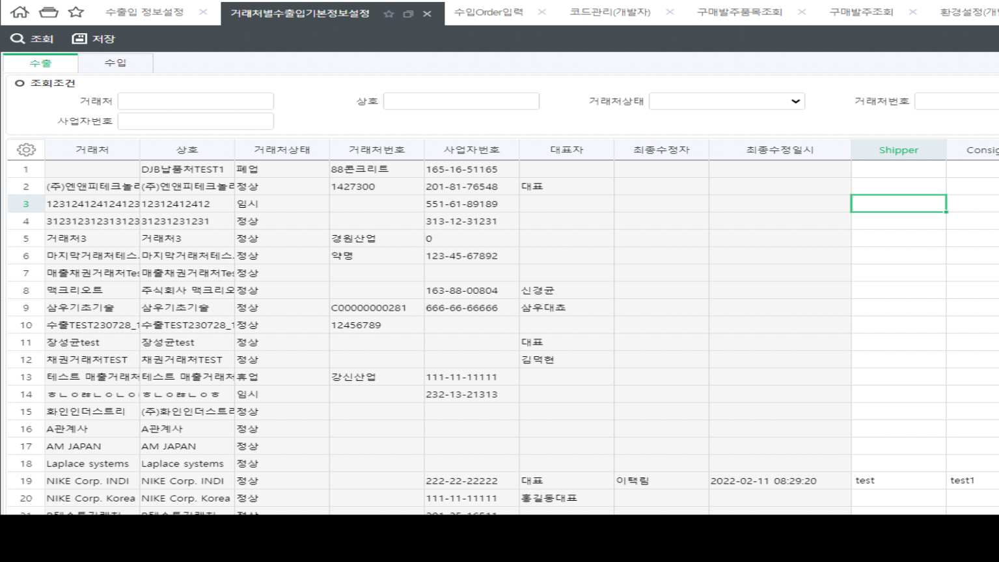
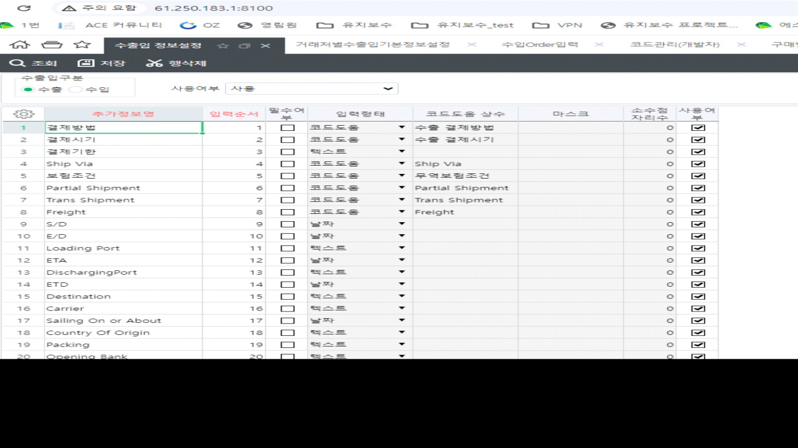

# 수출, 수입 추가정보정의

DECLARE @CompanySeq INT = 1

,@LanguageSeq INT = 1

,@DefineUnitSeq INT = 8212001 -- 수출 / 수입 = 8212002

SELECT -- A.Title,

CASE WHEN ISNULL(A.WordSeq,0) = 0 THEN ISNULL(A.Title, '') ELSE ISNULL(Dic.Word,'') END AS Title,

A.TitleSerl,

A.CodeHelpConst,

A.IsEss,

A.SMInputType AS SMInputType,

A.CodeHelpParams,

'',

A.MaskAndCaption,

A.QrySort,

A.IsCodeHelpTitle,

A.IsFix,

> A.DecLen

FROM \_TCOMUserDefine AS A WITH(NOLOCK)

LEFT OUTER JOIN \_TCADictionary AS Dic WITH(NOLOCK) ON A.CompanySeq = @CompanySeq

AND Dic.LanguageSeq = @LanguageSeq

AND A.WordSeq = Dic.WordSeq

WHERE A.CompanySeq = @CompanySeq

AND A.TableName = '\_TSLExpImpInfo'

AND A.DefineUnitSeq = @DefineUnitSeq

ORDER BY A.QrySort

거래처 기본정보 입력화면 : 거래처별수출입기본정보설정

 

 

화면명 : 수출입 정보설정

 

