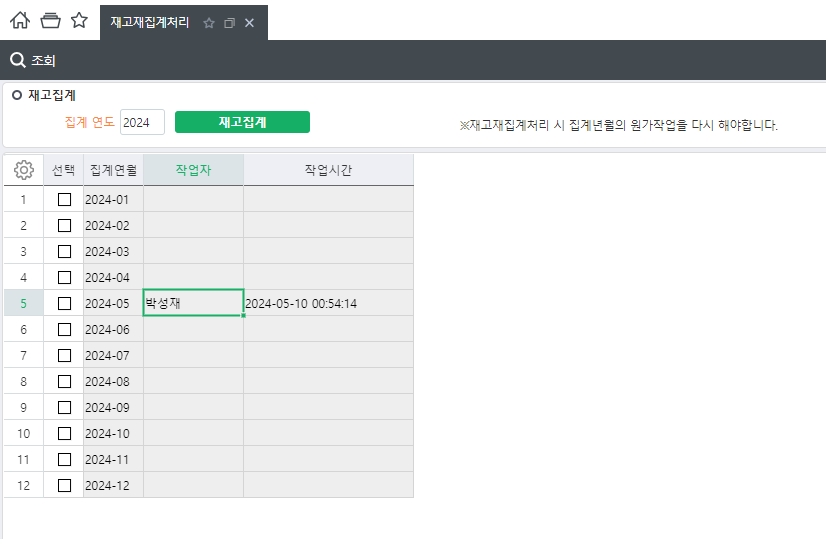

# 재고재집계처리

\_SWLGReInOutStockSum

| \_TLGReStockHist | 재집계 이력테이블 |
|------------------|-------------------|

 

\_TLGInOutStock

\_TLGInOutLotStock

\_TLGWHStock

\_TLGLotStock

 

SELECT \* FROM \_TLGInOutStock WHERE InOutYM = '202412'

SELECT \* FROM \_TLGInOutLotStock WHERE InOutYM = '202412'

SELECT \* FROM \_TLGWHStock WHERE StkYM = '202412'

SELECT \* FROM \_TLGLotStock WHERE StkYM = '202412'