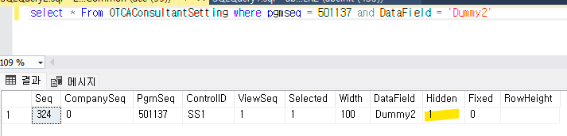
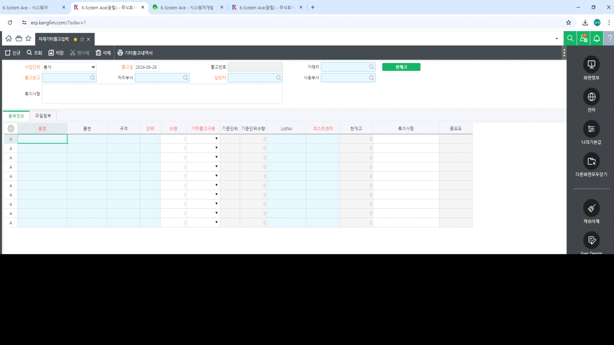

# 시트 설정 관리 - 기존 시트설정 삭제

프로그램 항목 속성에서 DIS 설정한 컬럼 값이 HID 되어 나오는 현상

 

=\> '컨설턴트 시트 설정'이 되어있음

 

 

1.  개발자 모드 로그인 (?isdev=1)

> <https://erp.kanglim.com/?isdev=1>

2.  설정하려는 화면 우측 상단 클릭

> 

 

3.  시트 설정 관리 - 기존 시트설정 삭제

 

+. 추가적으로, 화면의 Ever Design 기능을 통해 해당 컨트롤에 설정된 값들을 확인할 수 있습니다.

지금 같은 경우, 시트 설정으로 인해 HID/DIS가 모두 체크된 상태인 것을 볼 수 있습니다.