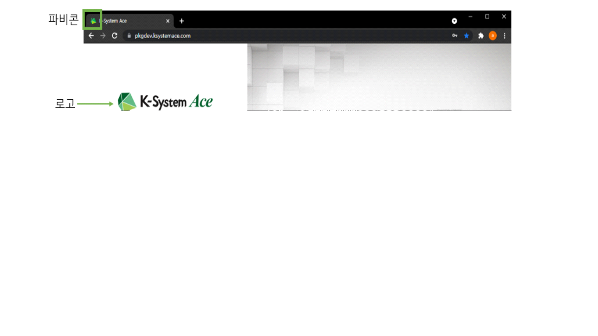
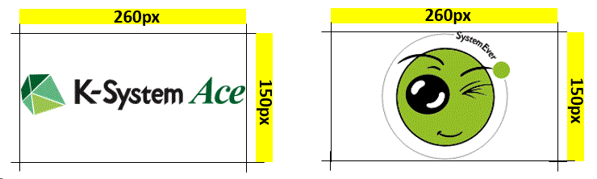
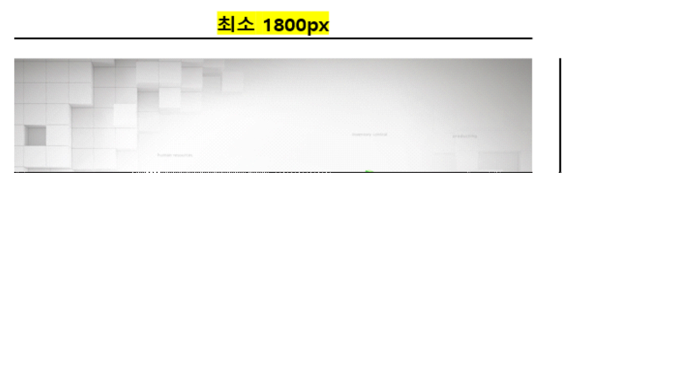
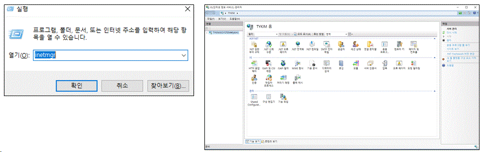
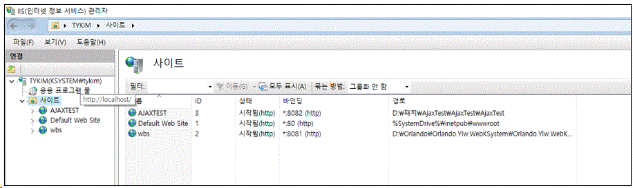
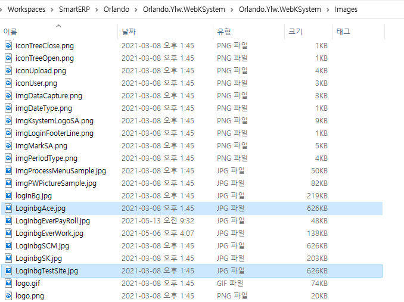
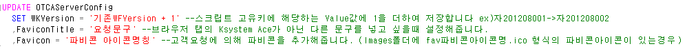
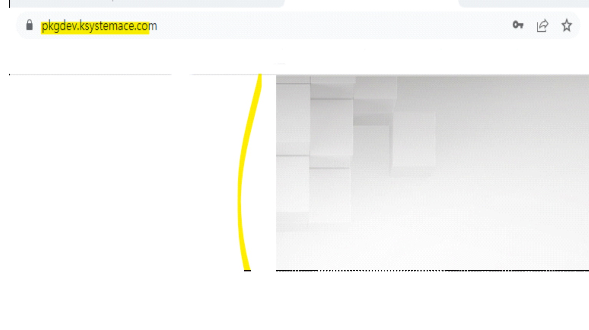
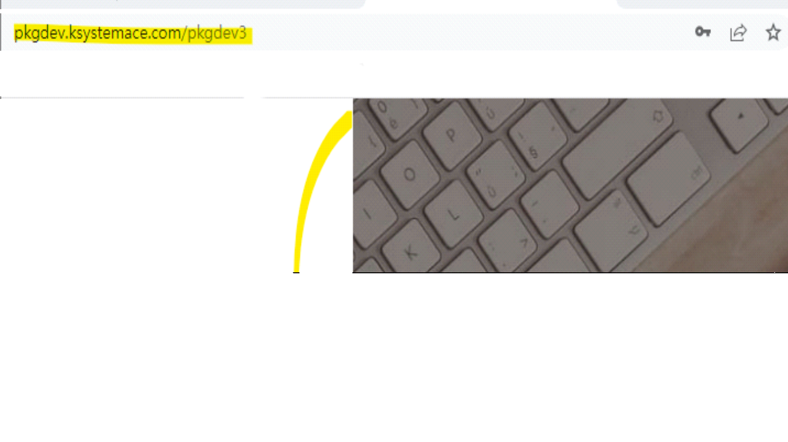
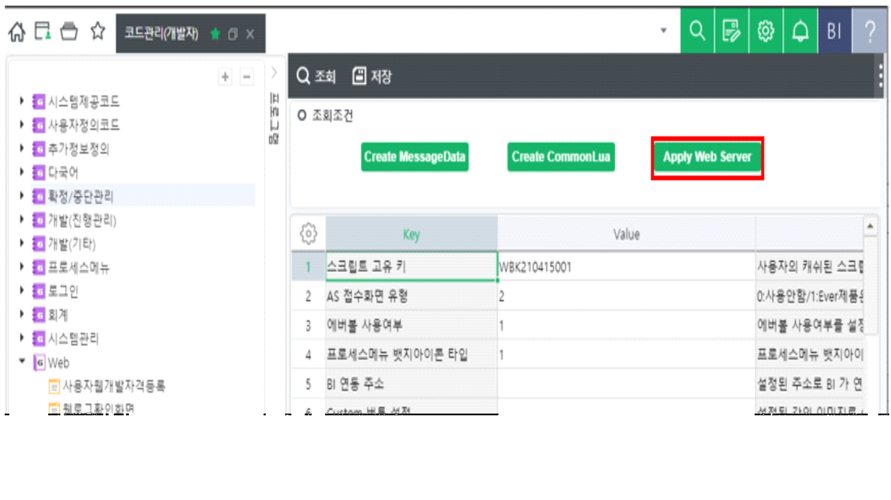

# > 로고 및 로그인 배경 변경 가이드

> 로고 및 로그인 배경 변경 가이드
>
>  
>
> 로고로그인배경
>
>  
>
>  
>
> \[주의사항\]
>
>  
>
> 로고 및 배경이미지 변경 시 이전에 배포된 가이드(PPT)의 경우 OTCAServerConfig의 Thema값을 변경하도록 되어있습니다.
>
>  
>
> Thema값을 변경하지 않도록 주의 부탁드립니다.(변경 필요 값은 아래 설명 참고)
>
> 이미지 가이드
>
>  
>
>  
>
> 
>
>  

- 로그인페이지의 로고 변경을 원하는 경우, 고객사에서 로고로 사용하고자 하는 이미지를 전달받습니다.

- 로고이미지는 아래 조건을 충족해야 합니다.

> ◦ 확장자 : 모든 확장자
>
>  
>
> ◦ 권장사이즈 : 가로 260px X 세로 150px 권장 (가로 150px ~ 350px /세로 50px~ 150px 가능)
>
>  
>
> ◦ 배경색 : 투명 또는 RGB(242,245,246) / \#F2F5F6 에 해당하는 색
>
>  
>
> ◦ 파일명 : logo+고객사사이트명(siteinit).확장자
>
> ex) logoYLW.png
>
>  
>
> 
>
>  

- 로그인페이지의 로그인 배경 변경을 원하는 경우, 고객사에서 배경이미지로 사용하고자 하는 이미지를 전달받습니다.

- 로그인 배경이미지는 아래 조건을 충족해야합니다.

> ◦ 확장자 : 모든 확장자
>
>  
>
> ◦ 권장사이즈 : 최소 가로 1800px X 세로 1200px 이상 권장 (기본값: 1874px \* 1200px)
>
>  
>
> ◦ 파일명 : Loginbg+고객사사이트명(siteinit).확장자
>
> ex) LoginbgAce.jpg
>
>  
>
> 
>
>  
>
>  
>
> 로고 및 로그인배경 이미지 변경 방법
>
>  
>
> 1\) 이미지를 넣기 위해 WEBERP가 설치된 터미널로 접속합니다.(고객연결정보 참고)
>
>  
>
> 2\) 실행창에서 Inetmgr을 검색하면 IIS(인터넷정보서비스) 관리자가 실행됩니다.
>
>  
>
> 
>
>  
>
> 3\) 좌측의 트리에서 사이트를 클릭하면 우측에 해당 서버의 사이트를 확인 가능합니다.
>
>  
>
> 4\) WEBERP 주소의 포트와 동일한 포트를 가진 사이트의 경로를 확인하여 해당 경로로 이동합니다.
>
>  
>
> Ex) WEBERP주소가 ylw.com:8081인 경우 아래 그림에서는 3번째 사이트의 경로가 WEBERP설치 경로입니다.
>
>  
>
> 
>
>  
>
> 5\) WEBERP 설치 경로에서 Images폴더 내로 이동합니다.
>
>  
>
> 6) Images 폴더 내에 이미지명을 변경하여 붙여넣습니다.
>
> 6-1) 로고 변경

- 기본 이미지명 : logoAce.gif

- 다른 이미지로 변경 시

> Ex) logoTestSite.png (logo+고객사사이트명(siteinit).확장자) 로 변경하고자 할 때
>
>  
>
> 다음 SQL문을 적용 시켜줍니다.
>
> SQL복사
>
> UPDATE OTCAServerConfig\
> SET WKVersion = '기존WFVersion + 1'\
> ,LogoAlias = 'TestSite' --고객사사이트명(siteinit)\
> ,LogoImageFormat = 'png' --로고 이미지 확장자
>
> \[참고\] 확장자 변경을 하지 않는 경우 LogoImageFormat = null 으로 세팅합니다.
>
>  
>
> 6-2) 로그인 배경이미지 변경

- 기본 이미지명 : LoginbgAce.jpg

- 앞서 로고 변경 시에 OTCAServerConfig 테이블의 LogoAlias를 변경 한 경우

> 기존 이미지 LoginbgAce.jpg 파일을 하나 더 복사하여 이미지명을 LoginbgTestSite.jpg 으로 변경해 줍니다.
>
>  
>
> Ex) LoginbgTestSite.jpg (Loginbg+고객사사이트명(siteinit).확장자)
>
>  
>
>  
>
>  
>
> 
>
>  
>
> 7\) Favicon이나 Favicon Title을 변경하고 싶은 경우
>
> 7-1) Favicon의 경우
>
> \- Images폴더 내에 전달받은 Favicon 아이콘을 \[fav+DB에 저장된 파비콘의 아이콘명.ico\]로 지정하여 붙여넣습니다.
>
> Ex) fav파비콘명.ico
>
>  
>
> 
>
> SQL복사
>
> UPDATE OTCAServerConfig\
> SET WKVersion = '기존WFVersion + 1'\
> ,FaviconTitle = '요청문구'\
> ,Favicon = '파비콘 아이콘명칭'
>
>  
>
>  
>
> 7-2) Favicon Title을 변경하고 싶은 경우
>
> \- 요청문구를 하기 8번 Update문 내 FaviconTitle 컬럼에 작성하여 운영 DB에 적용 후, 서버에서 재생합니다.
>
>  
>
> 8\) 로그인, SIGNIN 버튼 색을 변경하고 싶은 경우 (6.1.7.1004 버전 이후부터 가능합니다.)
>
> SQL복사
>
> UPDATE OTCAServerConfig\
> SET LoginBgColor = '로그인버튼 색' --css background color를 기준으로 작성해주시면 됩니다. (ex1. red, ex2. \#000)
>
>  
>
> 9\) 좌측하단 로고를 숨김처리하고 싶은 경우 (6.1.7.1004 버전 이후부터 가능합니다.)
>
>  
>
> \[참고\] 좌측하단 로고는 라이선스 표기를 위함이므로 다른 이미지로 변경은 미지원합니다.
>
> SQL복사
>
> UPDATE OTCAServerConfig\
> SET FwOption = '0000000001' --FwOption 컬럼의 10번째 값을 1로 변경해주시면 숨김처리 됩니다. (\*10번째 값만 추가/수정해주시면 됩니다)
>
>  
>
>  
>
> 법인별로 로고 및 로그인배경 이미지를 설정하고싶은 경우
>
>  
>
> 1\) 운영DB - OTCACompanyConfig 값 변경
>
> sql복사
>
> --변경 원하는 법인의 CompanySeq를 조건으로 법인별 이미지를 사용할지 여부 설정(0: 사용x, 1: 사용o)\
> UPDATE OTCACompanyConfig SET UseLoginImage = 1, UseLogoImage = 1\
> WHERE CompanySeq = @CompanySeq\
> --변경 원하는 법인의 CompanySeq를 조건으로 배경화면이미지와 로고이미지의 확장자 입력\
> --지원 확장자 : 모든 확장자\
> UPDATE OTCACompanyConfig SET LoginImgFormat = 'png', LogoImageFormat = 'gif'\
> WHERE CompanySeq = @CompanySeq
>
>  
>
> 2\) IIS 접속 후 Images/LoginImg 폴더에 이미지 복사

- 이때 이미지의 파일명은

>   ◦ 로고의 경우 \[Logo + 사이트이니셜\] ex) Logopkgdev3.png
>
>  
>
>   ◦ 배경화면의 경우 \[Loginbg + 사이트이니셜\] ex) Loginbgpkgdev3.png
>
>  
>
>  
>
> ex) 법인 별 배경화면 설정
>
>  
>
> 
>
>  
>
> 
>
>  
>
>  
>
> 주의사항
>
> 위 변경사항을 적용하기 위해서는 서버를 재생해주셔야합니다.
>
>  
>
> \[서버 재생 방법\]

- Ace: 코드관리(개발자) -\> Web -\> 웹서버설정화면 -\> Apply Web Server 버튼 클릭

>  
>
> 

- Ever: 98번 화면에서 재생

- 화면이 없는 경우 ERP가 설치된 App 서버 접속 후 풀 재생을 해주셔야합니다.

>  
>
> *웹 로그 화면을 사용할 수 없는 웹수발주의 경우 IIS 풀 재생을 해야됩니다.*
>
> 풀 재생 방법
>
>  
>
> 실행창(windows+R)에서 Inetmgr 입력 후 IIS(인터넷정보서비스) 관리자 실행 \> 아래 캡쳐사진에서 pkgdev_wk 대신 고객사 운영서버인경우 사이트이니셜_wk 클릭 \> 오른쪽 작업 창에 재생 클릭(한번)
>
>  
>
> 
>
>  
>
> 10\) 재로그인 시 로고가 변경됩니다.
>
>  
>
> 출처: \<<https://kdc.ksystem.co.kr/WebDev>\>