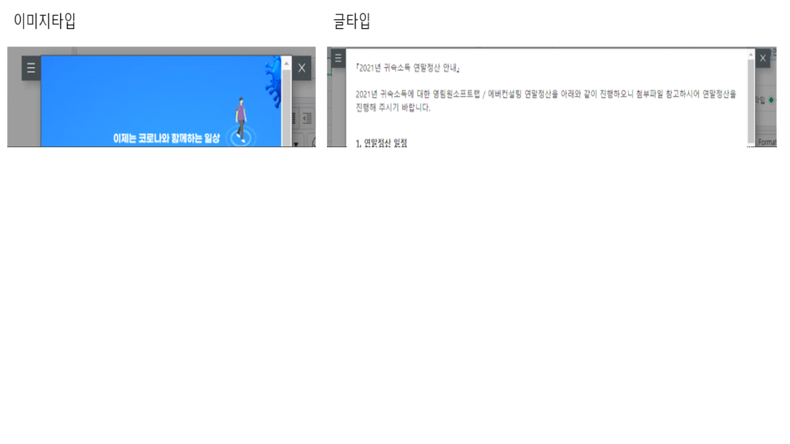
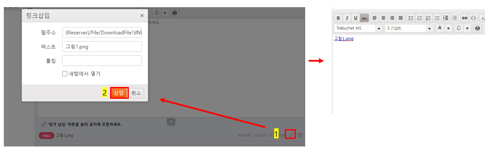
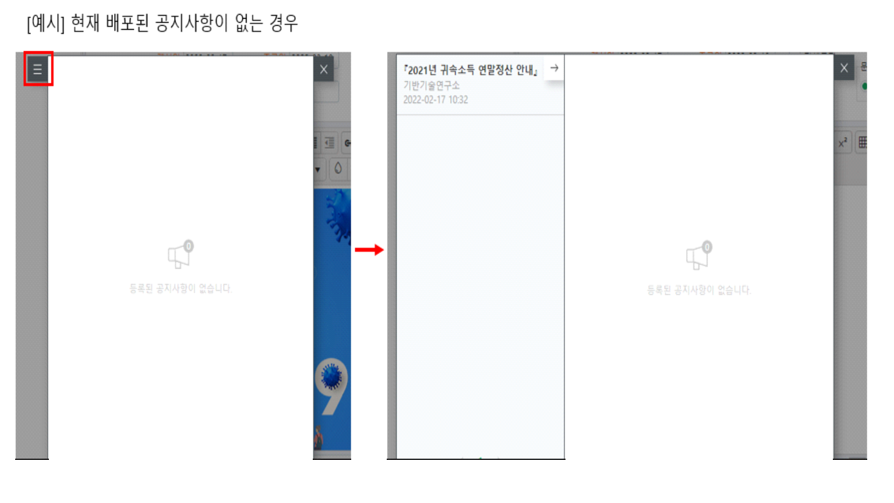
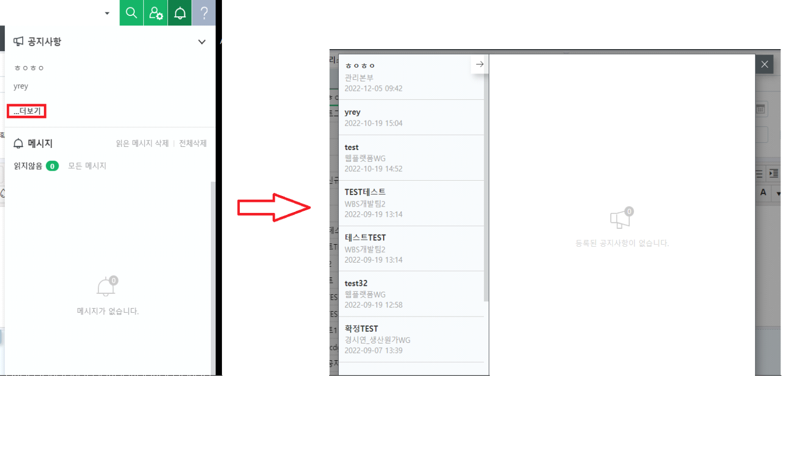
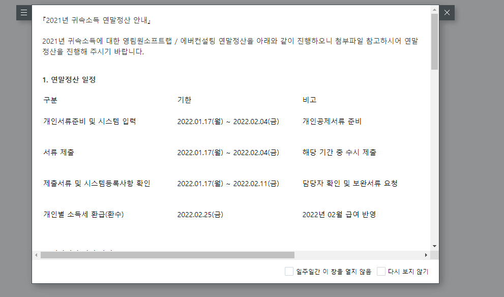

# 아이콘 숨김 / 알림 숨김 처리

> 공지사항 가이드
>
>  
>
> 공지사항공지
>
>  
>
>  
>
> \[참고\] 공통 6.1.7.1005 버전 이후부터 지원합니다.
>
>  
>
> \[아이콘 숨김처리 방법\]
>
> 1\) 운영DB에서 OTCAServerConfig 테이블의 FwOption 컬럼 12번째 값을 1로 UPDATE
>
> 2\) \[코드관리(개발자)\] -\> 웹서버설정화면에서 Apply Web Server 버튼 클릭

- \[웹서버설정화면\] 화면이 없어 'Apply Web Server 클릭'이 불가능한 경우 ERP가 설치된 App서버 접속 후 풀 재생을 해주셔야 합니다.

> [IIS 풀 재생 방법](https://kdc.ksystem.co.kr/?p=-q9UJURZ1P9b4y6M3syiPgHMMnPauha460RY6iS-OP5uffr70pPXKdGsPqgGo4TTJux7KVloaXW4fcOTWrAzLzLjnAbugilFInXvNId8Wz0=)
>
> \[공지사항등록(관리자)\]

- 관리자가 공지사항등록(관리자) 화면을 통해 공지사항을 배포, 관리하는 화면입니다.

- 프로세스 구성: 원하는 프로세스 위치에 구성하여 사용하시면 됩니다.

>  
>
>  
>
> 
>
>  

- 공지사항이 등록된 순서로 정렬되는 것이 디폴트이며, 행 선택 후 화살표를 클릭하여 행순서를 변경할 수 있습니다.

>  
>
> 
>
> \[공지사항 화면 정보\]
>
> -\> 우측 공지사항 정보 영역에 공지사항을 등록할 수 있습니다.

- 제목: 좌측 공지사항 리스트에서 관리하기 위한 제목으로, 에디터에 제목까지 별도로 포함해서 작성 필요

- 게시일, 종료일: 작성일보다 이전인 날짜를 지정할 수 없음

- 넓이, 길이: 직접 지정하여 팝업 크기를 설정 가능

- 문서종류: 이미지타입은 팝업크기에 딱맞게 지정되고, 글타입은 일정부분 띄어서 지정됨

>  
>
> 

- 확정: 확정버튼을 클릭해야 배포가 됨

- 공지그룹명: 공지그룹 설정 가능. (\[공지그룹등록\] 화면에 등록된 사용자에게만 공지사항을 띄울수 있게 제공된 기능으로 6.1.7.1008 버전부터 지원합니다.)

>  
>
> \[첨부파일 등록방법\]

- \[참고\] IE와 Edge는 6.1.7.1006.01 버전부터 지원합니다.

- '공지사항 정보' 하단의 첨부파일 컨트롤에 첨부파일을 추가한 후 우측 링크삽입 아이콘을 클릭하여 에디터 영역에 직접 추가

- \[주의\] 컨트롤에만 등록하면 파일이 첨부되지 않는 점 참고부탁드립니다.

>  
>
> 
>
>  
>
> \[공지사항리스트\]
>
> -\> 좌측 공지사항리스트 영역에서 등록, 배포한 공지사항을 관리할 수 있습니다.

- 미리보기를 더블클릭하여 팝업창 미리 확인 가능

- 우측 상단 공지사항 아이콘: 배포가 되었던 이전 공지사항 확인 가능

- 6.1.7.1008 이전 공지사항 리스트

>  
>
> 

- 6.1.7.1008 이후 공지사항 리스트

>  
>
> 
>
>  
>
> \[공지사항 팝업\]
>
>  
>
> 

- 지정한 기간내에 확정된 최신 공지사항이 있는 경우 가장 마지막에 확정된 공지사항을 기준으로 팝업이 뜹니다.

- 일주일간 이창을 열지 않음, 다시보지 않기 체크박스로 숨김처리 가능합니다.

>  
>
> \[표 에디터 사용방법\]

- 표 에디터 사용방법은 아래 링크를 참고바랍니다.

> [표 에디터 사용방법](https://kdc.ksystem.co.kr/?p=iVMCcLwIe-Q7ufUWne3G9VxfLfOJwXpMcAP8Q0mAXk5KLn48QBZpOL0WpL4tov1qIoW_OoYkJ5rEU4TKr0LKliTIwzRahktlf_3oBp-fwUs4xVOnoH2IBhgzAdsgoyu1)
>
>  
>
> 출처: \<<https://kdc.ksystem.co.kr/WebDev>\>
>
>  

--아이콘 숨김 처리 방법\]

--1) 운영DB에서 OTCAServerConfig의 FwOption에 따라 12번째 값을 1로 업데이트

SELECT FwOption FROM OTCAServerConfig

 

-- 아이콘 숨김

UPDATE OTCAServerConfig

SET FwOption = '000000101001000'

FROM OTCAServerConfig

 

-- 아이콘 오픈

UPDATE OTCAServerConfig

SET FwOption = '000000101000000'

FROM OTCAServerConfig

 

 

--2) \[코드관리(개발자)\] -\> 웹서버 설정화면에서 웹서버 적용 버튼클릭

 

--\[웹 서버 설정 화면\] 화면이 없어 '웹 서버 적용'을 클릭한 경우 ERP가 있는 경우 AppServer 접속 후 풀 플레이를 할 수 있습니다.

--IIS 재생 방법

 

--\[공지사항등록(관리자)\]

--관리자가 공지사항등록(관리자) 화면을 통해 공지사항을 배포, 관리하는 화면입니다.

--프로세스 구성: 원하는 프로세스 위치에 사용하도록 구성합니다.

