# KDC - 확정 진행 중단 점프

**확정, 진행, 중단, 점프**

**확정**

목적

프로세스를 진행함에 있어 확정 권한을 가진 사용자가 확정 처리를 하며, 확정 후 해당 건의 수정/삭제를 할 수 없습니다.

해당 기능을 사용하게 되면 다음 프로세스로 진행을 하기 위해 반드시 확정 처리를 해야 하며 데이터의 신뢰성을 높이는 역할을 합니다.

설정 절차

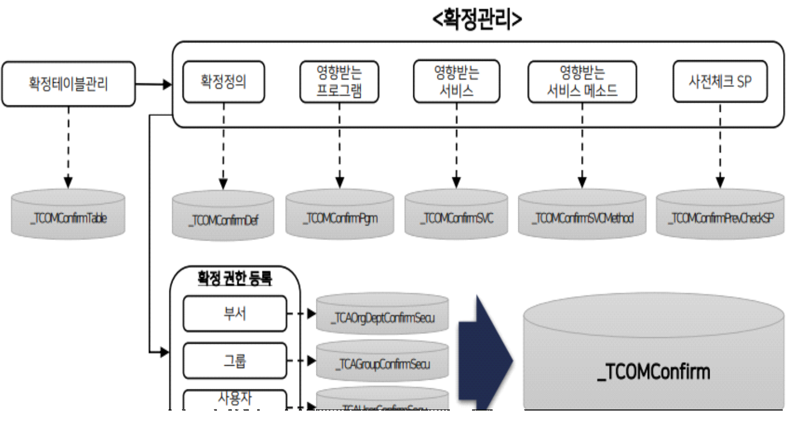

**확정 테이블 관리**

목적

확정에 대한 정의를 위한 기준이 되는 테이블을 등록합니다.

설명

확정 테이블 명칭: 테이블 명칭

확정 테이블: 확정의 기준이 되는 테이블

확정 체크되는 컬럼 레벨: 확정 처리에 대한 체크 로직 수행 시 체크할 키 값의 레벨 지정

마스터(Seq)를 기준으로 체크할 경우: 1

디테일(Serl)을 기준으로 체크할 경우: 2

4\. 체크 진행할 테이블: 확정을 정의하고자 하는 업무가 진행을 사용하는 경우 해당 업무의 진행 테이블을 입력5. 진행 체크되는 컬럼 레벨: 확정 처리 시 진행 관계에 따른 체크 로직을 수행할 때 체크할 키 값의 레벨을 지정

마스터(Seq)를 기준으로 체크할 경우: 1

디테일(Serl)을 기준으로 체크할 경우: 2

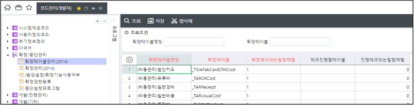

**확정 관리**

목적

확정 업무를 정의하고 세부 사항을 설정합니다.

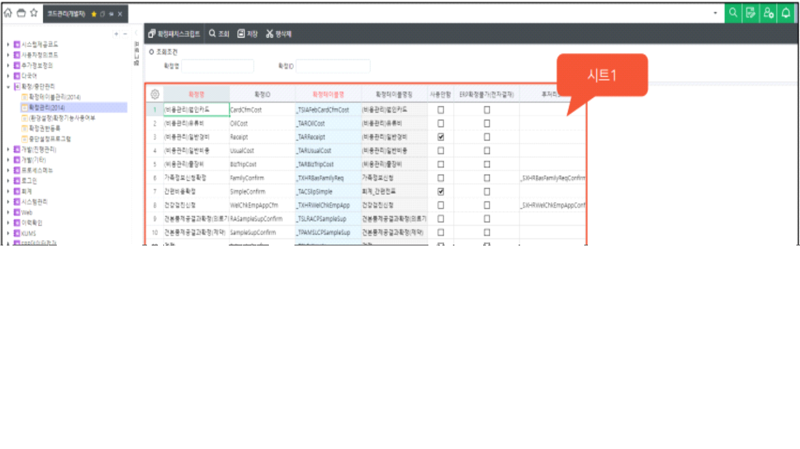

설명(시트 1)

확정명: 확정 업무의 명칭

확정 ID: 확정 업무의 고유 ID

확정 테이블 명칭: \[확정 테이블 관리\]에서 정의한 확정 테이블

사용 안 함: 확정 업무를 사용하지 않을 경우 체크

ERP 확정 불가(전자 결재): 체크 시 전자 결재 프로세스를 통해서만 확정 처리가 가능하며 ERP에서 확정 처리 불가

후처리 SP: 확정 처리/취소 후 처리할 SP 등록

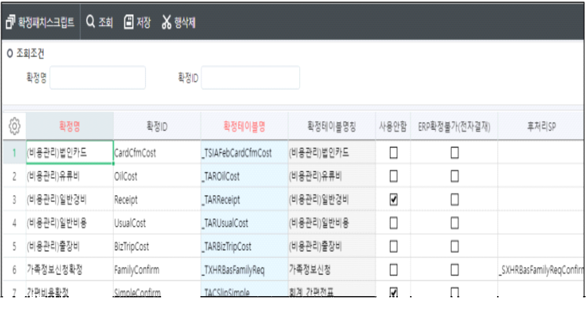

추가 설명

후처리 SP 사용

 확정을 사용할 경우 확정 처리/취소 시 호출되는 \_SWCOMConfirm SP 내에서 ‘후처리 SP’를 호출

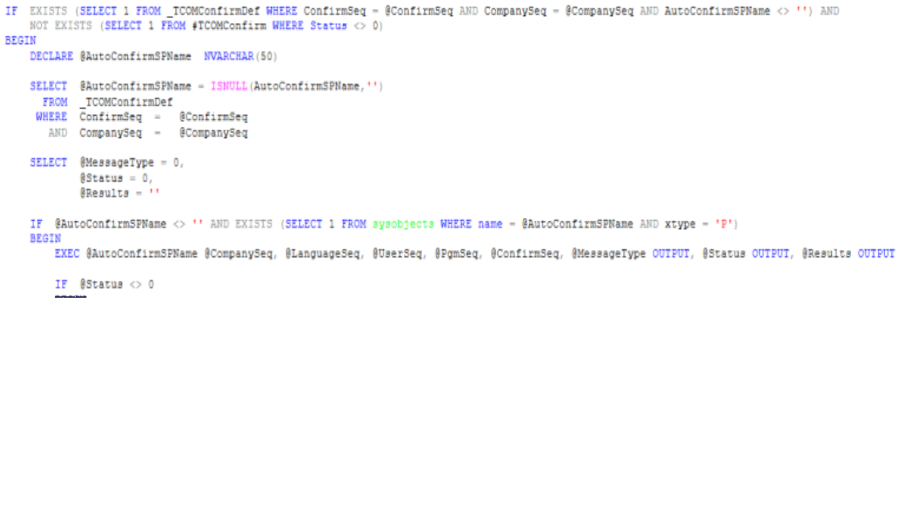

확정이 실제 처리된 \_TCOMConfirm 테이블의 상태 값을 확인하여 처리하는 것을 권장하며 사용 변수 및 Temp Table은 아래 참조

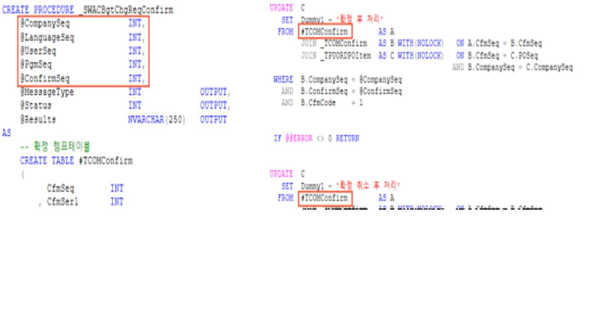

설명(시트 2)

영향 받는 프로그램: 확정 업무를 적용할 프로그램

읽기 전용: 확정 컬럼을 비활성화하여 조회 용도로만 사용하는 경우 체크

컨트롤 명칭: 확정 처리 시 처리가 발생하는 컨트롤명

Seq / Serl / SubSerl 컬럼: 프로그램 별 키 값이 되는 컬럼의 명칭

서비스명: 확정 데이터 생성 시 자동으로 로직을 반영할 비즈니스 서비스

확정 생성 서비스 추가 정보 등록: 연결된 비즈니스 서비스에 대하여 확정 데이터 생성에 필요한 세부 사항을 등록

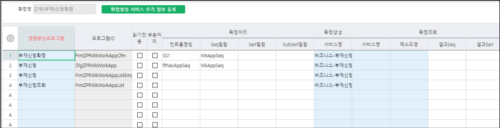

설명(확정 생성 서비스 추가 정보 등록 Dialog)

DataBlock: 확정 데이터 생성 시 기준이 되는 DataBlock명

Seq / Serl / SubSerl: DataBlock 내 키 값에 해당하는 DataField

AddDataBlock1, 2: 확정 데이터 생성 결과를 추가 반영할 DataBlock

Method 적용 체크: 확정 생성 할 메소드를 설정

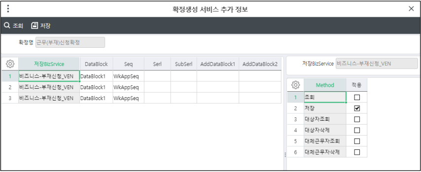

설명(시트 3)

사전 체크 SP: 확정 처리 시 추가적으로 체크할 SP ID

사전 체크 SP 내역: 해당 SP의 명칭

미사용: 체크 SP를 사용하지 않을 경우 설정

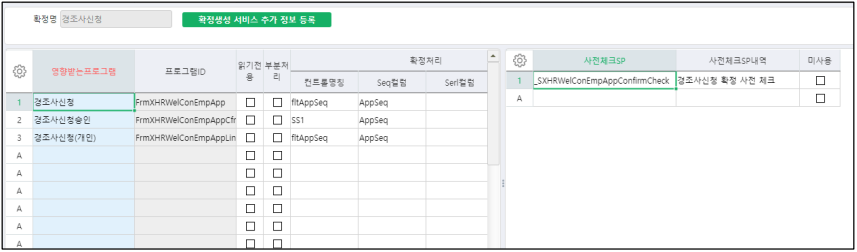

**확정 권한**

목적

해당 업무에 대한 권한을 부여하여 처리 시 체크합니다.

설명

그룹: 해당 확정명에 대한 처리 권한을 부여할 사용자 그룹 등록

사용자 추가: 해당 확정명에 대한 처리 권한을 부여할 사용자 등록

사용자 제외: 해당 확정명에 대한 처리 권한을 제외할 사용자 등록

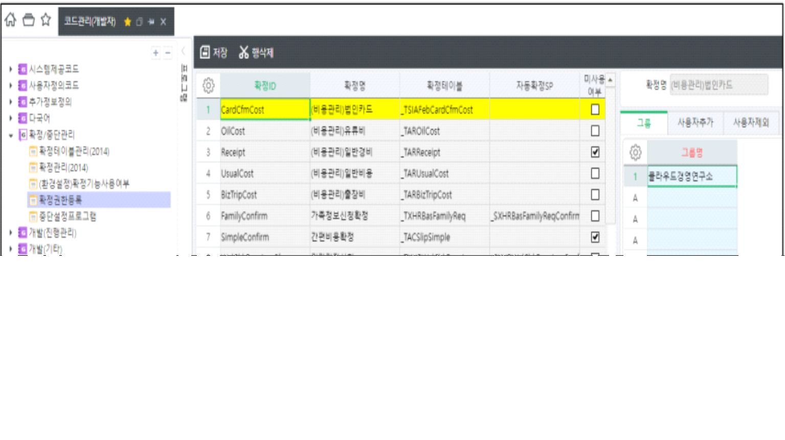

**실습**

목적

\[구매 발주 입력\]을 기준으로 확정 처리 및 데이터의 흐름을 파악합니다.

1-1 \[확정 권한 등록\] – “구매 발주” 확정을 더블 클릭하여 ‘사용자 추가‘ 탭에 권한을 부여할 사용자를 등록합니다.

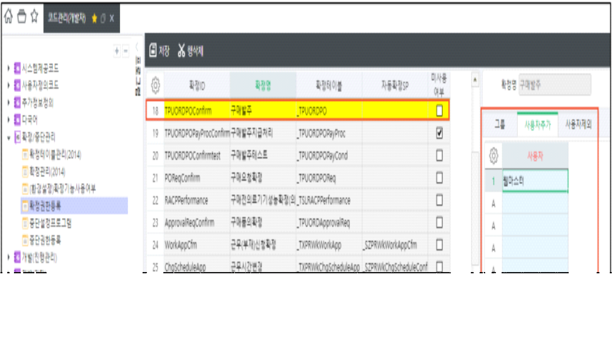

1-2. \[확정 관리(2014)\] – “구매 발주” 확정에 대한 ‘사용 안 함‘ 설정 해제 및 ‘영향받는프로그램’에 \[구매 발주 입력\] 프로그램 등록 여부를 확인합니다

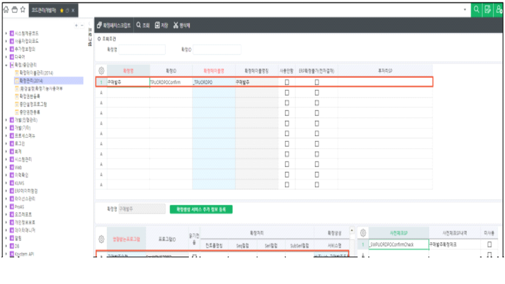

1-3. \[구매 발주 입력\] – 기본적인 데이터를 입력하고 저장합니다. (저장 시 실행되는 스크립트를 수집합니다.)

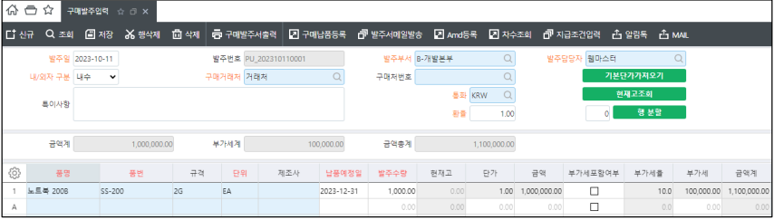

1-4. \_SWCOMConfirmCreateCHECK – 해당 프로그램의 저장 서비스WF가 실행되기 전에 확정 및 해당 건의 진행에 대한 기본적인 체크를 합니다.

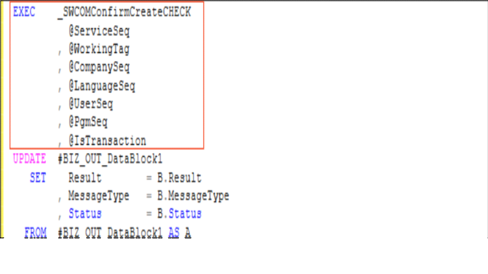

1-5. \_SWCOMConfirmCreate – 저장 서비스WF가 모두 실행된 후 생성된 업무 데이터 기준으로 확정 데이터를 생성합니다.

1-6. 생성된 확정 데이터를 확인합니다.

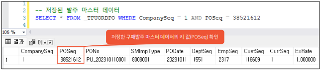

 

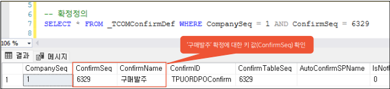

 

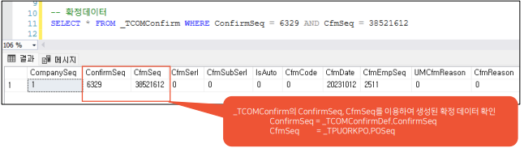

 

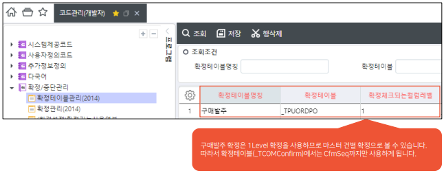

1-7. \[구매 발주 조회\] – 저장된 데이터를 조회한 후 확정 컬럼을 클릭하여 확정 처리합니다

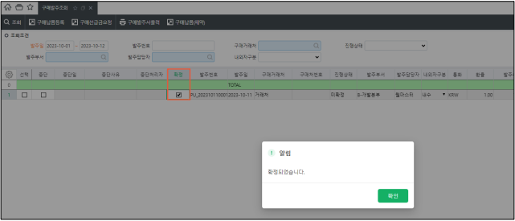

1-8. \[구매발주품목조회\] – 품목 별로 조회되는 화면으로 ‘확정’ 컬럼이 비활성화되어 조회용으로만 제공됩니다.

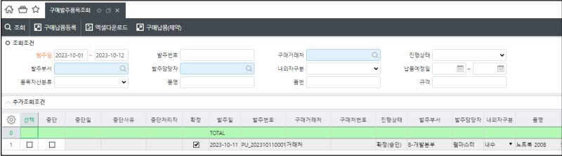

1-9. 확정 처리 데이터 확인

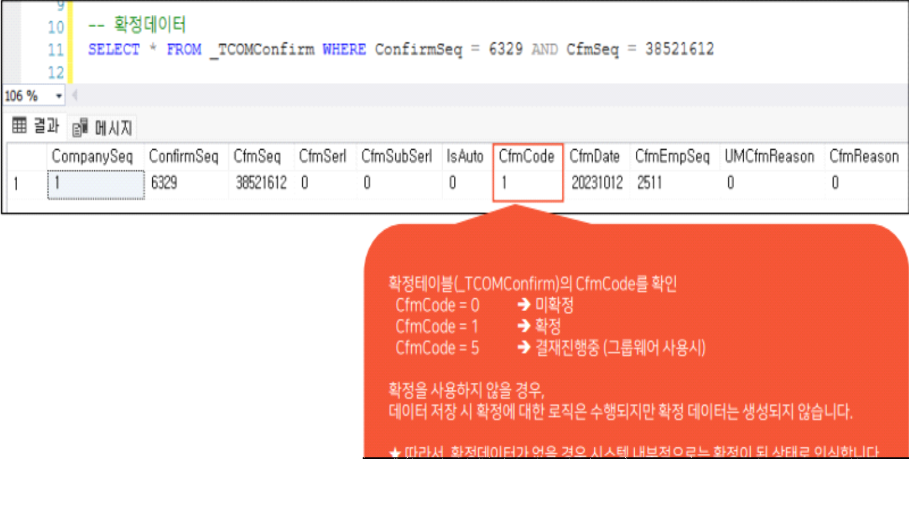

1-10. 확정 조회 로직 (ex)구매 발주 조회 SP - \_SWPUORDPOListQuery

 

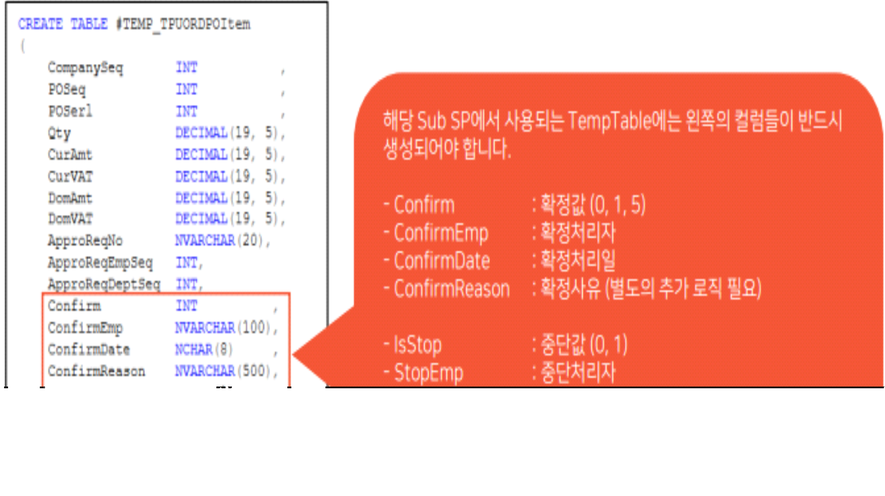

1-11. 확정 조회 로직 (ex) 구매 발주 품목 조회 SP - \_SWPUORDPOItemListQuery

1-12. 확정 정보 가져오기(\_SWCOMConfirmStopUpdate)

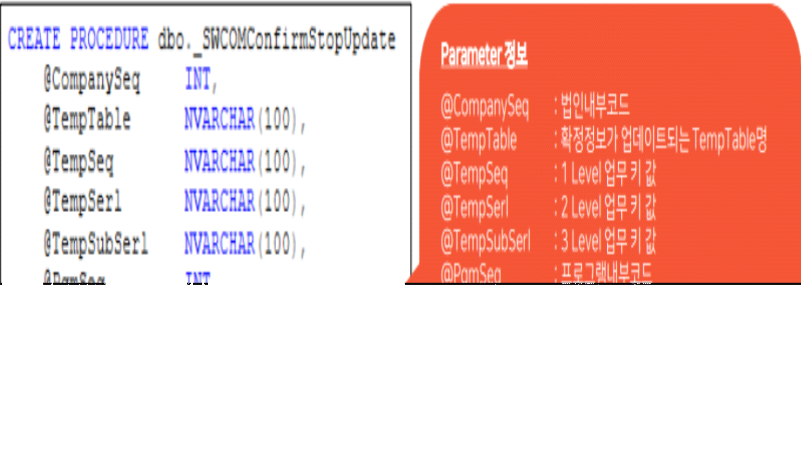

1-13. 기타 참고 사항

확정 사용 시 확정되지 않으면 다음 프로세스로 진행할 수 없습니다.

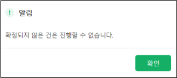

확정된 경우 해당 건에 대해서는 수정/삭제를 할 수 없습니다(확정 미사용인 경우 수정/삭제는 진행 여부만 체크합니다.)

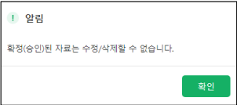

다음 프로세스로 진행된 경우 확정 취소할 수 없습니다.

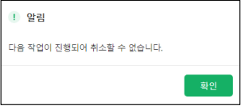

패키지는 마스터/디테일 구조로 되어있는 업무인 경우 모두 마스터 건 별 확정을 사용합니다.

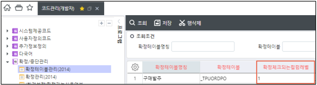

확정 컬럼은 공통에서 자동으로 시트에 적용해주는 기능이므로 프로그램 개발 시 직접 시트에 정의하지 않습니다.

단, 시트에 멀티 헤더 설정된 경우 자동 병합이 구조 상 불가하므로 단일 헤더 형태로 개발을 권장합니다.

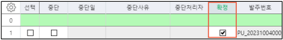

**중단**

목적

프로세스를 진행함에 있어 특정 건의 프로세스를 중단하기 위해 처리한다.

설정 절차

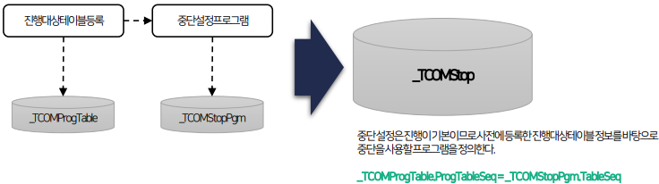

중단 설정 프로그램

프로그램명: 선택한 진행 테이블에 대해 중단을 사용할 프로그램 설정

마스터 여부: 마스터 기준으로 조회되는 프로그램인 경우 체크

IsReadOnly: 중단 컬럼에 대해 조회 용도로만 사용할 경우 체크

ControlName: 중단 컬럼을 추가하고자 하는 시트명

SeqColumn: 프로그램 시트에 정의된 첫 번째 키 값

SerlColumn: 프로그램 시트에 정의된 두 번째 키 값

SubSerlColumn: 프로그램 시트에 정의된 세 번째 키 값

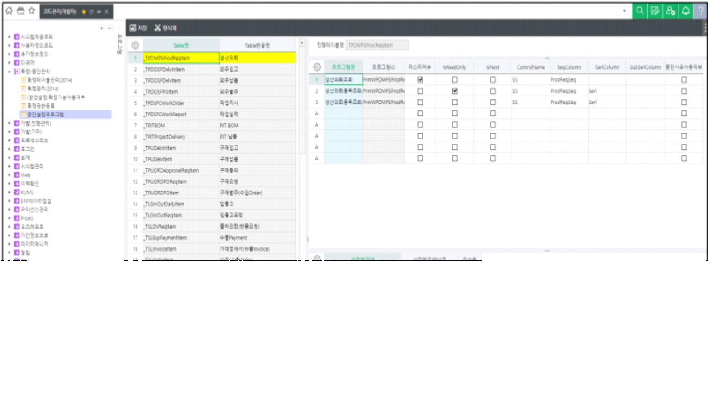

**실습**

목적

구매 발주 프로세스를 기준으로 중단 처리 및 데이터의 흐름을 파악합니다.

1-1. \[중단 설정 프로그램\] – \[구매 발주 조회\], \[구매 발주 품목 조회\] 프로그램이 정상적으로 설정되었는지 확인합니다.

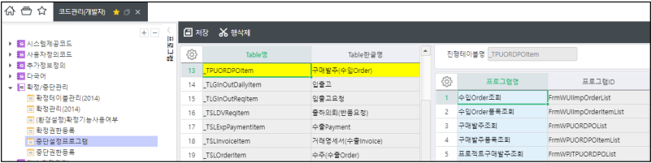

1-2. \[구매 발주 품목 조회\] – 발주 건을 조회하여 중단 처리를 합니다. (확정 데이터는 업무 데이터 저장 시 생성되나, 중단 데이터는 중단 처리 시 생성됩니다.)

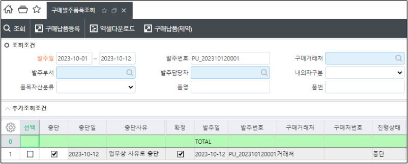

1-3. 중단 데이터 확인

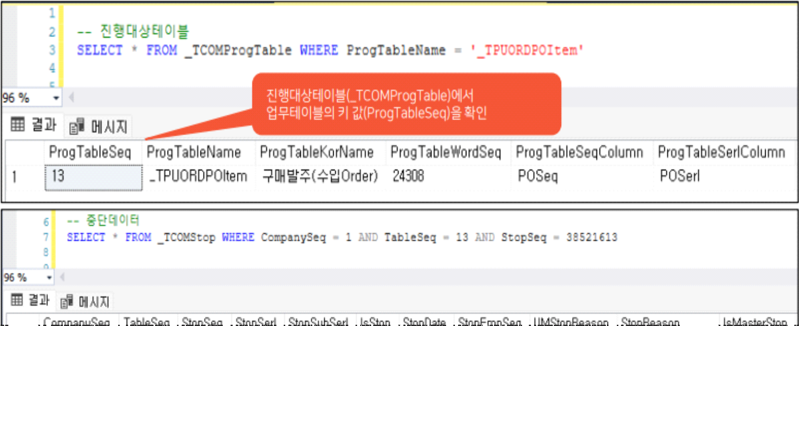

1-4. 중단 조회 로직 (ex) 구매 발주 조회 SP - \_SWPUORDPOListQuery

 

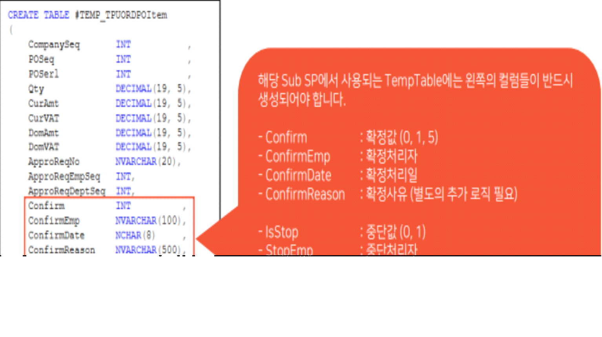

1-5. 중단 조회 로직 (ex) 구매 발주 품목 조회 SP - \_SWPUORDPOItemListQuery

1-6. 중단 정보 가져오기 (\_SWCOMConfirmStopUpdate )

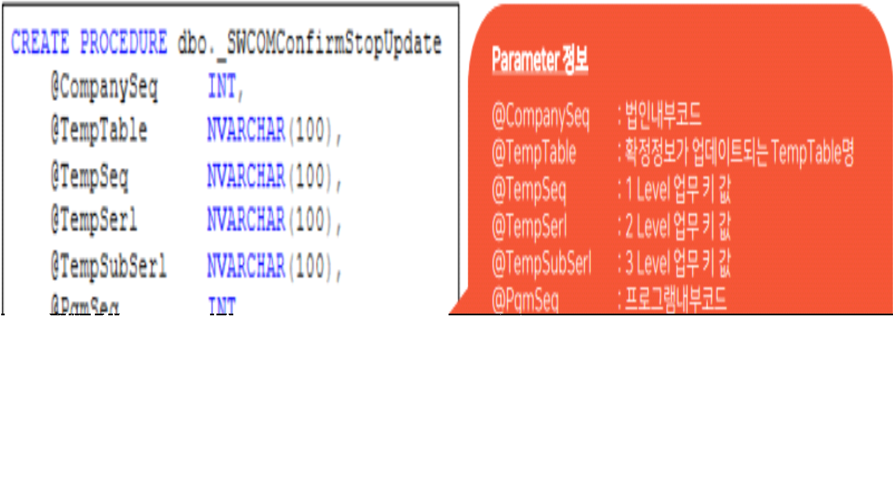

1-7. 기타 참고 사항

\[구매 발주 조회\]에서 중단 처리 시 세부 품목 건, 모두 중단 처리됩니다.

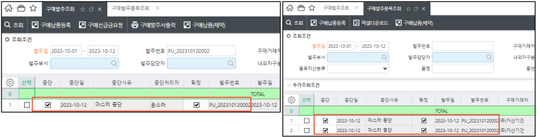

중단 처리 건에 대해서는 다음 프로세스로 진행 시 진행 수량 계산에서 제외됩니다.

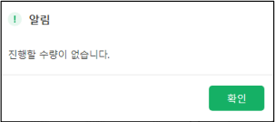

다음 프로세스로 전량 진행된 경우 중단할 수 없습니다.

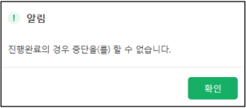

**진행**

목적

업무 프로세스 진행 시 데이터 간 연결을 공통화하여 데이터 무결성을 보장하고 유지 보수와 데이터 추적의 편리함을 제공한다.

설정 절차

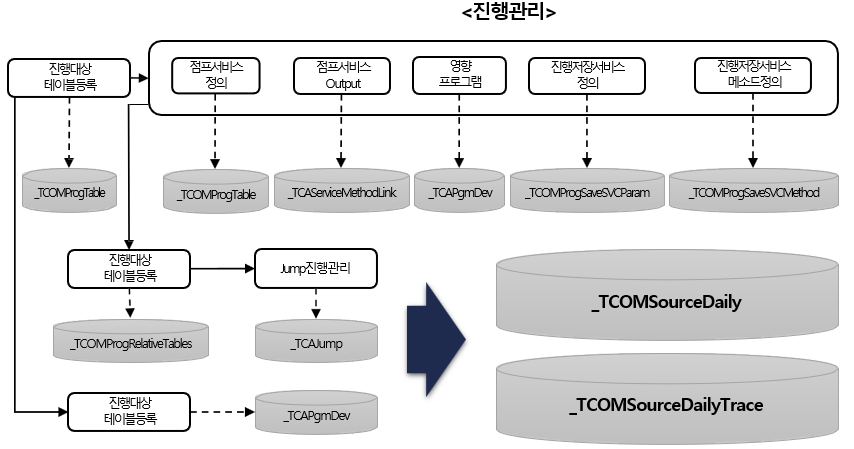

진행 대상 테이블 등

진행 테이블명: 진행을 사용할 업무 테이블

진행 테이블 업무명: 업무 테이블의 업무 명칭

진행 테이블Seq: 업무 데이터의 첫 번째 키 (마스터) 값

진행 테이블Serl: 업무 데이터의 두 번째 키 (디테일) 값

진행 테이블SubSerl: 업무 데이터의 세 번째 키 값

진행 테이블 수량: 업무 테이블 내 수량으로 관리되는 컬럼 입력

진행 테이블 기준 수량: 업무 테이블 내 기준 단위 수량으로 관리되는 컬럼 입력

진행 테이블 금액/부가세/기준 (원화)금액/기준(원화)부가세: 업무 테이블 내 관련 금액 정보 컬럼 입력

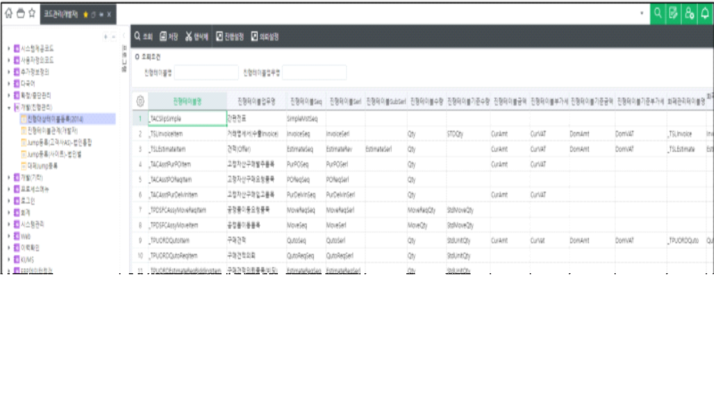

**진행 관리 테이블 설정**

목적

프로그램에서 사용할 진행 관리 테이블을 정의합니다.

설명

 \[프로그램 등록\] 및 K-Studio 에서 프로그램에 대한 진행 관리 테이블 설정 가능

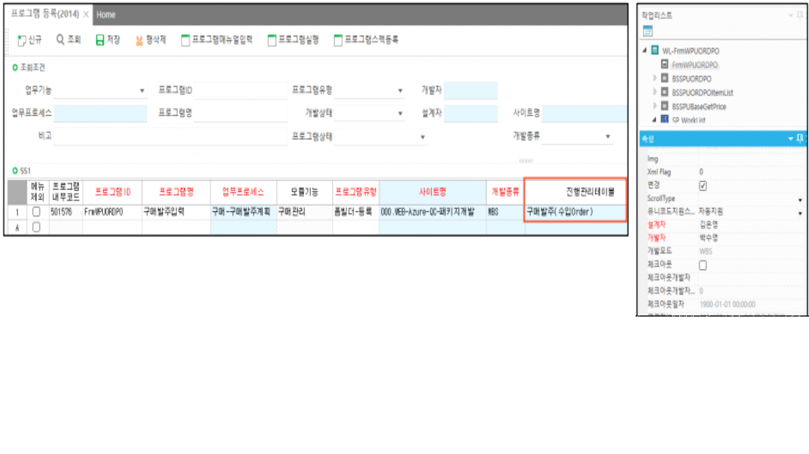

**진행 설정**

목적

진행 업무 별 세부 사항을 정의합니다.

설명(마스터)

해당 진행 테이블을 기준으로 점프 시 사용할 서비스 및 조회/체크 SP를 정의합니다.

1\. BizService명: 조회 시 사용할 서비스 등록

해당 서비스를 이용하여 DataField의 Output을 정의하는데 보통 관련 DataField가 가장 많은 품목 조회 서비스를 이용

2\. DataBlock: 서비스에서 사용할 DataBlock명

3\. Seq: 서비스 내 DataField 중 첫 번째 키 값으로 사용되는 DataField명

4\. Serl: 서비스 내 DataField 중 두 번째 키 값으로 사용되는 DataField명

5\. SubSerl: 서비스 내 DataField 중 세 번째 키 값으로 사용되는 DataField명

6\. QuerySqlScript명: 점프 시 다음 프로그램으로 넘길 데이터를 조회하기 위한 SP명 설정

7\. CheckSqlScript명: 점프 시 다음 프로그램으로 넘어갈 때 체크되어야 하는 로직이 정의된 SP명 설정

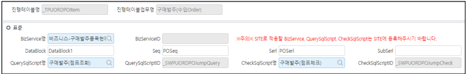

설명(시트 1)

해당 진행 테이블을 사용할 프로그램의 세부 사항을 정의합니다.

프로그램: \[프로그램 등록\]에 등록된 진행 관리 테이블을 기준으로 관련 프로그램이 조회됨.

Param: 진행 시 참조할 컬럼들이 속한 시트명 등록

Seq: 해당 업무의 첫 번째 키 값이 조회되는 컨트롤 및 컬럼명 등록

Serl: 해당 업무의 두 번째 키 값이 조회되는 컨트롤 및 컬럼명 등록

SubSerl: 해당 업무의 세 번째 키 값이 조회되는 컨트롤 및 컬럼명 등록

Checked: 시트에서 선택 컬럼을 통해 진행 시 해당 선택 컬럼의 명칭 등록

저장BizService: 등록 화면의 경우 해당 프로그램에서 저장 시 사용되는 저장 서비스를 등록

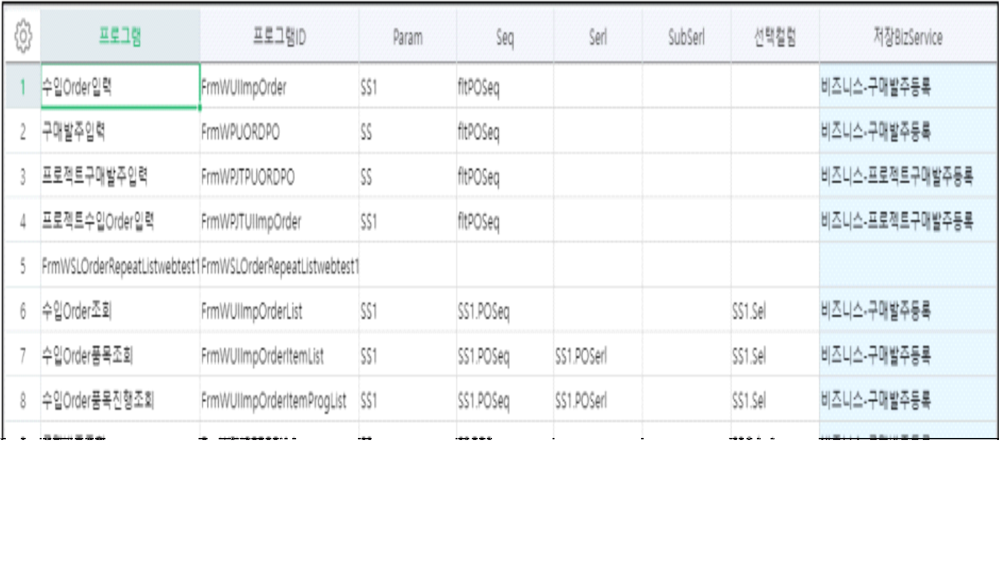

설명(시트 2)

해당 설정을 사용하여 진행 점프 시 다음 프로그램에 넘길 데이터의 Output을 정의합니다.

JumpQuery SP 수행 시 Output 되는 DataField 정의

데이터 블록/항목 ID/항목명: 마스터에 설정한 서비스의 정보가 조회됨.

Output: JumpQuery SP 수정 시 Output 대상 항목인 경우 체크

설명(시트 3, 4)

\<시트 1\>에서 정의한 등록 프로그램의 저장 서비스에 대해 진행 저장 처리를 위한 세부 사항을 설정합니다.

**\<시트 3\>**

저장BizService: "저장BizService내리기" 버튼을 통해 \<시트 1\>에서 정의한 저장 서비스 가져오기

DataBlock: 저장 서비스 내 DataBlock 중 진행 저장될 대상이 되는 DataBlock 등록

Seq/Serl/SubSerl: 진행 저장될 대상이 되는 키 값 DataField명 등록

Qty/StdQty/Amt/DomAmt/Vat/DomVAT: 진행 저장될 대상이 되는 수량/금액 정보의 DataField명 등록

**\<시트 4\>**

Method: \<시트 3\>에서 더블 클릭하여 선택한 서비스의 메소드가 조회됨.

사용 여부: 진행 저장 로직을 자동으로 생성할 서비스 메소드 선택

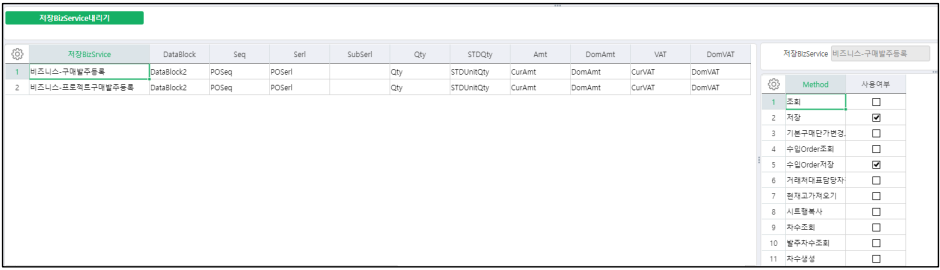

설명(사이트 설정)

해당 부분에 서비스 및 SQL Script가 설정되어 있는 경우, 해당 설정이 먼저 적용됩니다.

Output이 수정된 경우 해당 서비스 패치 시 자동으로 캐시가 재생성됩니다.

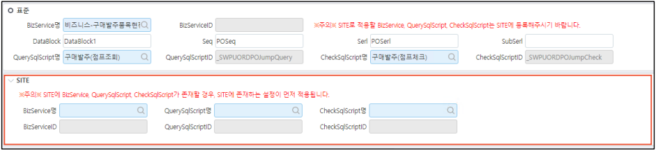

**진행 테이블 관계**

목적

진행 테이블에 대하여 From ~ To를 정의하고 해당 진행에 대해 상세 기능을 정의합니다.

설명

원천 테이블 : From 테이블이 될 진행 테이블

대상 테이블 : To 테이블이 될 진행 테이블

진행 테이블 관계 : 해당 진행이 어떤 업무에 대한 진행인지 설정 (생산/구매/물류/영업/반품 등)

진행 체크 종류 : 진행 시 체크될 기준 (수량/기준 수량/금액/존재)

초과 허용 : 원천에서 대상으로 점프 후 진행 저장 시 원천 수량보다 초과하여 저장 가능

(-) 진행 : 반품 진행에 대해 음수에 대한 정상 처리 가능

화면 부호 반전 : 진행 저장하는 프로그램에서 양수로 입력하나 실제 처리 로직이 음수로 처리되는 경우 정상 처리되도록 함

누적SUM : 다음 단계의 진행만을 고려하는 것이 아닌 진행된 모든 수량의 누적합으로 체크 (반품 진행 시 사용)

구매 발주를 기점으로 구매 반품까지 진행된 경우 해당 발주 건으로 다시 진행하고자 할 때 사용. 그러나 위와 같이 사용하면 진행 데이터의 전제 조건이 무너지게 되어 유지 보수에 어려움이 있음 (패키지는 미사용을 권장)

9\. 미사용 여부 : 해당 진행 관계에 대해 사용하지 않을 경우 체크

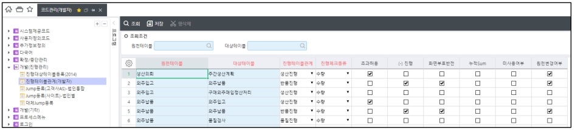

**Jump 진행 관리**

목적

From - To 프로그램을 설정하고 '점프명'을 정의합니다.

설명(마스터)

점프명: From – To 프로그램을 입력 후 저장하면 자동으로 점프명 생성

사이트명: 사이트용인 경우 해당 사이트를 입력

개발 종류: 사이트 내 개발 종류 등록

From/To 프로그램: From – To가 될 프로그램을 입력하면 자동으로 해당 프로그램의 DataField 정보가 시트에 조회됨

항목 자동 연결: 두 프로그램 간 같은 DataField를 자동으로 연결

JumpIn 유형: To 가 되는 프로그램으로 JumpIn 시 처리되는 유형 선택

\[Jump 진행 관리\]는 진행을 가진 Jump를 입력할 때 쓰이므로 ‘신규’로 입력

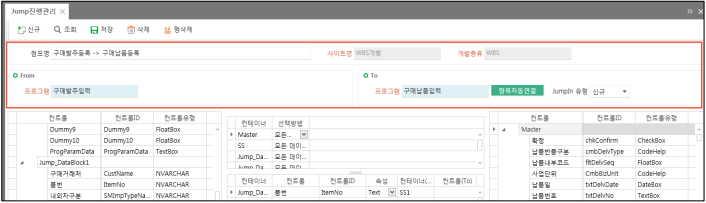

목적

From 프로그램의 DataField 정보를 확인하고 Jump 시 사용될 메소드를 정의합니다.

설명(FROM 프로그램 설정)

1\. 컨트롤 : From 프로그램 입력 시 자동으로 프로그램 내 컨트롤/컬럼 명칭 조회

 From에서는 화면 정보가 아닌 점프 데이터를 넘겨야 하므로 Jump_DataBlock1을 이용

2\. 컨트롤 ID : From 프로그램 입력 시 자동 조회되며 컨트롤/시트 컬럼 ID를 의미

3\. 컨트롤 유형 : 자동 조회 되며 DataField의 데이터 유형을 의미

4\. 실행 순서 : From 프로그램에서 JumpOut 시 실행되는 메소드의 순서

5\. 처리 유형 : From 프로그램에서 JumpOut 시 실행되는 메소드의 유형

서비스 또는 PgmMethod로 선택 가능하나 ‘PgmMethod호출’ 기능만 사용 가능

6\. 처리 : From 프로그램의 PgmMethod가 코드 도움되며 JumpOut 시 실행할 메소드를 입력

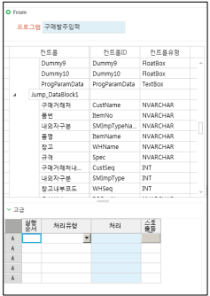

목적

To 프로그램의 DataField 정보를 확인하고 JumpIn 시 사용할 메소드를 정의합니다.

설명(TO 프로그램 설정)

컨트롤 : To 프로그램 입력 시 자동으로 프로그램 내 컨트롤/컬럼 명칭 조회

To에서는 JumpOut 된 데이터가 실제 화면에 설정되어야 하므로 Master, 시트 등 실제 화면 정보를 사용

2\. 컨트롤ID : To 프로그램 입력 시 자동 조회되며 컨트롤/시트 컬럼 ID를 의미

3\. 컨트롤 유형 : 자동 조회되며 DataField의 데이터 유형을 의미

4\. 실행 순서 : To 프로그램으로 JumpIn 시 실행되는 메소드의 순서

5\. 처리 유형 : To 프로그램으로 JumpIn 시 실행되는 메소드의 유형

서비스 또는 PgmMethod로 선택 가능하나 ‘PgmMethod호출’ 기능만 사용 가능

6\. 처리 : To 프로그램의 PgmMethod가 코드 도움되며 JumpIn 시 실행할 메소드를 입력

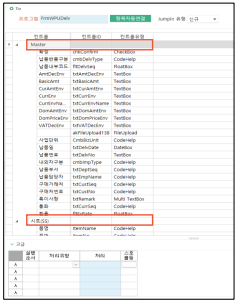

목적

From 프로그램에서 보내는 Jump 데이터를 To 프로그램의 화면 정보에 연결합니다.

설명(FROM - TO 연결)

컨테이너/컨트롤/컨트롤 ID : 연결하면 자동 표시됨

속성 : 데이터 값의 타입을 선택하여 입력

ALL : 문자/숫자, Text : 문자, TextCd : 코드 도움의 내부 코드 값, Value : 숫자

To 프로그램의 코드 도움 컨트롤에 연결해줘야 하는 경우 From Jump 데이터의 명칭 값/코드 값 모두 연결해줘야 함.

연결 정보를 개별로 연결하지 않아도 같은 DataBlock 명에 같은 DataField명이 있으면 점프 시 자동 처리됨.

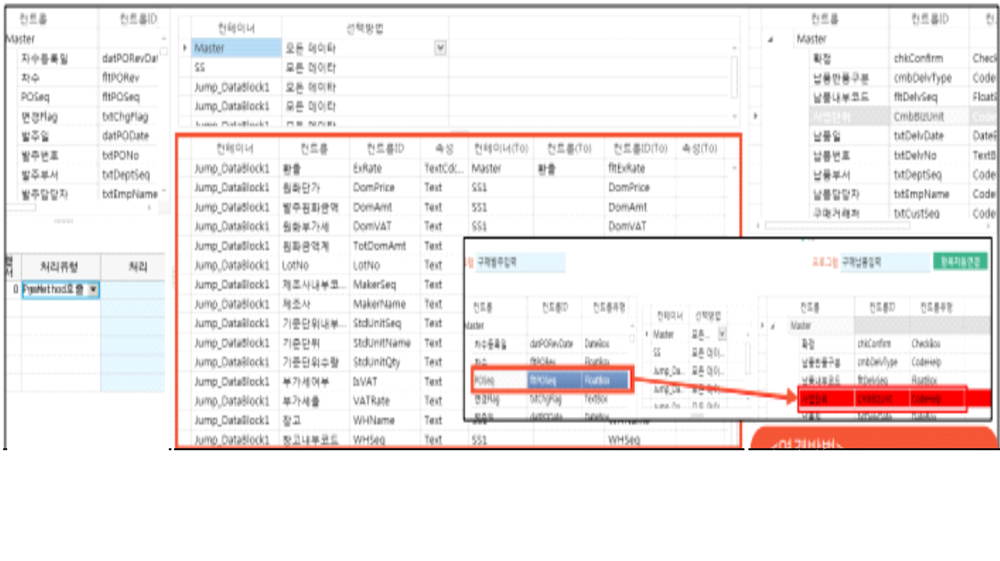

**Jump 진행 관리 복사 생성**

목적

사이트 개발 시 화면 단위 별 설정된 Jump 진행 내역을 수기로 등록해야 했으나 표준 화면의 Jump 진행을 사이트용으로 복사하여 편의성을 제공합니다.

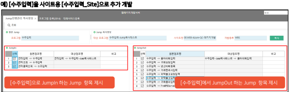

복사하고자 하는 Jump 항목을 선택하여 \<복사\> 버튼을 누르면 일괄 복사 됨.

\[견적 입력\] ➔ \[수주 입력_Site\] : 패키지 화면에서 사이트 화면으로 Jump 하는 경우는 고객 사에서 \[Jump등록(사이트)-법인 별\]을 통해 신규 생성된 Jump 항목을 추가

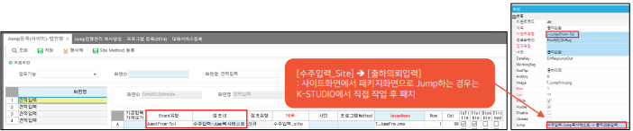

**실습**

목적

 \[구매발주입력\]에서 \[구매납품입력\]으로 점프하여 진행 저장 및 데이터의 흐름을 파악합니다.

1-1. \[구매 발주 입력\] – 2개의 품목을 입력 후 \[구매 발주 조회\]에서 발주 건에 대한 확정 처리 진행

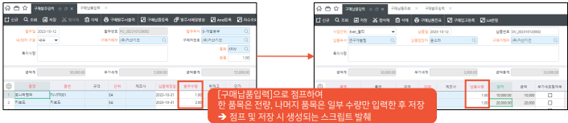

1-2. 진행 점프 시 로직 확인

1-3. 진행 저장 로직 확인

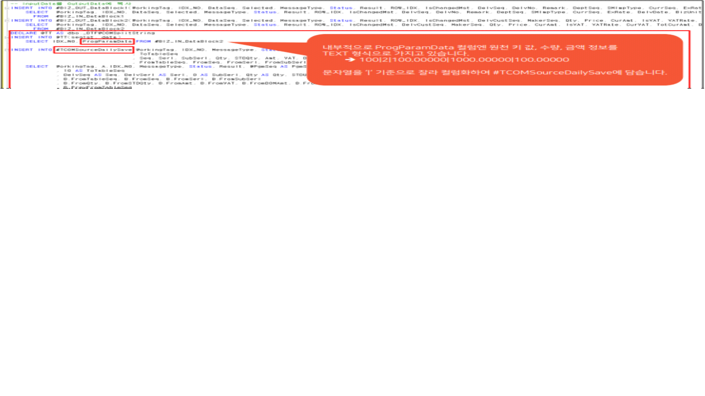

1-4. 진행 데이터 확인 - 저장된 구매 발주 품목 데이터

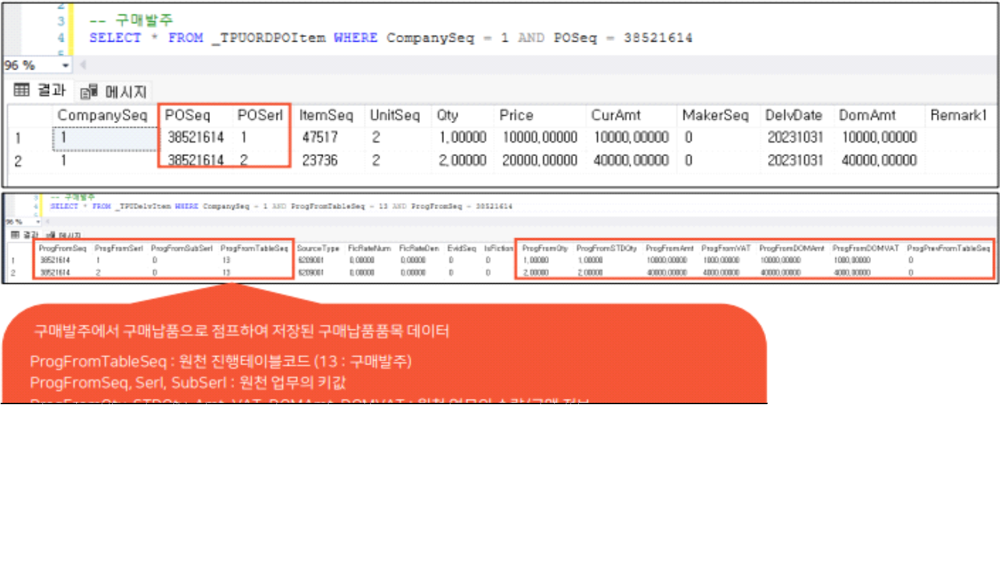

1-5. 진행 데이터 확인 – \_TCOMSourceDaily : 공통 진행 테이블로 모든 진행 테이블의 관계를 가지고 있습니다. 

1-6. 진행 데이터 확인 – \_TCOMSourceDailyTrace : 납품까지 진행된 내역에 대해 \[구매입고\]까지 진행하여 저장합니다.

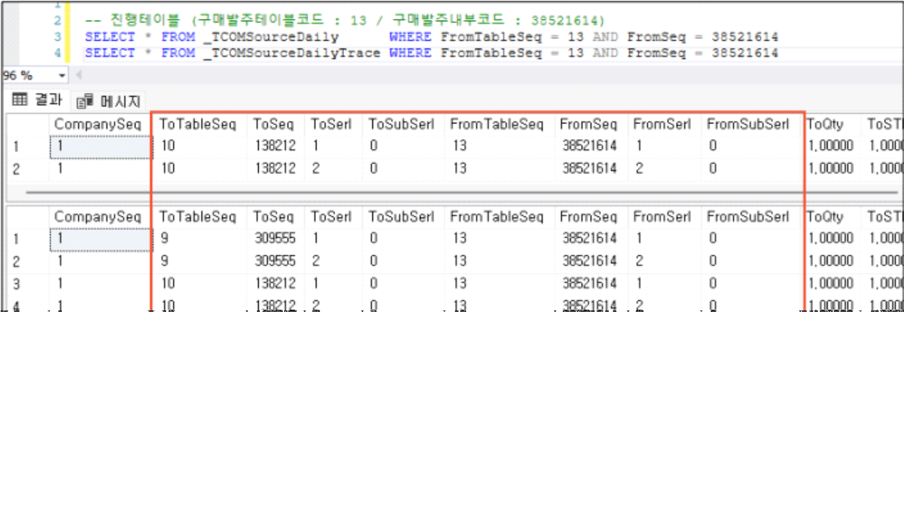

1-7. \[구매 발주 품목 조회\] – 발주 건에 대해 조회 시 진행 상태 및 납품으로 진행된 수량 및 금액 정보가 조회됩니다.

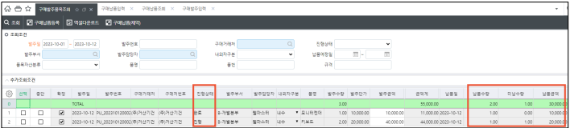

1-8. 진행 상태 조회 - \_SWCOMProgStatus

1-9. 진행 내역 조회 - \_SWCOMProgressTracking

1-10. 원천 내역 조회 - \_SWCOMSourceTracking

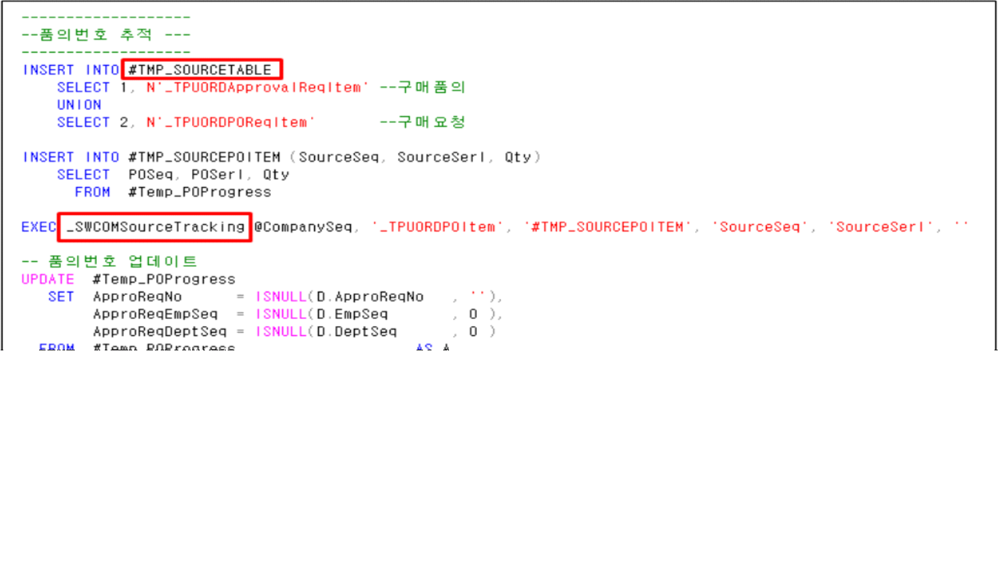

1-11. 잔량 추가 진행 및 데이터 확인 - \[구매 발주 조회\]에서 발주 건의 잔량에 대해 추가 진행해보고 데이터를 확인합니다.

**참고 사항**

\_SWCOMSourceDailyBatch (진행 일괄처리) 

화면에서 화면으로 점프하여 저장하는 케이스가 아닌, SP 로직 내부적으로 진행 데이터를 처리할 때 사용됩니다.

자동 입고 사용 시 \[구매 납품 입력\] 에서 입고 데이터까지 생성하는 경우

\[출하 의뢰 내역 거래 명세서 일괄 생성\] 에서 출하 의뢰 건을 가지고 거래 명세서를 일괄 생성하는 하는 경우

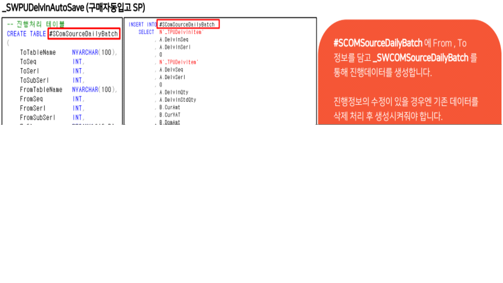

Jump 등록(사이트) - 법인 별(법인 통합)

표준 프로그램에 대하여 사이트용 프로그램으로 점프를 하고자 하는 경우 해당 프로그램을 이용하여 설정합니다. 예) 구매품의 품목 조회 ➔ 구매 발주 입력(SK)

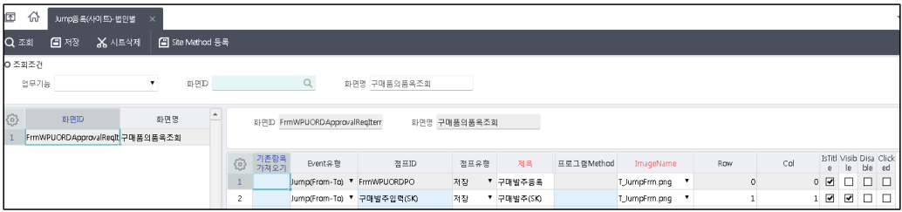

표준 화면에 대하여 조회한 후 더블 클릭하면 우측에 툴 바 버튼에 대한 세부 정보가 조회됩니다.

음영 처리된 기존 표준 프로그램으로 점프되는 항목은 Visible을 해제합니다.

사이트용으로 처리할 점프 항목에 대하여 추가 입력 후 IsTitle , Visible 에 체크 후 저장합니다.

Event유형

JumpIn/JumpOut : 진행 점프가 아닌 일반적인 점프 유형을 의미합니다. (더블 클릭 점프 또는 공통 진행을 안 쓰는 점프)

Jump(From-To): 앞서, 설명한 \[Jump 진행 관리\] 에서 등록된 점프 유형을 의미합니다. (진행 점프)

Print: 출력물 출력 용도의 버튼일 경우 선택합니다.

처리: 버튼을 통해 일반적인 처리를 할 경우 선택합니다.

점프ID

Event 유형 (JumpIn/Out/Print) 의 경우 폼 정보가 등록되어야 하므로 프로그램이 코드 도움됩니다.

Event 유형 (Jump(From-To)) 의 경우 대상 프로그램을 From 기준으로 설정한 Jump진행 내역이 코드 도움됩니다.

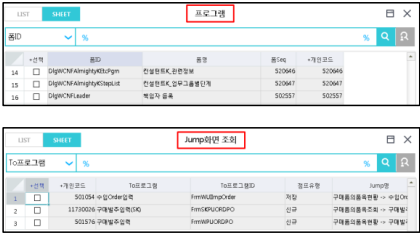

반품 진행 등록(-진행)

같은 진행 테이블로 진행하고 반품 진행(-진행)을 하는 경우 아래 사항에 처리되어야 합니다.

예) 구매 납품 불량 품목 조회 → 구매 납품 반품 입력 , 거래 명세서 조회 → 반품 거래 명세서 입력

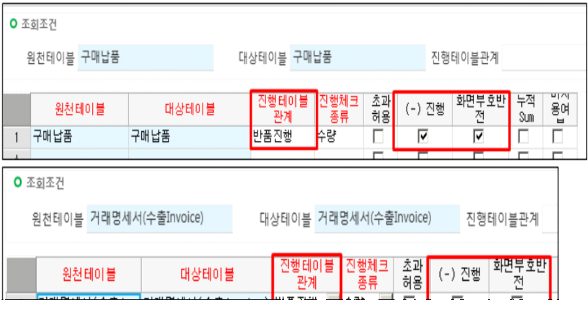

\[진행대상테이블관계\] 에서 테이블 관계는 ‘반품 진행‘ 이 되며, ‘-진행’ , ‘화면 부호 반전’ 에 체크되어야 합니다. 

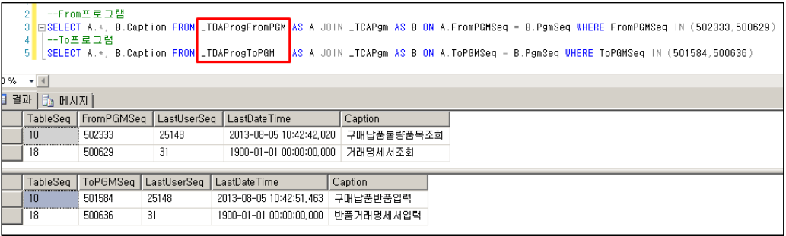

공통 로직에서 반품 진행으로 인식하게 하는 특정 테이블에 From프로그램 내부 코드 (FromPGMSeq)와 To 프로그램 내부 코드 (ToPGMSeq)를 수동으로 넣어줘야 합니다. (\_TDAProgFromPgm , \_TDAProgToPgm)

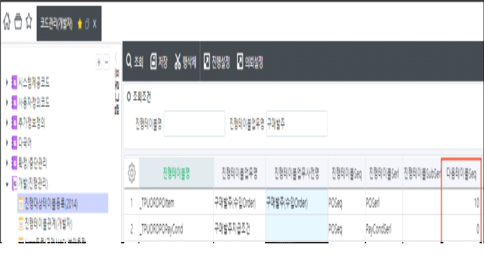

반품 진행을 하는 전 프로세스에는 “다음 테이블Seq”가 설정되어 있어야 반품 잔량을 가져올 수 있습니다. 예) 구매 발주에서 납품으로 100개의 수량이 처리된 후 30개의 수량이 반품 처리되었을 때, 구매 발주에서 반품 처리된 30개의 수량을 가져와야 합니다

 

출처: \<<https://kdc.ksystem.co.kr/education/levelup/M1737377450408>\>