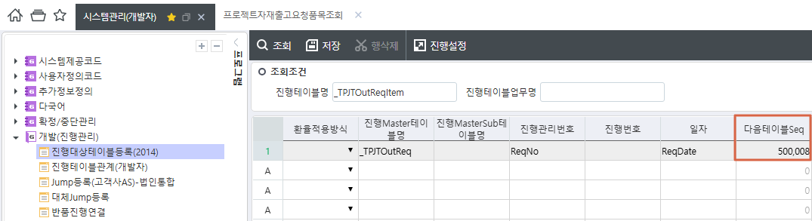
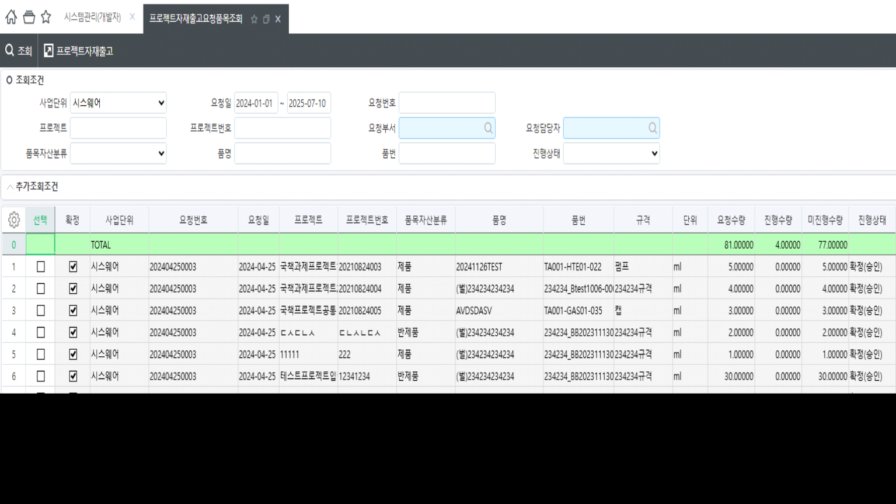
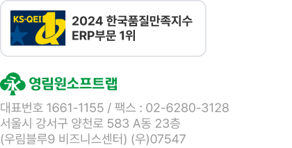
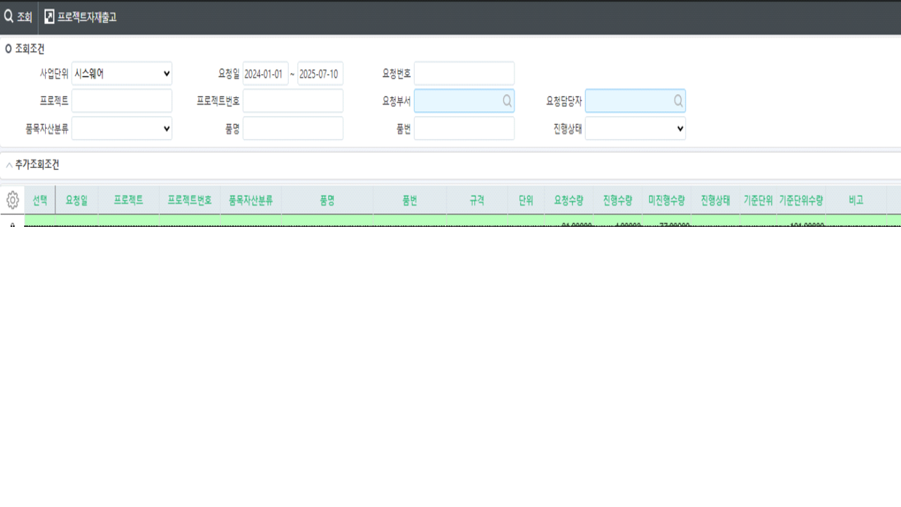
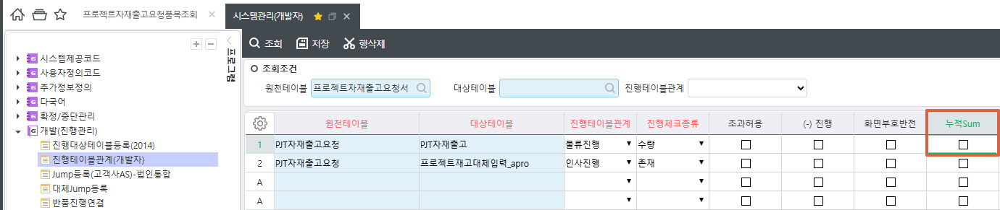
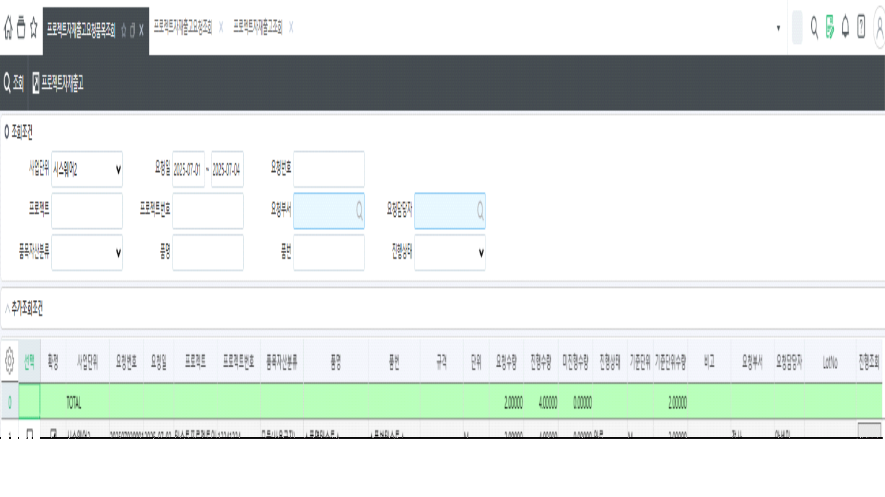

# FROM에서 TO에 대한 반품 진행조회 반영 / 출고요청 - 출고

| **제목** | **FW: \[202507030319        시스웨어\] 프로젝트자재출고요청반품처리 오류** |
|----|----|
| **보낸 사람** | [안진형](mailto:jhahn@sysware.co.kr) |
| **받는 사람** | '박성재' |
| **보낸 날짜** | 2025년 10월 29일 수요일 오전 11:54 |

 

 

 

**From:** 안진형 \<jhahn@sysware.co.kr\>

**Sent:** Friday, July 11, 2025 9:18 AM

**To:** '김 영석' \<yskim@ksystem.co.kr\>

**Subject:** RE: \[202507030319 시스웨어\] 프로젝트자재출고요청반품처리 오류

 

해당 내용 확인하였습니다.

고객사 긴급건이라 본의아니게 메일을 자주 보냈습니다.

확인 감사드립니다.

 

**From:** 김 영석 \<<yskim@ksystem.co.kr>\>

**Sent:** Friday, July 11, 2025 8:41 AM

**To:** 안진형 \<<jhahn@sysware.co.kr>\>

**Subject:** RE: \[202507030319 시스웨어\] 프로젝트자재출고요청반품처리 오류

 

안녕하세요. 영림원소프트랩 김영석입니다.

 

\[서비스답변\]

요청건 관련하여 답변드리겠습니다.

 

누적Sum을 사용하는 경우 \[**진행대상테이블등록**\] 화면에서 **다음테이블Seq**가 존재해야합니다.

해당 다음테이블Seq가 누락되어 있어 진행이 완료되어도 확정으로 조회된 것으로 확인되어 다음테이블Seq 적용 후 다시 조회 시

정상적으로 진행상태 변경되는 것을 확인하였습니다. \[그림1,2\]

 

하여 출고요청에서 누적Sum을 사용하는 경우 업무DB에서 해당 스크립트로 update 해주시면 될 것으로 보여집니다.

 

UPDATE \_TCOMProgTable

   SET NextTableSeq = 500008

  FROM \_TCOMProgTable

WHERE ProgTableSeq = 500009

 

추가적으로 메일은 누락될 가능성이 있어 서비스 접수 부탁드립니다.

 

확인부탁드립니다.

감사합니다.

 

\[그림1\]

 

 

\[그림2\]

 

 

 

<table>
<colgroup>
<col style="width: 70%" />
<col style="width: 29%" />
</colgroup>
<thead>
<tr>
<th><table style="width:34%;">
<colgroup>
<col style="width: 34%" />
</colgroup>
<thead>
<tr>
<th><table style="width:25%;">
<colgroup>
<col style="width: 25%" />
</colgroup>
<thead>
<tr>
<th><strong>김영석</strong> 선임연구원</th>
</tr>
</thead>
<tbody>
<tr>
<td>기간업무프로세스WG</td>
</tr>
</tbody>
</table></th>
</tr>
</thead>
<tbody>
<tr>
<td> </td>
</tr>
<tr>
<td><table style="width:32%;">
<colgroup>
<col style="width: 10%" />
<col style="width: 21%" />
</colgroup>
<thead>
<tr>
<th><strong>TEL.</strong></th>
<th>02-2093-1136</th>
</tr>
</thead>
<tbody>
<tr>
<td><strong>E-MAIL</strong></td>
<td><a href="mailto:yskim@ksystem.co.kr">yskim@ksystem.co.kr</a></td>
</tr>
<tr>
<td><strong> </strong></td>
<td> </td>
</tr>
</tbody>
</table></td>
</tr>
</tbody>
</table></th>
<th><table style="width:49%;">
<colgroup>
<col style="width: 48%" />
</colgroup>
<thead>
<tr>
<th>
 

 
</th>
</tr>
</thead>
<tbody>
</tbody>
</table></th>
</tr>
</thead>
<tbody>
<tr>
<td><table>
<colgroup>
<col style="width: 25%" />
<col style="width: 25%" />
<col style="width: 25%" />
<col style="width: 23%" />
</colgroup>
<thead>
<tr>
<th>
 

 
</th>
<th>
 

 
</th>
<th>
 

 
</th>
<th>
 

 
</th>
</tr>
</thead>
<tbody>
</tbody>
</table></td>
<td> </td>
</tr>
</tbody>
</table>

 

 

 

**From:** 안진형 \<<jhahn@sysware.co.kr>\>

**Sent:** Thursday, July 10, 2025 5:39 PM

**To:** 김 영석 \<<yskim@ksystem.co.kr>\>

**Subject:** RE: \[202507030319 시스웨어\] 프로젝트자재출고요청반품처리 오류

 

안녕하세요 시스웨어 개발팀 안진형입니다.

누적SUM에 체크하고 프로젝트자재출고요청품목조회 화면에서 조회하면

아래 이미지와 같이 요청수량 = 진행수량 인 건의 진행상태가 완료로 조회되야 하는데 확정(승인)으로 조회되고 있습니다.

9, 10행 데이터는 반품하지 않고 정상 출고처리된 데이터입니다.

해당 내용 긴급하게 확인 요청드립니다.

확인 부탁드립니다. 감사합니다.

 

 

 

**From:** 김 영석 \<<yskim@ksystem.co.kr>\>

**Sent:** Thursday, July 10, 2025 4:19 PM

**To:** 안진형 \<<jhahn@sysware.co.kr>\>

**Subject:** RE: \[202507030319 시스웨어\] 프로젝트자재출고요청반품처리 오류

 

안녕하세요. 영림원소프트랩 김영석입니다.

 

\[서비스답변\]

요청건 관련하여 답변드리겠습니다.

 

첨부로 드린 메일의 내용처럼 \[**프로젝트자재반품**\] 화면에서 진행데이터가 마이너스로 생성이 되지 않아

수량이 더블로 나온 것으로 파악됩니다.

 

반품을 사용하는 경우에는 누적Sum을 사용해야 수량 및 진행상태가 정상적으로 조회가 됩니다.

고객사 명단 회신주시면 수정내역 배포하도록 하겠으며 진행 관련 내용 아래 링크에서 확인이 가능하오니 참고 부탁드립니다.

<https://kdc.ksystem.co.kr/education/levelup/M1737377450408>

 

확인부탁드립니다.

감사합니다.

 

 

<table>
<colgroup>
<col style="width: 70%" />
<col style="width: 29%" />
</colgroup>
<thead>
<tr>
<th><table style="width:34%;">
<colgroup>
<col style="width: 34%" />
</colgroup>
<thead>
<tr>
<th><table style="width:25%;">
<colgroup>
<col style="width: 25%" />
</colgroup>
<thead>
<tr>
<th><strong>김영석</strong> 선임연구원</th>
</tr>
</thead>
<tbody>
<tr>
<td>기간업무프로세스WG</td>
</tr>
</tbody>
</table></th>
</tr>
</thead>
<tbody>
<tr>
<td> </td>
</tr>
<tr>
<td><table style="width:32%;">
<colgroup>
<col style="width: 10%" />
<col style="width: 21%" />
</colgroup>
<thead>
<tr>
<th><strong>TEL.</strong></th>
<th>02-2093-1136</th>
</tr>
</thead>
<tbody>
<tr>
<td><strong>E-MAIL</strong></td>
<td><a href="mailto:yskim@ksystem.co.kr">yskim@ksystem.co.kr</a></td>
</tr>
<tr>
<td><strong> </strong></td>
<td> </td>
</tr>
</tbody>
</table></td>
</tr>
</tbody>
</table></th>
<th><table style="width:49%;">
<colgroup>
<col style="width: 48%" />
</colgroup>
<thead>
<tr>
<th>
 

 
</th>
</tr>
</thead>
<tbody>
</tbody>
</table></th>
</tr>
</thead>
<tbody>
<tr>
<td><table>
<colgroup>
<col style="width: 25%" />
<col style="width: 25%" />
<col style="width: 25%" />
<col style="width: 23%" />
</colgroup>
<thead>
<tr>
<th>
 

 
</th>
<th>
 

 
</th>
<th>
 

 
</th>
<th>
 

 
</th>
</tr>
</thead>
<tbody>
</tbody>
</table></td>
<td> </td>
</tr>
</tbody>
</table>

 

 

 

**From:** 안진형 \<<jhahn@sysware.co.kr>\>

**Sent:** Thursday, July 10, 2025 3:15 PM

**To:** 김 영석 \<<yskim@ksystem.co.kr>\>

**Subject:** RE: \[202507030319 시스웨어\] 프로젝트자재출고요청반품처리 오류

 

안녕하세요 시스웨어 개발팀 안진형입니다.

저희쪽에서 확인해봤는데 누적SUM 체크하고부터

정상진행된 건이 미진행수량이 없는데도 진행상태가 작성으로 조회되고 있습니다.

추가적으로 확인하는 부분이 이 내용일까요?

고객사 사용중인 내용이라 해당 내용 확인중이신게 맞는지,

확인 후 수정 예정일 대략적으로 답변을 바라고 있습니다.

확인 부탁드립니다. 감사합니다.

 

**From:** 김 영석 \<<yskim@ksystem.co.kr>\>

**Sent:** Friday, July 4, 2025 2:10 PM

**To:** 안진형 \<<jhahn@sysware.co.kr>\>

**Subject:** RE: \[202507030319 시스웨어\] 프로젝트자재출고요청반품처리 오류

 

안녕하세요. 영림원소프트랩 김영석입니다.

 

\[서비스답변\]

요청건 관련하여 답변드리겠습니다.

 

해당 부분 추가적인 확인이 필요해 확인 후 회신드리도록 하겠습니다.

 

확인부탁드립니다.

감사합니다.

 

 

<table>
<colgroup>
<col style="width: 70%" />
<col style="width: 29%" />
</colgroup>
<thead>
<tr>
<th><table style="width:34%;">
<colgroup>
<col style="width: 34%" />
</colgroup>
<thead>
<tr>
<th><table style="width:25%;">
<colgroup>
<col style="width: 25%" />
</colgroup>
<thead>
<tr>
<th><strong>김영석</strong> 선임연구원</th>
</tr>
</thead>
<tbody>
<tr>
<td>기간업무프로세스WG</td>
</tr>
</tbody>
</table></th>
</tr>
</thead>
<tbody>
<tr>
<td> </td>
</tr>
<tr>
<td><table style="width:32%;">
<colgroup>
<col style="width: 10%" />
<col style="width: 21%" />
</colgroup>
<thead>
<tr>
<th><strong>TEL.</strong></th>
<th>02-2093-1136</th>
</tr>
</thead>
<tbody>
<tr>
<td><strong>E-MAIL</strong></td>
<td><a href="mailto:yskim@ksystem.co.kr">yskim@ksystem.co.kr</a></td>
</tr>
<tr>
<td><strong> </strong></td>
<td> </td>
</tr>
</tbody>
</table></td>
</tr>
</tbody>
</table></th>
<th><table style="width:49%;">
<colgroup>
<col style="width: 48%" />
</colgroup>
<thead>
<tr>
<th>
 

 
</th>
</tr>
</thead>
<tbody>
</tbody>
</table></th>
</tr>
</thead>
<tbody>
<tr>
<td><table>
<colgroup>
<col style="width: 25%" />
<col style="width: 25%" />
<col style="width: 25%" />
<col style="width: 23%" />
</colgroup>
<thead>
<tr>
<th>
 

 
</th>
<th>
 

 
</th>
<th>
 

 
</th>
<th>
 

 
</th>
</tr>
</thead>
<tbody>
</tbody>
</table></td>
<td> </td>
</tr>
</tbody>
</table>

 

 

 

**From:** 안진형 \<<jhahn@sysware.co.kr>\>

**Sent:** Friday, July 4, 2025 1:38 PM

**To:** 김 영석 \<<yskim@ksystem.co.kr>\>

**Subject:** RE: \[202507030319 시스웨어\] 프로젝트자재출고요청반품처리 오류

 

해당 내용 확인하였습니다. 감사합니다.

 

**From:** 김 영석 \<<yskim@ksystem.co.kr>\>

**Sent:** Friday, July 4, 2025 12:54 PM

**To:** 안진형 \<<jhahn@sysware.co.kr>\>

**Subject:** RE: \[202507030319 시스웨어\] 프로젝트자재출고요청반품처리 오류

 

안녕하세요. 영림원소프트랩 김영석입니다.

 

\[서비스답변\]

요청건 관련하여 답변드리겠습니다.

 

자재출고요청-\>자재출고에서 ‘**누적Sum**’이 체크되어 있지 않아 해당 오류가 발생한 것으로 보여집니다.

‘**누적Sum**’ 체크 후 재진행 부탁드립니다.

(출고반품-\>출고반품요청-\>자재출고 순으로 삭제 부탁드립니다.)

 

확인부탁드립니다.

감사합니다.

 

\[그림1\]

 

 

 

 

<table>
<colgroup>
<col style="width: 70%" />
<col style="width: 29%" />
</colgroup>
<thead>
<tr>
<th><table style="width:34%;">
<colgroup>
<col style="width: 34%" />
</colgroup>
<thead>
<tr>
<th><table style="width:25%;">
<colgroup>
<col style="width: 25%" />
</colgroup>
<thead>
<tr>
<th><strong>김영석</strong> 선임연구원</th>
</tr>
</thead>
<tbody>
<tr>
<td>기간업무프로세스WG</td>
</tr>
</tbody>
</table></th>
</tr>
</thead>
<tbody>
<tr>
<td> </td>
</tr>
<tr>
<td><table style="width:32%;">
<colgroup>
<col style="width: 10%" />
<col style="width: 21%" />
</colgroup>
<thead>
<tr>
<th><strong>TEL.</strong></th>
<th>02-2093-1136</th>
</tr>
</thead>
<tbody>
<tr>
<td><strong>E-MAIL</strong></td>
<td><a href="mailto:yskim@ksystem.co.kr">yskim@ksystem.co.kr</a></td>
</tr>
<tr>
<td><strong> </strong></td>
<td> </td>
</tr>
</tbody>
</table></td>
</tr>
</tbody>
</table></th>
<th><table style="width:49%;">
<colgroup>
<col style="width: 48%" />
</colgroup>
<thead>
<tr>
<th>
 

 
</th>
</tr>
</thead>
<tbody>
</tbody>
</table></th>
</tr>
</thead>
<tbody>
<tr>
<td><table>
<colgroup>
<col style="width: 25%" />
<col style="width: 25%" />
<col style="width: 25%" />
<col style="width: 23%" />
</colgroup>
<thead>
<tr>
<th>
 

 
</th>
<th>
 

 
</th>
<th>
 

 
</th>
<th>
 

 
</th>
</tr>
</thead>
<tbody>
</tbody>
</table></td>
<td> </td>
</tr>
</tbody>
</table>

 

 

 

**From:** 안진형 \<<jhahn@sysware.co.kr>\>

**Sent:** Friday, July 4, 2025 11:29 AM

**To:** 김 영석 \<<yskim@ksystem.co.kr>\>

**Subject:** RE: \[202507030319 시스웨어\] 프로젝트자재출고요청반품처리 오류

 

안녕하세요 시스웨어 개발팀 안진형입니다.

두 출고건 중 하나는 반품에 대한 출고건 이기 때문에

(-) 수량으로 진행되야 하는게 아닌지 질문드립니다.

현재 아래 이미지와 같이 출고 1번 -\> 반품에 대한 출고 1번이 진행되었는데

요청수량이 2 이고 진행수량이 4인 것이 이상한 것 같습니다.

관련 내용 답변 부탁드리겠습니다.

확인 부탁드립니다. 감사합니다.

 

 

 

**From:** 김 영석 \<<yskim@ksystem.co.kr>\>

**Sent:** Friday, July 4, 2025 11:15 AM

**To:** <jhahn@sysware.co.kr>

**Cc:** 기간_제품관리 \<<pbpsvcgroup@ksystem.co.kr>\>

**Subject:** \[202507030319 시스웨어\] 프로젝트자재출고요청반품처리 오류

 

안녕하세요. 영림원소프트랩 김영석입니다.

 

\[서비스답변\]

요청건 관련하여 답변드리겠습니다.

 

관련 데이터 확인 시 진행 데이터는 정상적으로 저장이 되는 것을 확인하였습니다.

말씀하신대로 순서상 프로젝트자재출고(202507030001) -\> 프로젝트자재출고요청서 (202507030002) -\> 프로젝트자재출고(202507030002)로 조회가 되어야 하나

진행 정보를 가져오는 과정에서 출고와 반품을 사용하는 테이블이 동일하기에 자재출고건들이 먼저 조회가 되고 자재출고요청서가 조회된 것으로 파악됩니다.

 

하여 데이터의 오류가 아닌 조회 순서의 차이로 가이드해주시면 감사하겠습니다.

 

\[서비스문의\]

안녕하세요 시스웨어 개발팀 안진형입니다.

프로젝트자재출고요청 데이터를 등록한 후, 출고처리 후

출고처리한 데이터로 프로젝트자재반품요청을 등록하였습니다.

해당 데이터로 반품처리까지 완료하였습니다.

최초 원천 프로젝트자재출고요청 데이터 조회 시, 진행정보가 이상하게 조회되고 있습니다.

해당 데이터는 시스웨어 개발서버에서 확인하였습니다.

최초 프로젝트자재출고요청번호 : 202507030001

최초 요청건 프로젝트자재출고번호  : 202507030001출고건 기준 프로젝트자재출고반품요청번호 : 202507030002프로젝트자재출고번호(반품) :          202507030002

고객사 요청사항으로 프로그램 수정에 발견한 내용이라 긴급하게 처리 부탁드립니다.확인 부탁드립니다. 감사합니다.

 

확인부탁드립니다.

감사합니다.

 

<table>
<colgroup>
<col style="width: 70%" />
<col style="width: 29%" />
</colgroup>
<thead>
<tr>
<th><table style="width:34%;">
<colgroup>
<col style="width: 34%" />
</colgroup>
<thead>
<tr>
<th><table style="width:25%;">
<colgroup>
<col style="width: 25%" />
</colgroup>
<thead>
<tr>
<th><strong>김영석</strong> 선임연구원</th>
</tr>
</thead>
<tbody>
<tr>
<td>기간업무프로세스WG</td>
</tr>
</tbody>
</table></th>
</tr>
</thead>
<tbody>
<tr>
<td> </td>
</tr>
<tr>
<td><table style="width:32%;">
<colgroup>
<col style="width: 10%" />
<col style="width: 21%" />
</colgroup>
<thead>
<tr>
<th><strong>TEL.</strong></th>
<th>02-2093-1136</th>
</tr>
</thead>
<tbody>
<tr>
<td><strong>E-MAIL</strong></td>
<td><a href="mailto:yskim@ksystem.co.kr">yskim@ksystem.co.kr</a></td>
</tr>
<tr>
<td><strong> </strong></td>
<td> </td>
</tr>
</tbody>
</table></td>
</tr>
</tbody>
</table></th>
<th><table style="width:49%;">
<colgroup>
<col style="width: 48%" />
</colgroup>
<thead>
<tr>
<th>
 

 
</th>
</tr>
</thead>
<tbody>
</tbody>
</table></th>
</tr>
</thead>
<tbody>
<tr>
<td><table>
<colgroup>
<col style="width: 25%" />
<col style="width: 25%" />
<col style="width: 25%" />
<col style="width: 23%" />
</colgroup>
<thead>
<tr>
<th>
 

 
</th>
<th>
 

 
</th>
<th>
 

 
</th>
<th>
 

 
</th>
</tr>
</thead>
<tbody>
</tbody>
</table></td>
<td> </td>
</tr>
</tbody>
</table>