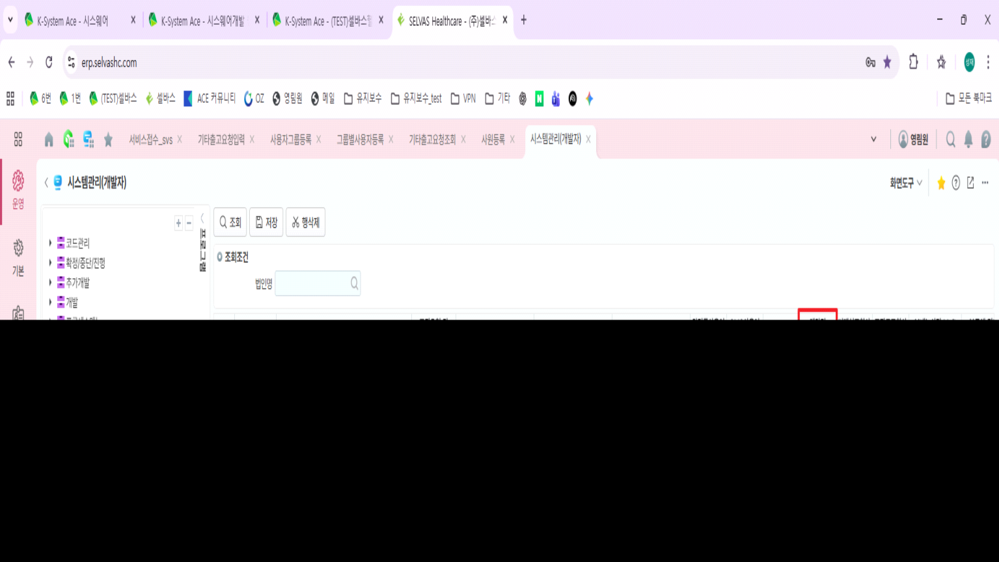

# 앱 알림

-- 1. (운영) IsUseFlex = 1 설정 필요

SELECT IsUseFlex ,\* FROM \_TCAMobileSecurityPolicy -- '1'

 

 

-- 2. (운영) 법인별KUMS설정값관리

-- 앱 알림 사용여부 = '1'

-- UsingMbFlexAppNoti = '1'

SELECT \* FROM OTCACompanyKums

UNION

SELECT \* FROM SVSTESTCOMMON.DBO.OTCACompanyKums

 

-- 프로그램별KUMS설정 (업무)

SELECT A.\*

FROM OTCAKumsTemplatePgm AS A WITH(NOLOCK)

LEFT OUTER JOIN \_TCAPgm AS B WITH(NOLOCK) ON A.PgmSeq = B.PgmSeq

WHERE B.Caption LIKE '기타출고요청%'

 

SELECT A.\*

FROM SVSTEST.DBO.OTCAKumsTemplatePgm AS A WITH(NOLOCK)

LEFT OUTER JOIN \_TCAPgm AS B WITH(NOLOCK) ON A.PgmSeq = B.PgmSeq

WHERE B.Caption LIKE '기타출고요청%'

 

 

>  
>
>  

 

 

