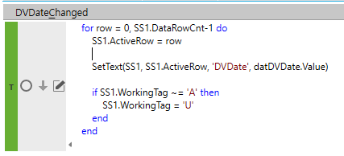
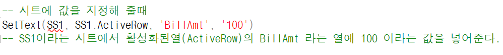
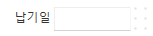
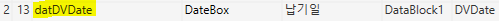
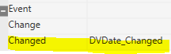

# Ace이벤트, 메소드

> \* 이벤트 처리 \*\*
>
> 
>
>  
>
> for row = 0, SS1.DataRowCnt-1 do
>
> SS1.ActiveRow = row
>
>  
>
> SetText(SS1, SS1.ActiveRow, 'DVDate', datDVDate.Value)
>
> -- ======= ==========
>
> -- 시트영역 마스터영역(명칭)
>
> -- (DataFieldName)
>
> -----------------------------------------------------------------------------
>
> +.SS1이라는 시트에서 활성화된열(ActiveRow)의 DVDate 라는 열에 datDVData.Value를 넣어준다
>
> 
>
> -----------------------------------------------------------------------------
>
> if SS1.WorkingTag ~= 'A' then -- A가 아닌 경우 U로 변경 (A는 바뀌어도 A이기 때문)
>
> SS1.WorkingTag = 'U'
>
> end
>
> end
>
>  

- (마스터 영역) 납기일 명칭

> 
>
>  
>
> 
>
>  

- (마스터영역) 납기일 - 속성

> 