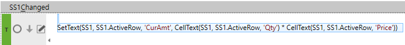
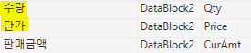
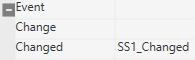
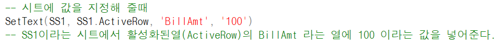

# 수량 \* 단가 = 금액

- 수량 \* 단가 = 판매금액 =\> 자동 계산 메소드

> 'CurAmt', CellText(SS1, SS1.ActiveRow, 'Qty') \* CellText(SS1, SS1.ActiveRow, 'Price'))
>
>  
>
> SetText(SS1, SS1.ActiveRow, 'CurAmt', CellText(SS1, SS1.ActiveRow, 'Qty') \* CellText(SS1, SS1.ActiveRow, 'Price'))
>
>  
>
> 
>
>  
>
>  
>
> 
>
>  
>
> 
>
>  
>
> 수량, 단가
>
> 속성 – Changed에 작성
>
>  
>
> 
>
>  

local Amt, Qty, Price

 

Qty = tonumber(CellText(SS1, SS1.ActiveRow, 'Qty'))

Price = tonumber(CellText(SS1, SS1.ActiveRow, 'Price'))

Amt = Qty \* Price

 

SetText(SS1, SS1.ActiveRow, 'Amt', Amt)