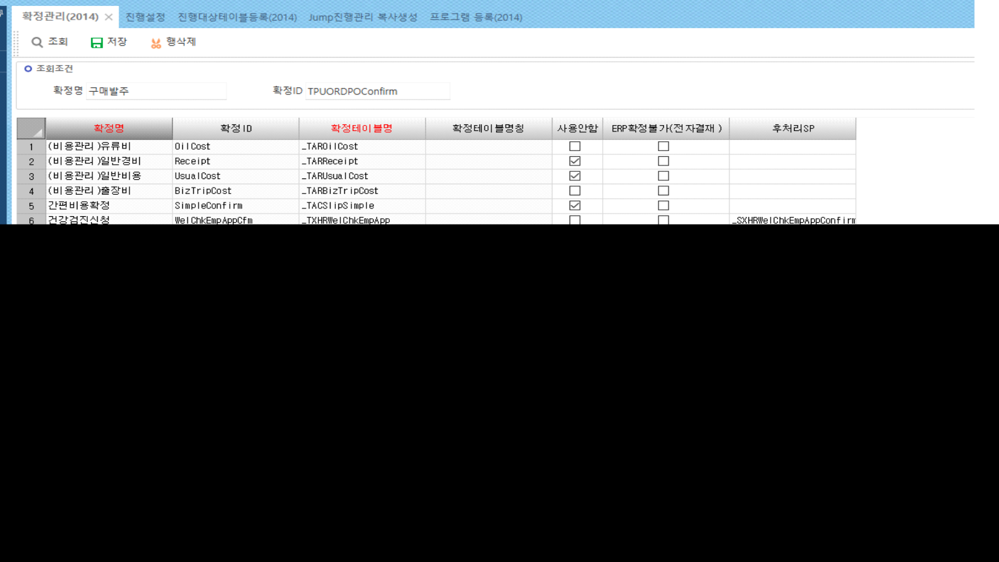
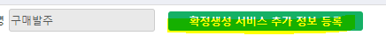
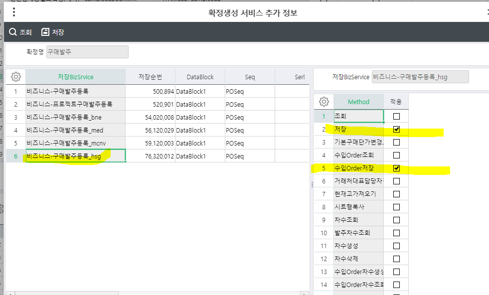
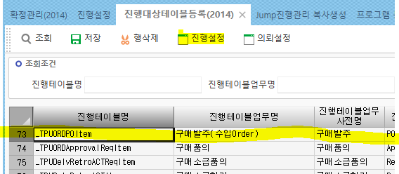
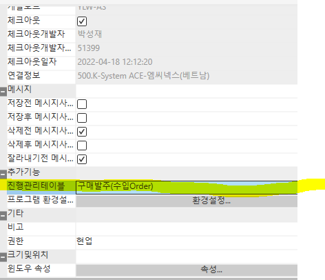
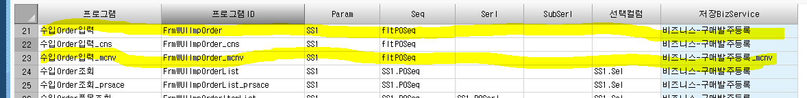
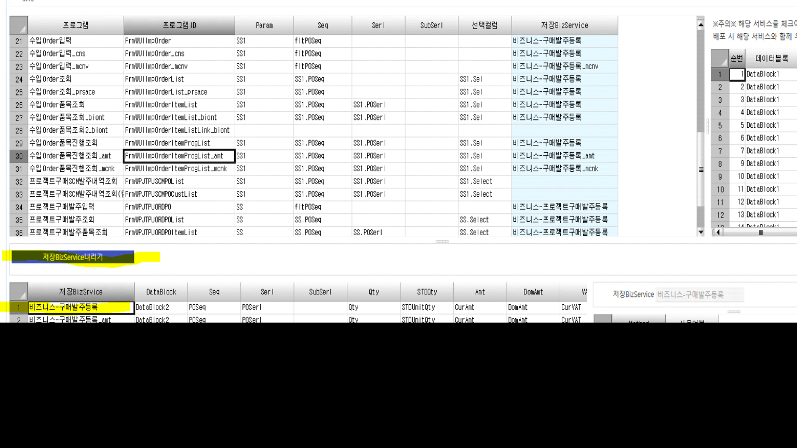
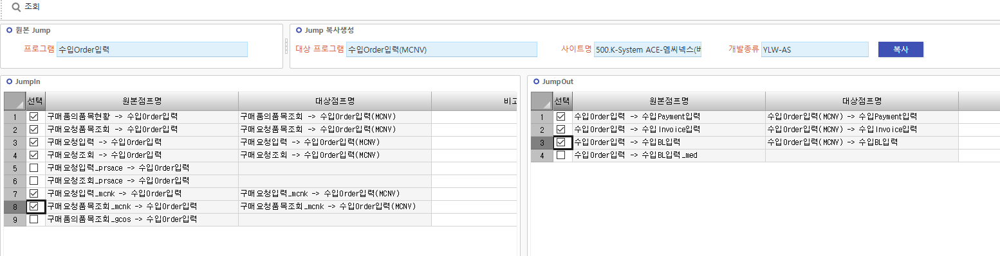
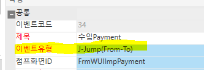
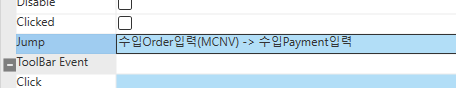

# 사이트 가져올 때 확정,진행,jump

사이트 따올 때 필수로 해야하는 것

 

+. dummy에 코드값을 넣을 경우 따로 dummy를 건드릴 필요가 없다

UseDept 컬럼 추가 / dummy10에 UseDeptSeq 넣을 경우

 

\- 테이블 신규 생성 필요 없음

\- UseDept Cd에 UseDeptSeq가 아니라 dummy10을 넣으면 된다

\- 비즈니스에서 dummy를 건드릴 필요가 없다

 

● 필수로 해야하는 것 (확정, 진행, 점프, 점프 추가)

 

1\. 확정관리(2014)

표준화면과 똑같은 값을 넣는다

 

 

확정생성 서비스 추가 정보 등록 클릭

 

표준과 똑같이 작성

 

 

 

 

2\. 진행대상테이블등록 (2014)

진행테이블 클릭 후 =\> 진행설정 툴바 클릭

 

 

 

 

 

개발툴 – 프로그램 - (추가기능) 진행관리테이블에 저장되어 있으면

자동으로 진행설정에서 나온다

(진행설정에 없을 경우 개발툴에서 먼저 추가해야함)

 

 

 

 

표준과 똑같이 입력

+. 비즈니스를 새로 만든 경우 비즈니스는 바꿔줘야한다

 

 

 

 

저장BizService 내리기 클릭

표준 비즈니스 더블클릭 후 체크되어 있는 항목 똑같이 체크

 

 

 

 

 

 

 

3\. Jump진행관리 복사생성

원본 Jump = 따온 표준 화면 입력

jump 복사생성 = 만든 화면 입력

사이트명 입력하면 자동으로 JumpIn, JumpOut항목이 나옴

 

표준에서 가는 것들만 선택 후 복사 누름

 

 

 

+. JumpOut에서 선택한 것들은 개발툴에서 바꿔줘야한다

 

 

이벤트 유형 : J-Jump(From-To) 인지 확인

 

 

 

Jump에 해당 JumpOut 입력