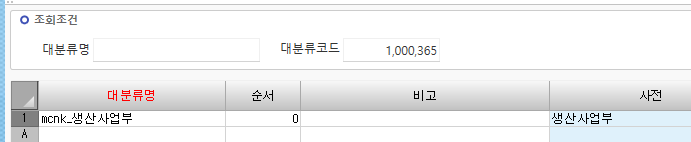
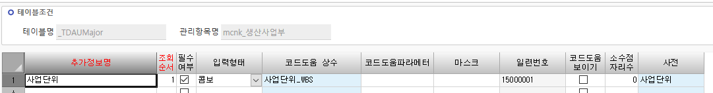
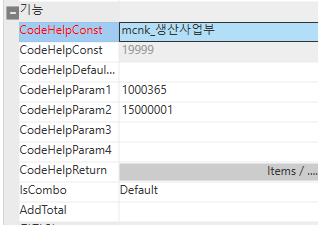
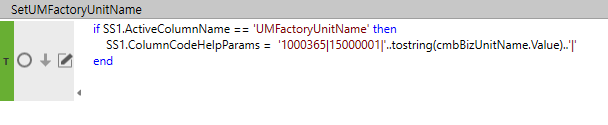
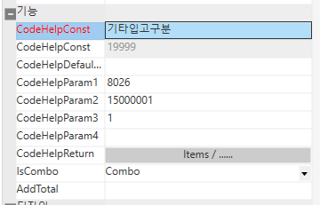

# 사용자정의코드 추가정보

생산사업부 =\> 사업단위

 

 

 

 

Param1 =\> 대분류 코드

Param2 =\> 일련번호 (시트설정에서 HID 풀어줘야함)

 

if SS1.ActiveColumnName == 'UMFactoryUnitName' then

> SS1.ColumnCodeHelpParams = '1000365\|15000001\|'..tostring(cmbBizUnitName.Value)..'\|'

end

 

 

 

기타입고구분 - 추가정보정의

 

