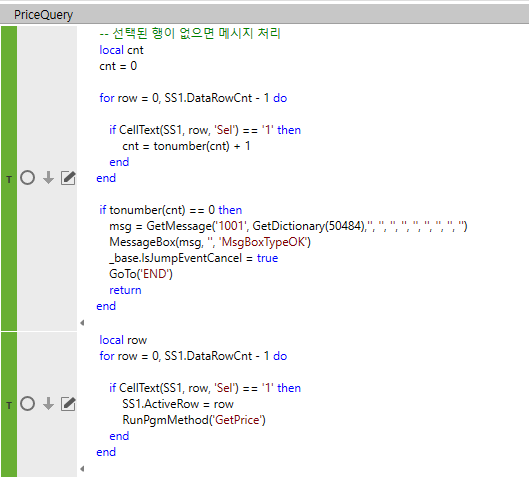
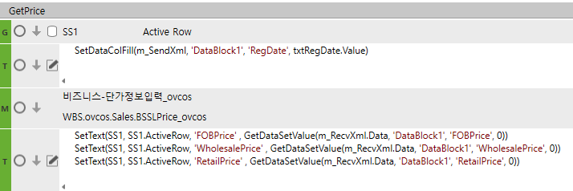

# 선택 행만 sp타서 값 넣기

 

FrmWSLPrice_ovcos

단가정보입력_ovcos

 

 

 

1.  선택된 행 없으면 에러처리

-- 선택된 행이 없으면 메시지 처리

local cnt

cnt = 0

for row = 0, SS1.DataRowCnt - 1 do

        if CellText(SS1, row, 'Sel') == '1' then

> cnt = tonumber(cnt) + 1
>
> end

end

 

if tonumber(cnt) == 0 then

        msg = GetMessage('1001', GetDictionary(50484),'', '', '', '', '', '', '', '', '')

> MessageBox(msg, '', 'MsgBoxTypeOK')
>
> \_base.IsJumpEventCancel = true
>
> GoTo('END')
>
> return

end

 

2.  선택된 행만 단가 구하는 메소드 반복

local row

for row = 0, SS1.DataRowCnt - 1 do

        if CellText(SS1, row, 'Sel') == '1' then

> SS1.ActiveRow = row
>
> RunPgmMethod('GetPrice')
>
> end

end

 

-------------------------------------------------------------------------------------------------

SS1의 Active Row 가져가기 (G)

1.  시트에 마스터 값 넣기

SetDataColFill(m_SendXml, 'DataBlock1', 'RegDate', txtRegDate.Value)

 

2.  SP

 

3.  해당 열에 값 넣기

SetText(SS1, SS1.ActiveRow, 'FOBPrice' , GetDataSetValue(m_RecvXml.Data, 'DataBlock1', 'FOBPrice', 0))

SetText(SS1, SS1.ActiveRow, 'WholesalePrice' , GetDataSetValue(m_RecvXml.Data, 'DataBlock1', 'WholesalePrice', 0))

SetText(SS1, SS1.ActiveRow, 'RetailPrice' , GetDataSetValue(m_RecvXml.Data, 'DataBlock1', 'RetailPrice', 0))