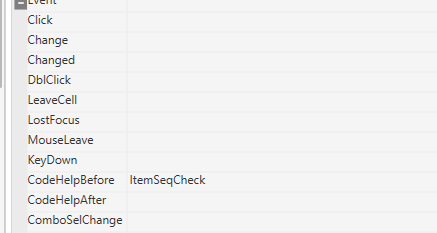

# 코드도움전에 필요한 것만 가져오기

FrmWLGHighRackIn_gcos

 

if SS1.CodeHelpDblClick == true then

> if CellText(SS1, SS1.ActiveRow, 'ItemSeq') == '0' then
>
> SS1.IsCodeHelpCancelEvent = true
>
> else
>
> SS1.IsCodeHelpCancelEvent = false
>
> SS1.ColumnCodeHelpParams = CellText(SS1, SS1.ActiveRow,'ItemSeq')..'\|'
>
> end

else

SS1.IsCodeHelpCancelEvent = true

end

 

--if (SS1.ActiveColumnName == 'LotNo') then

-- SS1.ColumnCodeHelpParams = CellText(SS1, SS1.ActiveRow,'ItemSeq')..'\|'..txtInWHName.TextCd

--end

 

--if CellText(SS1, SS1.ActiveRow, 'ItemSeq') == '0' then

--        SS1.IsCodeHelpCancelEvent = true

--end

 

