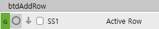
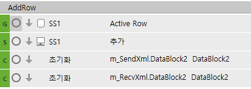

# 행추가

--==============================================================

-- 행추가 - 입력한 숫자만큼 행추가하기 (거래명세서입력_evc, 구매납품입력_sscnt)

--==============================================================

-- 버튼은 행추가지만 기능은 행복사에 가까움....

local IsSet, IsNotAllModify, IsNotRowAdd, IsNotAccAmtMod, col, CellName, CellNameText, RowAddCnt

 

RowAddCnt = fltRowCnt.Value

 

if tonumber(RowAddCnt) == 0 then

> RowAddCnt = 1

end

 

-- 데이터복사

ActiveRowOld = SS1.ActiveRow

 

for row = 0, RowAddCnt -1 do

> Trow = SS1.DataRowCnt

 

> -- 행추가
>
> SS1.StartRow = Trow
>
> SS1.ActionCount = 1
>
> SS1.ActionType = 'ActionType_InsertRow'

 

> -- 컬럼을 돌면서 데이터 복사하여 넣자
>
> for col = 0, SS1.MaxCols - 1 do
>
> SS1.ActiveCol = col
>
> CellName = SS1.ActiveColumnName

 

> CellNameText = CellText(SS1, SS1.ActiveRow, CellName)

 

> if SS1.ActiveColumnName == 'InvoiceSerl' then
>
> CellNameText = ''        
>
> end

 

> SetText(SS1, Trow, CellName, CellNameText)
>
>  
>
> if SS1.ActiveCellReadOnly == true then
>
> SS1.ActiveRow = Trow
>
> SS1.ActiveCellReadOnly = true
>
> SS1.ActiveRow = ActiveRowOld
>
> end
>
> end

 

> -- 추가된 행은 워킹태그를 'A'로 변경하자.
>
> SS1.ActiveRow = Trow
>
> SS1.WorkingTag = 'A'

end

여러 줄 한번에 복사 시

체크된 컬럼 -\> 지점반품확정입력_hsg

 

 

 

선택된 컬럼

 

 

local cnt

cnt = SS1.DataRowCnt

for i = 0, cnt-1 do

> for j=0, fltRowCnt.Value-1 do
>
> SS1.ActiveRow = i
>
> RunPgmMethod('AddRow')
>
> end

end

 

--------------------------------------------------------------

 

 

 

 

 

선택된 Row =\> 거래명세서입력_evc

 

if SS1.WorkingTag == 'A' then

> for i=1, fltRowCnt.Value do
>
> DisplayAdd(SS1, m_SendXml.Data, -1)
>
> end

end