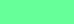
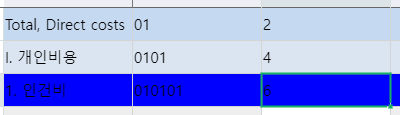
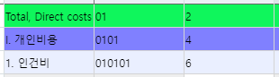
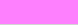
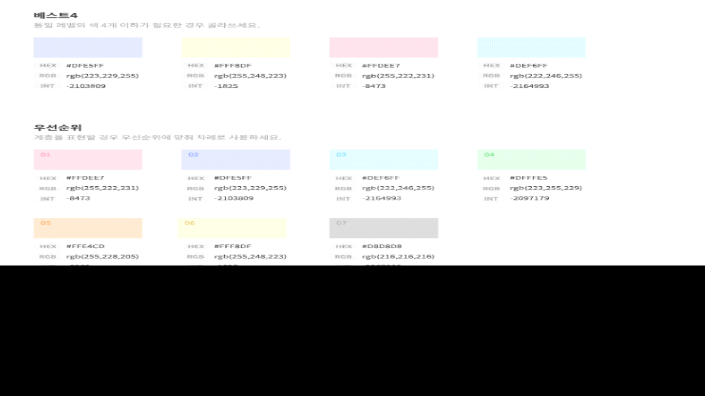
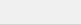
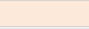
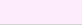

# 색깔 색상 종류

-10027111

-3810831

 

-2365967

 

-16776961

-8323073

 

'#DDEBF7'

1046108

 

8421631

 

> GetBrush("#EAEFFF")

 

 

16744703

 

16711808

-986896

 

-136743

 

-135684