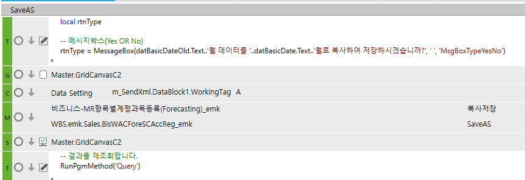

# 복사저장

FrmWACForeSCAccReg_emk

MR항목별계정과목등록(Forecasting)\_emk

 

local rtnType

 

-- 메시지박스(Yes OR No)

rtnType = MessageBox(datBasicDateOld.Text..'월 데이터를 '..datBasicDate.Text..'월로 복사하여 저장하시겠습니까?', ' ', 'MsgBoxTypeYesNo')

if rtnType == 1 then

elseif (rtnType == 0) then

datBasicDateOld.Text = datBasicDate.Text

GoTo('END')

return

end

 

if SS1.DataRowCnt == 0 then

> MessageBoxShow('쉬트에 자료가 없습니다. \n자료를 입력하세요.', '')

GoTo('END')

return

end