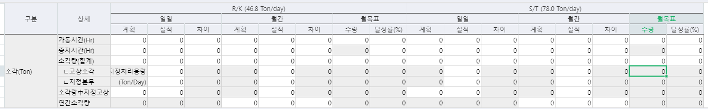

# 컬럼 특정 위치 DIS

-- 시트1 DIS처리

for col = 0, SS1.MaxCols - 1 do

> SS1.ActiveCol = col
>
> if SS1.ActiveColumnName == 'RKDayPlan' then        
>
> SS1.ActiveRow = 3
>
> SS1.ActiveCellReadOnly = true
>
>  
>
> SS1.ActiveRow = 4
>
> SS1.ActiveCellReadOnly = true        
>
>  
>
> SS1.ActiveRow = 6
>
> SS1.ActiveCellReadOnly = true                
>
> end

 

> if SS1.ActiveColumnName == 'RKDayResult' then                
>
> SS1.ActiveRow = 6
>
> SS1.ActiveCellReadOnly = true                
>
> end
>
>  
>
> if SS1.ActiveColumnName == 'RKDayDiff' then        
>
> SS1.ActiveRow = 3
>
> SS1.ActiveCellReadOnly = true
>
>  
>
> SS1.ActiveRow = 4
>
> SS1.ActiveCellReadOnly = true        

 

> SS1.ActiveRow = 5
>
> SS1.ActiveCellReadOnly = true        
>
>  
>
> SS1.ActiveRow = 6
>
> SS1.ActiveCellReadOnly = true                
>
> end        
>
>  
>
> if SS1.ActiveColumnName == 'RKMonthPlan' then        
>
> SS1.ActiveRow = 3
>
> SS1.ActiveCellReadOnly = true
>
>  
>
> SS1.ActiveRow = 4
>
> SS1.ActiveCellReadOnly = true        

 

> SS1.ActiveRow = 5
>
> SS1.ActiveCellReadOnly = true
>
> end                
>
>  
>
> if SS1.ActiveColumnName == 'RKMonthDiff' then        
>
> SS1.ActiveRow = 3
>
> SS1.ActiveCellReadOnly = true
>
>  
>
> SS1.ActiveRow = 4
>
> SS1.ActiveCellReadOnly = true        

 

> SS1.ActiveRow = 5
>
> SS1.ActiveCellReadOnly = true
>
> end                        

 

> if SS1.ActiveColumnName == 'RKMonthTarget' then        
>
> SS1.ActiveRow = 1
>
> SS1.ActiveCellReadOnly = true
>
>  
>
> SS1.ActiveRow = 3
>
> SS1.ActiveCellReadOnly = true
>
>  
>
> SS1.ActiveRow = 4
>
> SS1.ActiveCellReadOnly = true        

 

> SS1.ActiveRow = 5
>
> SS1.ActiveCellReadOnly = true
>
>  
>
> SS1.ActiveRow = 6
>
> SS1.ActiveCellReadOnly = true
>
> end                        
>
>  
>
> if SS1.ActiveColumnName == 'RKMonthProcRate' then        
>
> SS1.ActiveRow = 3
>
> SS1.ActiveCellReadOnly = true
>
>  
>
> SS1.ActiveRow = 4
>
> SS1.ActiveCellReadOnly = true        

 

> SS1.ActiveRow = 5
>
> SS1.ActiveCellReadOnly = true
>
>  
>
> SS1.ActiveRow = 6
>
> SS1.ActiveCellReadOnly = true
>
> end                        
>
>  
>
> if SS1.ActiveColumnName == 'STDayPlan' then        
>
> SS1.ActiveRow = 3
>
> SS1.ActiveCellReadOnly = true
>
>  
>
> SS1.ActiveRow = 4
>
> SS1.ActiveCellReadOnly = true        
>
>  
>
> SS1.ActiveRow = 6
>
> SS1.ActiveCellReadOnly = true
>
> end                        

 

> if SS1.ActiveColumnName == 'STDayResult' then        
>
> SS1.ActiveRow = 6
>
> SS1.ActiveCellReadOnly = true
>
> end                        
>
>  
>
> if SS1.ActiveColumnName == 'STDayDiff' then        
>
> SS1.ActiveRow = 3
>
> SS1.ActiveCellReadOnly = true
>
>  
>
> SS1.ActiveRow = 4
>
> SS1.ActiveCellReadOnly = true        
>
>  
>
> SS1.ActiveRow = 5
>
> SS1.ActiveCellReadOnly = true        
>
>  
>
> SS1.ActiveRow = 6
>
> SS1.ActiveCellReadOnly = true
>
> end                        
>
>  
>
> if SS1.ActiveColumnName == 'STMonthPlan' then        
>
> SS1.ActiveRow = 3
>
> SS1.ActiveCellReadOnly = true
>
>  
>
> SS1.ActiveRow = 4
>
> SS1.ActiveCellReadOnly = true        
>
>  
>
> SS1.ActiveRow = 5
>
> SS1.ActiveCellReadOnly = true        
>
> end                        

 

> if SS1.ActiveColumnName == 'STMonthDiff' then        
>
> SS1.ActiveRow = 3
>
> SS1.ActiveCellReadOnly = true
>
>  
>
> SS1.ActiveRow = 4
>
> SS1.ActiveCellReadOnly = true        
>
>  
>
> SS1.ActiveRow = 5
>
> SS1.ActiveCellReadOnly = true        
>
> end                        
>
>  
>
> if SS1.ActiveColumnName == 'STMonthTarget' then        
>
> SS1.ActiveRow = 1
>
> SS1.ActiveCellReadOnly = true        
>
>  
>
> SS1.ActiveRow = 3
>
> SS1.ActiveCellReadOnly = true
>
>  
>
> SS1.ActiveRow = 4
>
> SS1.ActiveCellReadOnly = true        
>
>  
>
> SS1.ActiveRow = 5
>
> SS1.ActiveCellReadOnly = true        
>
>  
>
> SS1.ActiveRow = 6
>
> SS1.ActiveCellReadOnly = true        
>
> end                        

 

> if SS1.ActiveColumnName == 'STMonthProcRate' then        
>
> SS1.ActiveRow = 3
>
> SS1.ActiveCellReadOnly = true
>
>  
>
> SS1.ActiveRow = 4
>
> SS1.ActiveCellReadOnly = true        
>
>  
>
> SS1.ActiveRow = 5
>
> SS1.ActiveCellReadOnly = true        
>
>  
>
> SS1.ActiveRow = 6
>
> SS1.ActiveCellReadOnly = true        
>
> end                        

end

