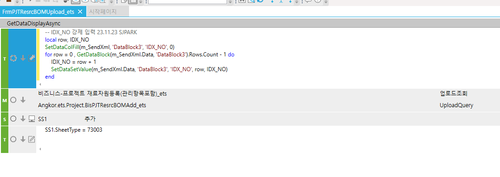

# 엑셀 업로드 시 IDX_NO 강제입력

FrmPJTResrcBOMUpload_ets 제뉴인

 

FrmWSLOrderUpload_shilla 에이스

 

 

 

 

-- IDX_NO 강제 입력 23.11.23 SJPARK

local row, IDX_NO

SetDataColFill(m_SendXml, 'DataBlock3', 'IDX_NO', 0)

for row = 0 , GetDataBlock(m_SendXml.Data, 'DataBlock3').Rows.Count - 1 do

> IDX_NO = row + 1
>
> SetDataSetValue(m_SendXml.Data, 'DataBlock3', 'IDX_NO', row, IDX_NO)

end

 

