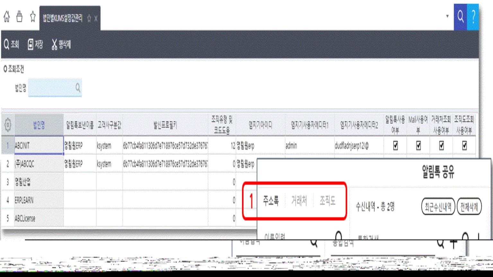
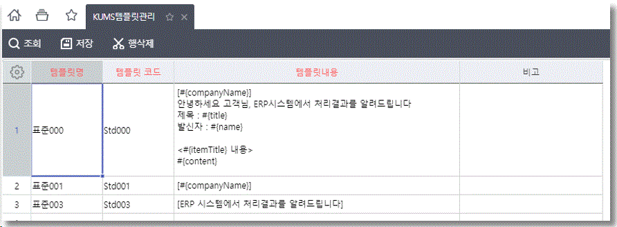
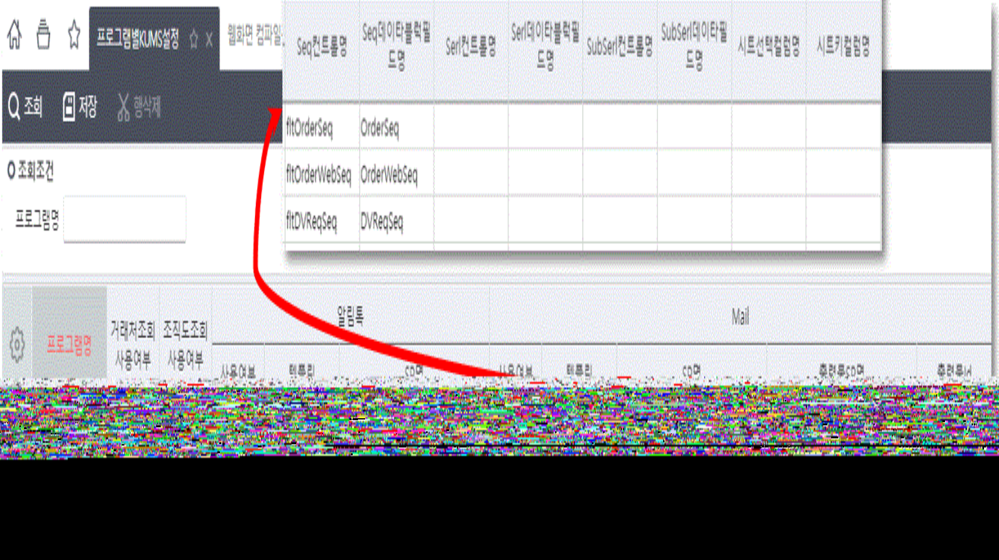
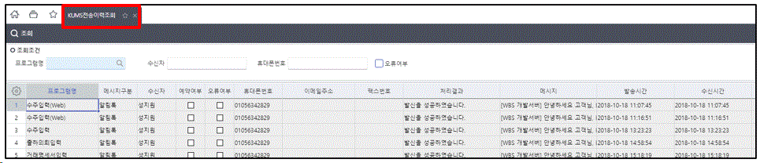
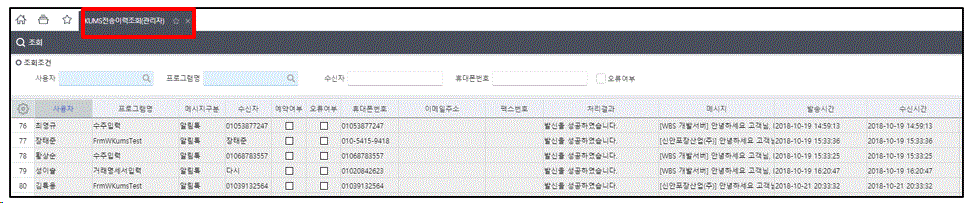

# KUMS - SMS, 알림톡 가이드

> KUMS - SMS, 알림톡 가이드
>
>  
>
> KUMSSMS알림톡
>
>  
>
>  
>
> \[사전준비\]
>
> KDC 매뉴얼 \[KUMS - 1. 계약진행 프로세스\] 를 참고하여 사전에 필요한 계약 및 진행 프로세스를 확인하실 수 있습니다.
>
>  
>
>  
>
> \[설정화면정보\]
>
>  

| PgmSeq |         PgmID         |          화면명          |
|:------:|:---------------------:|:------------------------:|
| 524763 |    FrmWKumsCompany    |   법인별KUMS설정값관리   |
| 524764 |   FrmWKumsTemplate    |      KUMS템플릿관리      |
| 524770 |  FrmWKumsMessagePgm   |    프로그램별KUMS설정    |
| 524766 |   FrmWKumsTransLog    |     KUMS전송이력조회     |
| 524769 | FrmWKumsAdminTransLog | KUMS전송이력조회(관리자) |

> 프로세스 메뉴에서는 코드관리(개발자) \> KUMS 항목에 위치
>
>  
>
>  
>
> \[법인별 KUMS 설정값 관리\]
>
>  
>
> 

- \<법인별로 KUMS를 사용하기 위해 처음 세팅해줘야 할 값\>

- 고객사구분값, 발신프로필키 : M&WISE 에서 제공해주는 값

- 조직유형내부코드 : 조직도 사용시 사용될 조직유형코드값 키인

- 엠지기아이디, 엠지기사용자데이터1, 엠지기사용자데이터2 : M&WISE 알림톡 템플릿 관리 시스템 로그인정보\
  (<https://alimtalk.carrym.com>)

- 알림톡 사용, SMS사용, Mail사용, Fax사용 : 법인별로 사용여부 체크

- 거래처조회사용 : 기본적으로 개인별 주소록이 제공되며, 거래처 탭을 사용시에 체크(1)

- 조직도조회사용 : 위에 등록한 조직유형내부코드를 가지고 조회되는 조직도 탭을 사용시에 체크(1)

- 설정이 변경되면 재로그인 필요

>  
>
> \[KUMS 템플릿 관리\]
>
>  
>
> 

- KDC 매뉴얼 \[KUMS - 알림톡 템플릿 추가 방법\] 를 참고하여 템플릿 등록

- KUMS 알림톡을 사용하기 위해 우선적으로 M&WISE에서 제공하는 엠지기알림톡(https://alimtalk.carrym.com/)에서 알림톡 메시지 템플릿을 승인 받는 절차가 필요(M&WISE -\> 카카오)

- KUMS 알림톡을 사용하기 위한 템플릿 관리 화면

- 템플릿코드 : 엠지기알림톡에서 등록한 템플릿코드

- 템플릿내용 : 엠지기알림톡에서 등록한 템플릿내용

- 새로운 템플릿이 필요한 경우, 카카오의 승인을 받아야 하기 때문에 ‘클라우드플랫폼WG <cpwg@ksystem.co.kr>’ 으로 요청

>  
>
> \[프로그램별 KUMS 설정\]
>
>  
>
> 

- 프로그램별 KUMS 설정만으로 알림톡, SMS, MAIL 기능을 사용할 수 있다.

- 저장 후 화면을 다시 오픈하면 적용(재로그인 필요없음)\
  \
  \<컬럼설명\>

- 거래처조회, 조직도조회 사용여부 : 체크 시 해당 조회 조건 화면을 볼 수 있다.

- 알림톡 사용여부, 템플릿, SP명

- 사용여부 : 체크 시 툴바에 나옴

- 템플릿 : 메세지 내용에 사용하는 템플릿코드

- SP명 : 메세지 내용에 사용하는 개발자 SP명

- 출력물SP명 : 첨부파일에 들어가는 출력물관련 SP명

- 출력물Id : 첨부파일에 들어가는 출력물Id

- Seq컨트럴명, Seq데이타블럭필드명, Serl컨트럴명, Serl데이타블럭필드명, SubSerl컨트럴명, SubSerl데이타필드명, 시트선택컬럼명, 시트키컬럼명 -\>화면의 컨트럴명 및 데이터필드명 또는 시트의 선택된 컬럼명 또는 키컬럼명

>  
>
>  
>
> \[전송이력조회\]

- KUMS 전송이력조회: 로그인한 사원이 전송한 내역에 대해서 조회

>  
>
> 

- KUMS 전송이력조회(관리자): 전송 내역 전체가 조회되며, 사용자별로 조회 가능

>  
>
> 
>
>  
>
>  
>
> \[기타 개발관련 내용\]
>
> 1\) SP 관련 내용

- Input

- MessageDiv : A(알림톡), S(SMS), M(Mail)

- TemplateCode, TemplateContent : 템플릿 코드 및 내용

- Param1, 2, 3, 4, 5 : 프로그램별 설정에서 설정된 컬럼 및 필드의 조회된 연속된 값

> 2\) Select시 화면에 설정되는 값

- SP 에서 해당 컬럼이름으로 SELECT 하면, 화면에 자동 세팅됨

- TemplateContent : 파라메터들을 Replace한 템플릿 내용(Mail인 경우 HTML TAG로 작성)

- RecvNames : 수신인 이름(세미콜론으로 연결)

- RecvValues : 수신번호 및 메일주소(세미콜론으로 연결)

- ReferNames : 참조인 이름(세미콜론으로 연결)

- ReferValues : 참조번호 및 메일주소(세미콜론으로 연결)

- CustName : 거래처조회란에 거래처명

- Subject : 메일 제목(Mail인 경우만)

- SendEmail : 송신인 메일주소(Mail인 경우만)

- DisplayReportName : 첨부되는 레포트 파일 이름(Mail인 경우만)

- CustomUserName : 알림톡 경우 추가메시지란에 \<’유저명’의 메시지\>란 문구가 추가되는데, 유저명 변경

>  
>
>  
>
> \[Lua 바로 전송\]
>
> Lua복사
>
> WKumsServiceInit(m_RecvXml, 'A')\
> --\<async\>function(resultXml)m_RecvXml = resultXml\
> --전화번호 세팅m_RecvXml = WKumsServiceSend(m_RecvXml, 'A')\
> --메시지 처리--\</async\>
>
>  
>
> WKumsServiceInit(m_RecvXml, 'A')
>
> \- 프로그램별KUMS설정에서 등록한 알림톡('A')의 개발자SP를 실행 하고 난 후의 데이터가 리턴
>
>  
>
> ‘DataBlock1’ Table
>
> \- sendPhoneNum : 발신번호
>
> \- templateCode : 템플릿코드
>
> \- message : 템플릿메시지
>
> \- recvSeq : 수신자순번
>
> \- recvValue : 수신자번호
>
> \- recvName : 수신자이름
>
>  
>
> \<개발자SP에서 수신자를 선택하지 않은 경우\>
>
> SetDataSetValue(m_RecvXml.Data, 'DataBlock1', ‘recvSeq’, 0, '0')
>
> SetDataSetValue(m_RecvXml.Data, 'DataBlock1', 'recvValue', 0, '010-1111-2222')
>
> SetDataSetValue(m_RecvXml.Data, 'DataBlock1', 'reccName', 0, '홍길동')
>
> -\> DataBlock1에 수신자의 순번, 핸드폰번호, 이름 등을 추가한다
>
>  
>
> CopyDataRow(m_RecvXml, 'DataBlock1', 0) : 0번째 ROW을 복사한다. : 복사후 순번, 핸드폰번호, 이름등을 변경한다.
>
>  
>
> m_RecvXml = WKumsServiceSend(m_RecvXml, 'A') : 앞에서 수신자를 추가 한 m_RecvXml을 알림톡('A') 전송
>
>  
>
> \<알림톡 전송 후 메시지 처리\>
>
> \- 기본적으로 Status가 ‘0’이면 성공 ‘1’이면 실패
>
> \- 알림톡의 경우 메시지 경우수가 많아서 중요한 내용만 상세메시지 처리
>
> Lua복사
>
> localcode, altcode, name, num, status, msg\
> forrow = 0, GetDataBlock(m_RecvXml.Data, 'DataBlock1').Rows.Count - 1docode = GetDataSetValue(m_RecvXml.Data, 'DataBlock1', 'Code', row)\
> altcode = GetDataSetValue(m_RecvXml.Data, 'DataBlock1', 'AltCode', row)\
> name = GetDataSetValue(m_RecvXml.Data, 'DataBlock1', 'RecvName', row)\
> num = GetDataSetValue(m_RecvXml.Data, 'DataBlock1', 'RecvValue', row)\
> status= GetDataSetValue(m_RecvXml.Data, 'DataBlock1', 'Status', row)\
> ifcode == 'AS'then-- 전송이 완료되었습니다.msg = GetMessage('4', GetDictionary(1405),'', '', '', '', '', '', '', '', '')\
> MessageBoxShow(tostring(row+1)..'. '..msg..' '..name..' \['..num..'\]', '')\
> elseifaltcode == '3008'then-- 휴대폰번호를 확인하세요.msg = GetMessage('1196', GetDictionary(24931),'', '', '', '', '', '', '', '', '')\
> MessageBoxShow(tostring(row+1)..'. '..msg..' '..name..' \['..num..'\]', '')\
> elseifaltcode == '3018'then-- 전송오류 KakaoTalk 사용여부를 확인하세요.msg = GetMessage('1196', GetDictionary(1471),'', '', '', '', '', '', '', '', '')\
> MessageBoxShow(tostring(row+1)..'. '..GetDictionary(53894)..' '..'KakaoTalk'..' '..msg..' '..name..' \['..num..'\]', '')\
> elseifstatus== '1'then-- 처리 작업중 오류가 발생하였습니다.msg = GetMessage('1053', '','', '', '', '', '', '', '', '', '')\
> MessageBoxShow(msg..' '..name..' \['..num..'\]', '')\
> endend
>
>  
>
>  
>
> \[툴바버튼없이 Lua로 KUMS화면 열기\] - 공통버전 6.1.6.1009 이상
>
> 제목대로 툴바버튼을 눌렀을 때 실행되는 이벤트를 Lua로 호출 가능합니다.
>
> 예) 화면 저장 후 KUMS 메일화면을 열어서 전송하고 싶을 때
>
> Lua복사
>
> WOpenKums(m_RecvXml, 'A')\
> --'A' : 알림톡--'S' : SMS--'M' : MAIL
>
>  
>
> 출처: \<<https://kdc.ksystem.co.kr/WebDev>\>