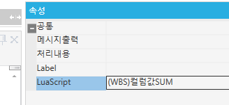

# 행 별 SUM / 컬럼값 SUM 함수

1.  반복문

<!-- -->

2.  함수

-- 반제금액합계의 경우 수수료컬럼도 반영되도록 추가 24.02.14 SJPARK

local SumData7, SumData8

 

SumData7 = 0

SumData8 = 0

 

for row = 0, SS4.DataRowCnt - 1 do

SumData7 = SumData7 + tonumber(CellText(SS4, row, 'ReturnAmt')) + tonumber(CellText(SS4, row, 'ServiceFeeCurAmt'))

> SumData8 = SumData8 + tonumber(CellText(SS4, row, 'ReturnDomAmt')) + tonumber(CellText(SS4, row, 'ServiceFeeDomAmt'))
>
>  

end

 

 

fltTotReturnAmt.Text = SumData7

fltTotalReturnDomAmt.Text = SumData8

fnSLGetSheetSum(SS1, 'CurAmt', fltInvoiceAmt)

fnSLGetSheetSum(SS1, 'DomAmt', fltInvoiceDomAmt)

 

--fnSLGetSheetSum(SS4, 'ReturnAmt', fltTotReturnAmt)

--fnSLGetSheetSum(SS4, 'ReturnDomAmt', fltTotalReturnDomAmt)

 

ACE

 

fnSLGetSheetSum(SS1, 'DomAmt', fltTotDomAmt,'')

fnSLGetSheetSum(SS1, 'DomVAT', fltTotDomVAT,'')

fnSLGetSheetSum(SS1, 'TotDomAmt', fltTotalDomAmt,'')

 

(WBS)컬럼값SUM

 

