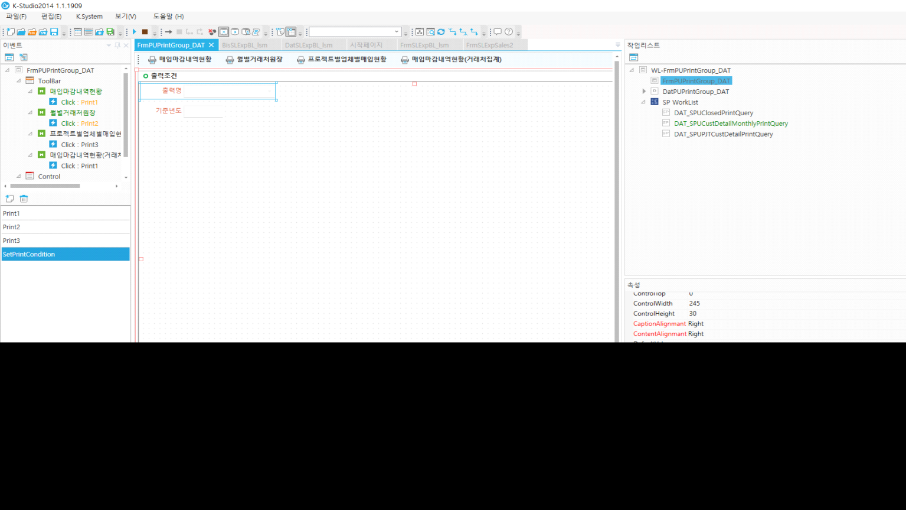

# 콤보 값에 따라 툴바 숨기기

if cmbPrintName.Value == '2100020001' then

GetToolbar('Print1').EventArgs.Visible = true

> GetToolbar('Print2').EventArgs.Visible = false
>
> GetToolbar('Print3').EventArgs.Visible = false
>
> GetToolbar('Print4').EventArgs.Visible = false
>
> datStdDate.ControlKey = 'NOQ;'
>
> datStdYM.ControlKey = 'DIS;HID;'

elseif cmbPrintName.Value == '2100020002' then

> GetToolbar('Print1').EventArgs.Visible = false
>
> GetToolbar('Print2').EventArgs.Visible = true
>
> GetToolbar('Print3').EventArgs.Visible = false
>
> GetToolbar('Print4').EventArgs.Visible = false
>
> datStdDate.ControlKey = 'DIS;HID;'
>
> datStdYM.ControlKey = 'NOQ;'

elseif cmbPrintName.Value == '2100020003' then

> GetToolbar('Print1').EventArgs.Visible = false
>
> GetToolbar('Print2').EventArgs.Visible = false
>
> GetToolbar('Print3').EventArgs.Visible = true
>
> GetToolbar('Print4').EventArgs.Visible = false
>
> datStdDate.ControlKey = 'NOQ;'
>
> datStdYM.ControlKey = 'DIS;HID;'

elseif cmbPrintName.Value == '2100020004' then

GetToolbar('Print1').EventArgs.Visible = false

> GetToolbar('Print2').EventArgs.Visible = false
>
> GetToolbar('Print3').EventArgs.Visible = false
>
> GetToolbar('Print4').EventArgs.Visible = true
>
> datStdDate.ControlKey = 'NOQ;'
>
> datStdYM.ControlKey = 'DIS;HID;'

end

FrmPUPrintGroup_DAT

매입출력물모음_dat

 

