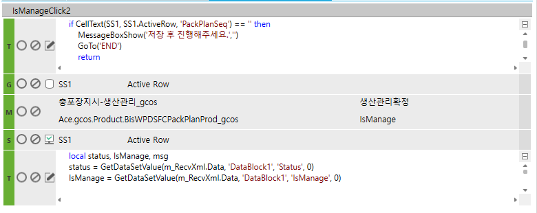

# 체크박스 클릭하여 UPDATE 처리

FrmWPDSFCPackPlan_gcos

충포장지시입력_gcos

if CellText(SS1, SS1.ActiveRow, 'PackPlanSeq') == '' then

> MessageBoxShow('저장 후 진행해주세요.','')
>
> GoTo('END')
>
> return

end

local status, IsManage, msg

status = GetDataSetValue(m_RecvXml.Data, 'DataBlock1', 'Status', 0)

IsManage = GetDataSetValue(m_RecvXml.Data, 'DataBlock1', 'IsManage', 0)

 

if status ~= '0' then

 

if IsManage == '1' then

> SetText(SS1, SS1.ActiveRow, 'IsManage' ,'0')
>
> else
>
> SetText(SS1, SS1.ActiveRow, 'IsManage', '1')
>
> end
>
>  
>
> msg = GetDataSetValue(m_RecvXml.Data, 'DataBlock1', 'Result', 0)
>
>  

else

 

> if IsManage == '1' then -- 확정되었습니다.
>
> msg = GetMessage('2152', '', '', '', '', '', '', '', '', '', '' )
>
> else -- 취소되었습니다.
>
> msg = GetMessage('1136', '', '', '', '', '', '', '', '', '', '' )
>
> end
>
>  

end

>  

MessageBoxShow(msg, '')

 

 

CREATE PROC gcos_SWPDSFCPackPlanIsManage

 

@ServiceSeq INT = 0,

@WorkingTag NVARCHAR(10)= '',

@CompanySeq INT = 1,

@LanguageSeq INT = 1,

@UserSeq INT = 0,

@PgmSeq INT = 0,

@IsTransaction BIT = 0

AS

 

 

 

UPDATE C

SET IsManage = CASE WHEN ISNULL(A.IsManage, '') = '1' THEN '1' ELSE '0' END

 

FROM \#BIZ_OUT_DataBlock1 AS A JOIN gcos_TPDSFCPackPlan AS C WITH(NOLOCK) ON C.CompanySeq = @CompanySeq

AND C.PackPlanSeq = A.PackPlanSeq

WHERE A.Status = 0

 

 

UPDATE A

SET IsManage = C.IsManage

FROM \#BIZ_OUT_DataBlock1 AS A JOIN gcos_TPDSFCPackPlan AS C WITH(NOLOCK) ON C.CompanySeq = @CompanySeq

AND C.PackPlanSeq = A.PackPlanSeq

WHERE A.Status = 0

 

 

 

RETURN

 

-- gcos_TPDSFCPackPlan