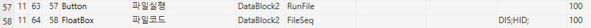

# 버튼 클릭하여 첨부파일 실행

local AttachFileSeq

AttachFileSeq = tonumber(CellText(SS1, SS1.ActiveRow, 'FileSeq'))

 

if AttachFileSeq == 0 then

MessageBoxShow(GetMessage('1276', '', '', '', '', '','','','','',''),'') -- 다운로드할 파일이 없을때 처리

else

akFileUpload.Value = AttachFileSeq -- 해당 파일그룹번호로 파일 리스트를 조회한다.

akFileUpload.ListFileDownloadRun = 0 -- 리스트의 0번째 파일을 내려받고 실행한다.

end

 

