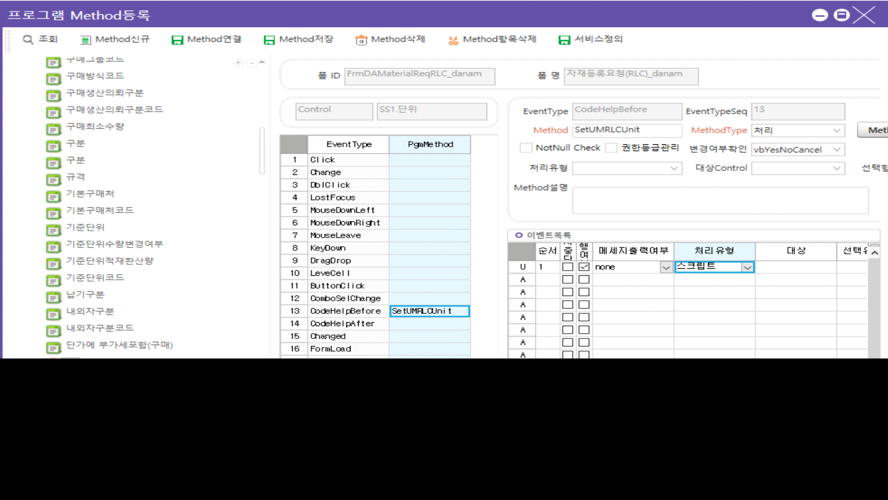

# 시트 콤보 / 코드헬프 파라미터 설정

 

if SS1.ActiveColumnName == 'UMRLCUnitName' then

SS1.ColumnCodeHelpParams = CellText(SS1, SS1.ActiveRow, 'UMRLCSeq')..'\|\|\|'

end

DROP PROCEDURE danam_SCACodeHelpRLCUnit

GO

CREATE PROCEDURE danam_SCACodeHelpRLCUnit

@WorkingTag NVARCHAR(1),

@LanguageSeq INT,

@CodeHelpSeq INT,

@DefQueryOption INT, -- 2: direct search

@CodeHelpType TINYINT,

@PageCount INT = 20,

@CompanySeq INT = 1,

@Keyword NVARCHAR(50) = '',

@Param1 NVARCHAR(50) = '', -- RLC 코드

@Param2 NVARCHAR(50) = '', --

@Param3 NVARCHAR(50) = '', --

@Param4 NVARCHAR(50) = '' --

AS

SET ROWCOUNT @PageCount

SELECT A.MinorName AS UMRLCUnitName                 

,A.MinorSeq AS UMRLCUnitSeq                

FROM \_TDAUMinor A WITH(NOLOCK)

LEFT OUTER JOIN \_TDAUMinorValue B WITH(NOLOCK) ON B.CompanySeq = @CompanySeq                                                                                                

AND B.MinorSeq = A.MinorSeq

AND B.Serl = 1000001

LEFT OUTER JOIN \_TDAUMinorValue C WITH(NOLOCK) ON C.CompanySeq = @CompanySeq                                                                                                

AND C.MinorSeq = A.MinorSeq

AND C.Serl = 1000002

LEFT OUTER JOIN \_TDAUMinorValue D WITH(NOLOCK) ON D.CompanySeq = @CompanySeq                                                                                                

AND D.MinorSeq = A.MinorSeq

AND D.Serl = 1000003

 

WHERE A.CompanySeq = @CompanySeq        

AND A.MajorSeq = 1028200

> AND ((@Param1 = 1028164001 AND B.ValueText = '1')
>
> OR (@Param1 = 1028164002 AND C.ValueText = '1')
>
> OR (@Param1 = 1028164003 AND D.ValueText = '1')

)

AND (@Keyword = '' OR A.MinorName LIKE @Keyword +'%' )

ORDER BY A.MinorSeq                

 

SET ROWCOUNT 0

 

RETURN