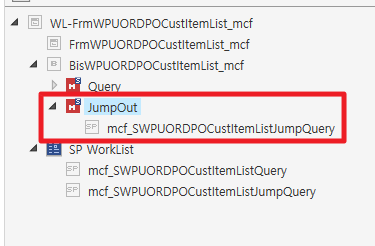
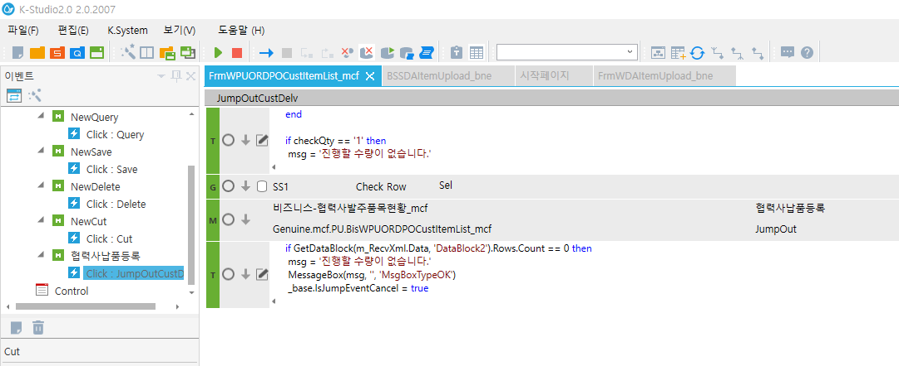
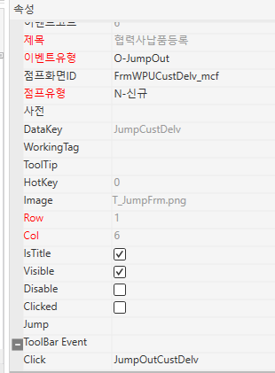

# SP 수량 체크

 

local checkrow, checkQty

 

for row = 0, SS1.DataRowCnt - 1 do

> if CellText(SS1, row, 'Sel') == '1' then
>
> checkrow = '1'
>
> if tonumber(CellText(SS1, row, 'RemainQty')) \<= 0 then
>
> checkQty = '1'
>
> end
>
> end

end

 

if checkrow ~= '1' then

msg = GetMessage('1001', GetDictionary(1572), '', '', '', '', '', '', '', '', '')

MessageBox(msg, '', 'MsgBoxTypeOK')

\_base.IsJumpEventCancel = true

GoTo('END')

return

end

 

if checkQty == '1' then

msg = '진행할 수량이 없습니다.'

MessageBox(msg, '', 'MsgBoxTypeOK')

\_base.IsJumpEventCancel = true

GoTo('END')

return

end

if GetDataBlock(m_RecvXml.Data, 'DataBlock2').Rows.Count == 0 then

msg = '진행할 수량이 없습니다.'

MessageBox(msg, '', 'MsgBoxTypeOK')

\_base.IsJumpEventCancel = true

GoTo('END')

return

 

