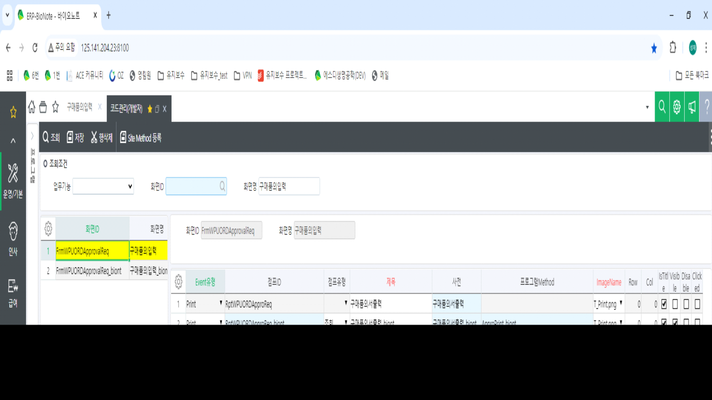

# Dummy 더미 콤보로 변경

 

Jump 등록 처리 (FormLoad 추가)

 

 

SS.ActiveColumnName = 'Dummy2'

SS.ColumnDataFieldCd = 'Dummy3'

 

SS.ColumnCellType = 'enCodeHelp'

SS.ColumnCodeHelp = 19999

SS.ColumnIsCombo = true

 

SS.ColumnIsComboAndTotal = true

SetTypeComboSheet(SS,'Dummy2',-1,19999,'1000255','', '', '', true)

 

SS.ColumnTitle = '연구과제'

SS.ColumnControlKey = 'NOS;'

 

SS.ActiveColumnName = 'Dummy3'

SS.ColumnTitle = '연구과제Cd'

SS.ColumnControlKey = 'HID;DIS;NOS;'

 

SS.ActiveColumnName = 'Dummy1'

SS.ColumnDataFieldCd = 'Dummy6'

 

SS.ColumnCellType = 'enCodeHelp'

SS.ColumnCodeHelp = 19999

SS.ColumnIsCombo = true

 

SS.ColumnIsComboAndTotal = true

SetTypeComboSheet(SS,'Dummy1',-1,19999,'1000320','', '', '', true)

 

SS.ColumnTitle = '수령장소'

SS.ColumnControlKey = 'NOS;'

 

SS.ActiveColumnName = 'Dummy6'

SS.ColumnTitle = '수령장소Cd'

SS.ColumnControlKey = 'HID;DIS;NOS;'

개발툴 이벤트 추가

 

 

-- 더미 코드도움 세팅 24.10.17 SJPARK

SS1.ActiveColumnName = 'Dummy4'

SetTypeComboSheet(SS1,'Dummy4',-1,19999,'1110135','', '', '', true)

 

SS1.ActiveColumnName = 'Dummy5'

SetTypeComboSheet(SS1,'Dummy5',-1,19999,'1000355','', '', '', true)

 

SS1.ActiveColumnName = 'Dummy4'

SS1.ColumnDataFieldCd = 'Dummy9'

 

SS1.ColumnCellType = 'enCodeHelp'

SS1.ColumnCodeHelp = 19999

SS1.ColumnIsCombo = true

 

SS1.ColumnIsComboAndTotal = true

SetTypeComboSheet(SS1,'Dummy4',-1,19999,'1110135','', '', '', true)

 

SS1.ColumnTitle = '수주타입'

SS1.ColumnControlKey = ''

 

SS1.ActiveColumnName = 'Dummy9'

SS1.ColumnTitle = '수주타입Cd'

SS1.ColumnControlKey = 'HID;DIS;'

 

SS1.ActiveColumnName = 'Dummy5'

SS1.ColumnDataFieldCd = 'Dummy8'

 

SS1.ColumnCellType = 'enCodeHelp'

SS1.ColumnCodeHelp = 19999

SS1.ColumnIsCombo = true

 

SS1.ColumnIsComboAndTotal = true

SetTypeComboSheet(SS1,'Dummy5',-1,19999,'1000355','', '', '', true)

 

SS1.ColumnTitle = '생산후부자재처리'

SS1.ColumnControlKey = ''

 

SS1.ActiveColumnName = 'Dummy8'

SS1.ColumnTitle = '생산후부자재처리Cd'

SS1.ColumnControlKey = 'HID;DIS;'

 

 

SS1.ActiveColumnName = 'Dummy1'

SS1.ColumnDataFieldCd = 'Dummy7'

 

SS1.ColumnCellType = 'enCodeHelp'

SS1.ColumnCodeHelp = 72820002

SS1.ColumnIsCombo = false

 

--SS1.ColumnIsComboAndTotal = true

--SetTypeComboSheet(SS1,'Dummy1',-1,19999,'1110135','', '', '', true)

 

SS1.ColumnTitle = 'MD번호'

SS1.ColumnControlKey = 'NOS;'

 

SS1.ActiveColumnName = 'Dummy7'

SS1.ColumnTitle = 'MD번호코드'

SS1.ColumnControlKey = 'HID;DIS;'