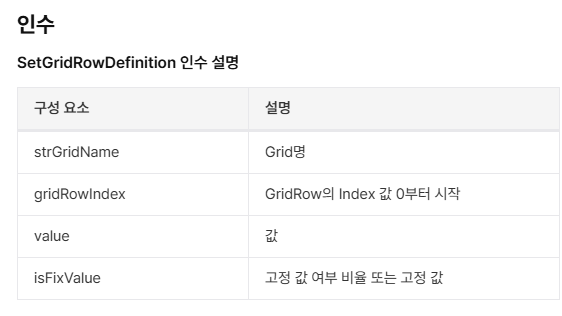

# 시트 숨김

-- 행기준

 

SetGridRowDefinition('GridItem',2,0,false)

 

-- 시트3 조회

SetGridRowDefinition('GridItem',2,0,true)

-- 열 기준

 

-- 25.06.18 sjpark

-- 외주검사인 경우에만 문서 시트 조회

if \_base.PgmSeq == 128410196 then

> SetGridColumnDefinition('GridItem', 0, 832, false)
>
> SetGridColumnDefinition('GridItem', 1, 100, true)
>
> SetGridColumnDefinition('GridItem', 2, 40, false)
>
> SetGridColumnDefinition('GridItem', 3, 250, false)

else

> SetGridColumnDefinition('GridItem', 0, 832, false)
>
> SetGridColumnDefinition('GridItem', 1, 100, true)
>
> SetGridColumnDefinition('GridItem', 2, 40, false)
>
> SetGridColumnDefinition('GridItem', 3, 0, false)

end        

