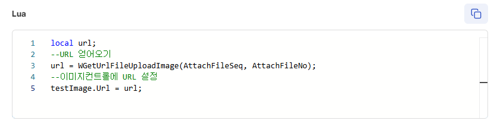
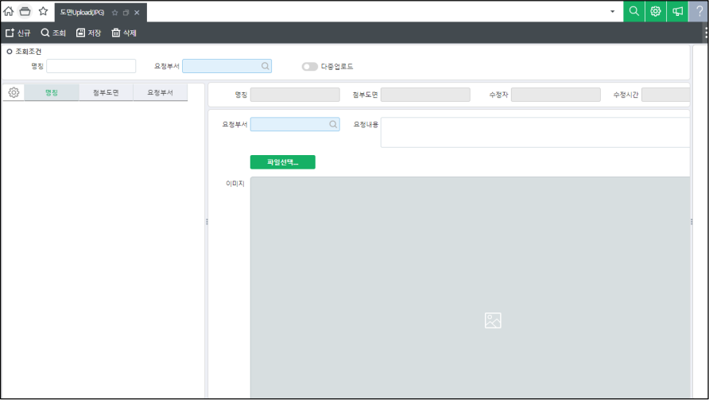

# 파일 컨트롤 이미지 URL 가져오기

**파일컨트롤 이미지URL 활용**

**개요**

파일 컨트롤에 등록한 이미지에 대한 URL을 가져오는 방법을 설명한 문서입니다.

**설명**

화면 메소드에서 파일 컨트롤에 등록한 이미지 파일 URL을 가져올 수 있습니다.

이미지 컨트롤과 같이 사용한다면 해당 URL을 이미지 컨트롤에 넣어 미리보기 할 수 있습니다.

사용 예제

 

local url;

--URL 얻어오기

url = WGetUrlFileUploadImage(AttachFileSeq, AttachFileNo);

--이미지컨트롤에 URL 설정

testImage.Url = url;

 

 

 

사이트 개발 예시

 

출처: \<<https://kdc.ksystem.co.kr/developments/erpdev/M1736831885412>\>