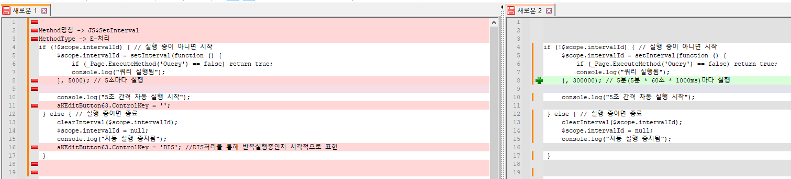

# 일정시간마다 이벤트 반복

// 5분마다 조회를 반복 실행하는 이벤트를 작성하였습니다.

if (!\$scope.intervalId) { // 실행 중이 아니면 시작

\$scope.intervalId = setInterval(function () {

if (\_Page.ExecuteMethod('Query') == false) return true;

console.log("쿼리 실행됨");

}, 300000); // 5분(5분 \* 60초 \* 1000ms)마다 실행

console.log("5초 간격 자동 실행 시작");

} else { // 실행 중이면 종료

clearInterval(\$scope.intervalId);

\$scope.intervalId = null;

console.log("자동 실행 중지됨");

}

JS확장이벤트로 구현 가능합니다.

예시로 만든 예제 전달드립니다.

\<코드\>

Method명칭 -\> JS\$SetInterval

MethodType -\> E-처리

if (!\$scope.intervalId) { // 실행 중이 아니면 시작

     \$scope.intervalId = setInterval(function () {

         if (\_Page.ExecuteMethod('Query') == false) return true;

         console.log("쿼리 실행됨");

     }, 5000); // 5초마다 실행



     console.log("5초 간격 자동 실행 시작");

     aKEditButton63.ControlKey = '';

 } else { // 실행 중이면 종료

     clearInterval(\$scope.intervalId);

     \$scope.intervalId = null;

     console.log("자동 실행 중지됨");

     aKEditButton63.ControlKey = 'DIS'; //DIS처리를 통해 반복실행중인지 시각적으로 표현

 }



해당 내용에 대해 주문입력8_ghpark 화면으로 실행 테스트 결과 정상 작동함을 확인하였습니다.

실제 적용된 사이트 화면 : 공정별생산진행현황_ssv

 

출처: \<<https://call.sysware.co.kr/Page/Open/79968/100101/3/18820569>\>

 

