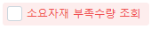

# 컨트롤 스타일

 

txtSerialNo2.StyleName = 'styleTextDis' -- styleTextDis Init 추가

 

체크박스

styleCheckboxIcon Favorite

styleCheckDefault

styleCheckHL

styleCheckHL colorGreen text18 textBold

styleCheckHL colorRed

styleCheckToggle

styleCheckToggle colorGreen

styleCheckToggle toggleRight

styleCheckToggle1

styleTextDis

-----------------------------------------------------

styleCheckHL colorRed

 

 

styleCheckHL colorBlue

 

SELECT A.Style, A.PgmSeq, B.Caption

FROM \_TCAPgmControls AS A

JOIN \_TCAPgm AS B ON B.PgmSeq = A.PgmSeq

WHERE A.ControlType = 4 -- 체크박스

AND ISNULL(A.Style,'') \<\> ''

AND A.Style LIKE 'Style%'

 

SELECT DISTINCT A.Style

FROM \_TCAPgmControls AS A

JOIN \_TCAPgm AS B ON B.PgmSeq = A.PgmSeq

WHERE A.ControlType = 4 -- 체크박스

AND ISNULL(A.Style,'') \<\> ''

AND A.Style LIKE 'Style%'