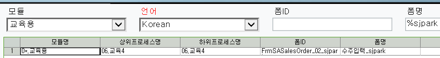
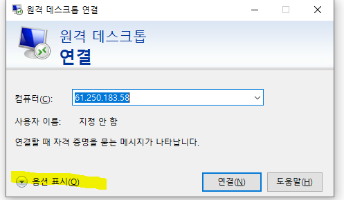
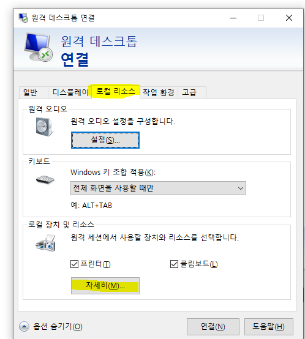
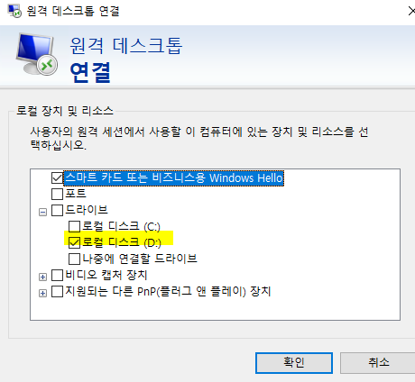

# 특징 및 주의사항

61.250.183.1 (Internet Explorer)

- \*이 붙은 것

<!-- -->

- 개발된 화면

- Ex. 수주입력\* (수주입력\*\* =\> 버전2)

- \* 없으면 표준화면

 

- 현황 더블클릭 =\> 입력으로 jump

표준 테이블 수정이 많다 (Ace는 표준 테이블을 거의 수정하지 않는다)

> +. Ace 표준 테이블 수정 시

1.  더미 컬럼 추가

2.  다른 테이블 하나 만들어서 필요한 컬럼, 외부키로 쓸 키 값 하나 추가 후 조인

>  

\*\*\* 시트 저장이 테이블 단위가 아니라 행 단위

 

----------------------------------------------------------------------------------------------

폼(화면) 구성요소

1.  확장자

    1.  aspx

    2.  cs

    3.  csproj

    4.  resx

    5.  webinfo

    6.  sln (자동생성)

<!-- -->

2.  SP

>  

- 보통 aspx, cs, SP 수정 / 나머지는 새로 개발할 때 사용

- aspx - 화면, 데이터를 보여주는 쪽

- cs - 데이터, DB갔다오는 애

<!-- -->

- 대부분 frm~ 으로 시작 (97%) / dlg~ (3%)

- 조회, 저장 다 가능

>  

 

 

메뉴 어디 있는지 찾고 싶을 때

- 마스타 및 운영관리 - 모듈 - 메뉴구성조회

> +. 메뉴에 없는건 '메뉴구성 안된폼조회' 에 있다

원격 연결 시 컴퓨터 D드라이브 나오게 하기

 

 

 

- 백업 필수

 

aspx 주석처리 시

'\_'는 밑에줄을 이어주기 때문에 뒤에다가 주석처리하면 안된다