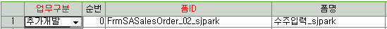
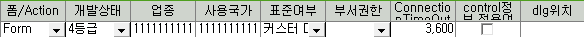
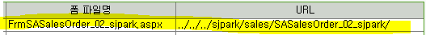
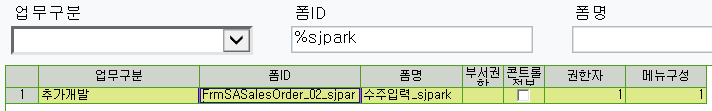
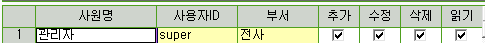
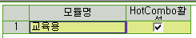
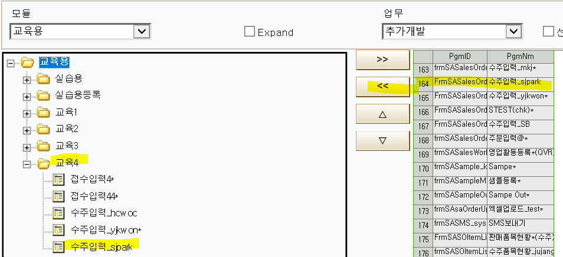
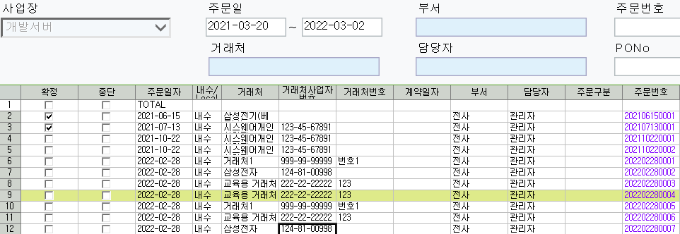

# 폼등록 및 기본설정

1.  폼등록

    1.  마스터 및 운영관리 - 운영관리 - - 폼등록

 

 

 

2\. 사용자등록 =\> 권한

 

 

3\. 모듈 - 메뉴등록

- 오른쪽 수주입력_sjpark 행 클릭

- 교육4 폴더 클릭

- \<\< 클릭

 

 

 

 

 

 

+. 입력 되었는지 확인 방법

- 영업/수출관리 - 영업활동 - 수주현황

 

 

- 개발된 곳으로 점프시키는 법

<!-- -->

- 마스타 및 운영관리 / 운영관리 / 프로그램 / Jump항목 등록

 

SP