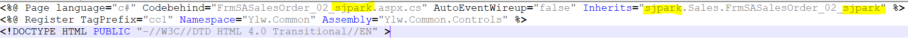
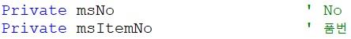

# \<\<FrmSASalesOrder_02_sjpark - 복사본.aspx\>\>

aspx

\* 처음 3줄 

\- Codebehind =\> 이름 변경

\- Inherits (aspx의) 경로 =\> sjpark - Sales - ~.aspx

 

 

\<HTML\> 부분 (처음부터 끝까지 이긴함)

1\. 화면의 컨트롤(마스터) 부분 (속성 정하기)

> \<변수\>값123\</변수\> =\> 여러 개로 구성되어있음
>
> +. (58번 서버) csproj에서 수정하면 더 편하다
>
>  

2\. 변수

시트에 필요한 변수 작성 (EX. No, 판매구분 등등)

> (마스터 부분은 id가 있기 때문에 변수 설정이 필요 없다)

양식 : ms~

> 고객사 : 컬럼 추가해주세요~
>
> =\> ms~ 추가

 

3\. Function (함수) (Ace의 툴바)

> aspx =\> 화면에 보여주는 부분이므로 =\> JumpOut
>
> 화면에 있는 데이터를 긁어가서 점프하기 때문에
>
> cs =\> JumpIn 다른 화면이 준 데이터를 보여줌

 

 

 

 

 

 

4\. Page_Load() (제일 중요 / 거의 이거만 고침)

 

순서가 중요 =\> 60 =\> 전체 컬럼 갯수

 

G&I 의 가장 큰 특징 중 하나가 특징대로 출력한다는 점이다

> Ace에서는 컬럼 추가 시 위치는 별도로 지정 안해도 되지만
>
> G&I는 순서가 정해져 있기 때문에 중간에 추가하면
>
> 다시 일일히 뒤로 내려야한다

 

5\. 코드도움 함수 (Sub txt\~\~~\_CodeHelp(IsDblClick)

> 코드도움 추가하려면 이걸 하나 추가하면 된다

 

6\. Private Sub ylwsh_Change(Col, Row)

> ====
>
> 영림원 시트
>
> 사용자가 시트를 바꿀 때
>
> ex. 수량, 판매단가 쓰면 자동으로 판매금액 나오는 것
>
> ----------------------------------------------------------------------------------------------------------------------------------------------------------------------------------------------------------------------------
>
> 조회 누르면 - function_query 이벤트 실행
>
> pageMode = Query
>
> PageParam.value - 페이지 받은거 넣음
>
>